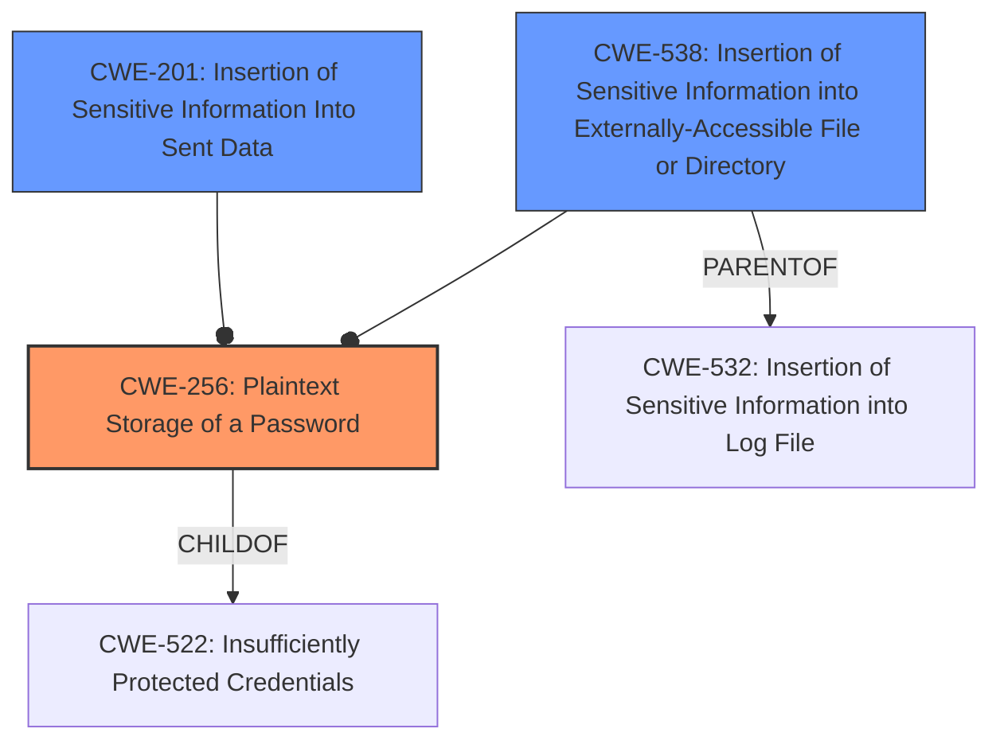

# Analysis Report for CVE-2022-41933

# Vulnerability Analysis Report: CVE-2022-41933

## Description


## Analysis (with Relationship Data)

# Summary
| CWE ID  | CWE Name                                                      | Confidence | CWE Abstraction Level | CWE Vulnerability Mapping Label | CWE-Vulnerability Mapping Notes |
| :-------- | :------------------------------------------------------------ | :--------- | :---------------------- | :------------------------------ | :------------------------------ |
| CWE-256   | Plaintext Storage of a Password                             | 1          | Base                    | Primary CWE                     | Allowed                       |
| CWE-201   | Insertion of Sensitive Information Into Sent Data           | 0.75       | Base                    | Secondary Candidate             | Allowed                       |
| CWE-538   | Insertion of Sensitive Information into Externally-Accessible File or Directory | 0.5        | Base                    | Secondary Candidate             | Allowed                       |

## Evidence and Confidence

*   **Confidence Score:** 0.9
*   **Evidence Strength:** HIGH

## Relationship Analysis
The primary CWE, CWE-256, is a base-level weakness that accurately describes the vulnerability. It is related to CWE-522, which is a parent class that represents insufficiently protected credentials. The secondary CWE, CWE-201, is also a base-level weakness related to sending sensitive information. The relationships between these CWEs help to understand the context of the vulnerability and how it can be exploited.



## Vulnerability Chain
The vulnerability chain starts with the **insecure storage of the password in plain text**, which directly leads to the exposure of sensitive information.

## Summary of Analysis
The primary weakness is the **insecure storage of password in plain text**. This is directly supported by the "Vulnerability Description Key Phrases" and "CVE Reference Links Content Summary." The retriever results also list CWE-256 as the top candidate.

The final selection is based on the evidence provided, graph relationships, and the principle of selecting the most specific CWE.

Relevant CWE Information:

# Enhanced Context (25 CWEs)

## CWE-256: Plaintext Storage of a Password
**Abstraction:** Base
**Similarity Score:** 5332.17
**Source:** sparse

**Description**:
Storing a password in plaintext may result in a system compromise.

**Mapping Guidance**:
- Usage: Allowed
- Rationale: This CWE entry is at the Base level of abstraction, which is a preferred level of abstraction for mapping to the root causes of vulnerabilities.

### How the Vulnerability Details Match the CWE Characteristics:
The vulnerability description explicitly states that the password was stored in plaintext in the database. This directly matches the description of CWE-256, which is "Storing a password in plaintext may result in a system compromise."
### Security Implications and Potential Impact:
Storing passwords in plaintext allows anyone with access to the database to view and use the passwords, potentially leading to unauthorized access and data breaches.
### Parent-Child Relationships or Chain Patterns:
CWE-256 is a child of CWE-522 (Insufficiently Protected Credentials).
### Whether the Weakness is Primary or Secondary in the Vulnerability:
This is the primary weakness.
### How the Official MITRE Mapping Guidance Influenced Your Decision:
The mapping guidance for CWE-256 states that it is at the Base level of abstraction, which is a preferred level, and that the Usage is "Allowed."

## CWE-201: Insertion of Sensitive Information Into Sent Data
**Abstraction:** Base
**Similarity Score**: 5.03
**Source**: graph

**Description**:
CWE-201: Insertion of Sensitive Information Into Sent Data

**Mapping Guidance**:
- Usage: Allowed
- Rationale: This CWE entry is at the Base level of abstraction, which is a preferred level of abstraction for mapping to the root causes of vulnerabilities.

### How the Vulnerability Details Match the CWE Characteristics:
While the primary issue is the plaintext storage, the exposure of the password in the database could be considered as insertion of sensitive information into sent data.
### Security Implications and Potential Impact:
Exposure of sensitive information can lead to unauthorized access and data breaches.
### Parent-Child Relationships or Chain Patterns:
CWE-201 is a child of CWE-200 (Exposure of Sensitive Information).
### Whether the Weakness is Primary or Secondary in the Vulnerability:
This is a secondary weakness, as the primary issue is the plaintext storage itself.
### How the Official MITRE Mapping Guidance Influenced Your Decision:
The mapping guidance for CWE-201 states that it is at the Base level of abstraction, which is a preferred level, and that the Usage is "Allowed."

## CWE-538: Insertion of Sensitive Information into Externally-Accessible File or Directory
**Abstraction Level**: Base
**Similarity Score**: 0.78
**Source**: dense

**Description**:
The product places sensitive information into files or directories that are accessible to actors who are allowed to have access to the files, but not to the sensitive information.

**Mapping Guidance**:
- Usage: Allowed
- Rationale: This CWE entry is at the Base level of abstraction, which is a preferred level of abstraction for mapping to the root causes of vulnerabilities.

### How the Vulnerability Details Match the CWE Characteristics:
The vulnerability description states that the password was stored in plaintext in the database. This means the database, which is an externally accessible file, contained sensitive data.
### Security Implications and Potential Impact:
Exposure of sensitive information can lead to unauthorized access and data breaches.
### Parent-Child Relationships or Chain Patterns:
CWE-538 is a child of CWE-200 (Exposure of Sensitive Information).
### Whether the Weakness is Primary or Secondary in the Vulnerability:
This is a secondary weakness, as the primary issue is the plaintext storage itself.
### How the Official MITRE Mapping Guidance Influenced Your Decision:
The mapping guidance for CWE-538 states that it is at the Base level of abstraction, which is a preferred level, and that the Usage is "Allowed."

## Other CWEs Considered but Not Used:

*   **CWE-1390 Weak Authentication:** This CWE is too high-level. While storing passwords in plaintext weakens authentication, the more specific CWE-256 is a better fit.
*   **CWE-116 Improper Encoding or Escaping of Output:** This CWE is not directly relevant, as the issue is not with encoding or escaping, but with storing the password in plaintext.
*   **CWE-863 Incorrect Authorization:** This CWE is not relevant, as the issue is not with authorization, but with the storage of passwords.
*   **CWE-306 Missing Authentication for Critical Function:** Although related to authentication, the core issue isn't a complete lack of authentication; rather, it is the **insecure storage of credentials** that are intended to be used in the authentication process.
*   **CWE-209 Generation of Error Message Containing Sensitive Information, CWE-202 Exposure of Sensitive Information Through Data Queries:** These are related to information exposure, but not the core issue of storing the password in plaintext.


## CWE Relationship Analysis

Current CWEs represent these abstraction levels: .


### Vulnerability Chain Analysis

**Chain starting from CWE-201:**
- 201 (Insertion of Sensitive Information Into Sent Data) - ROOT


**Chain starting from CWE-200:**
- 200 (Exposure of Sensitive Information to an Unauthorized Actor) - ROOT


### CWE Relationship Diagram

```mermaid
graph TD
    classDef primary fill:#f96,stroke:#333,stroke-width:2px
    classDef secondary fill:#69f,stroke:#333
    classDef tertiary fill:#9e9,stroke:#333
```


*Report generated on 2025-03-31 00:36:23*
