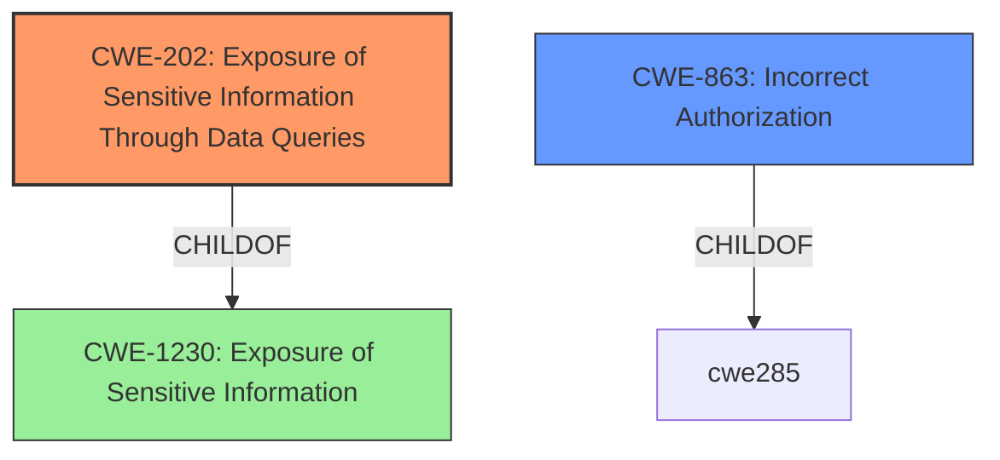

# Enhanced Analysis for CVE-2022-41935

# Summary
| CWE ID | CWE Name | Confidence | CWE Abstraction Level | CWE Vulnerability Mapping Label | CWE-Vulnerability Mapping Notes |
|---|---|---|---|---|---|
| CWE-202 | Exposure of Sensitive Information Through Data Queries | 0.9 | Base | Allowed | Primary CWE |
| CWE-863 | Incorrect Authorization | 0.6 | Class | Allowed-with-Review | Secondary Candidate |

## Evidence and Confidence

*   **Confidence Score:** 0.75
*   **Evidence Strength:** HIGH

## Relationship Analysis
The primary relationship considered was the hierarchical structure. CWE-202 is a base-level CWE that directly addresses the issue of sensitive information exposure through data queries. CWE-863, while relevant, is a class-level CWE and thus less specific. The analysis focused on identifying the root cause, which is the improper handling of data queries leading to information exposure. No significant chain relationships were identified in this specific case.



## Vulnerability Chain
The vulnerability chain starts with **insufficient access control** on the `LiveTableResults` macro. This leads to **exposure of sensitive information through data queries** (CWE-202), as users can deduce the existence and partial content of documents they should not have access to. The final impact is **data leakage**, where attackers can reconstruct document content via iterative queries.

## Summary of Analysis
The initial analysis focused on the **information disclosure** aspect of the vulnerability, supported by the CVE Reference Links Content Summary. The key phrase "Users can deduce existence of documents" pointed toward CWE-202 as the primary weakness. The Retriever Results also listed CWE-202 as the top candidate.

The analysis considered CWE-863 (Incorrect Authorization) as a potential secondary CWE, given the **insufficient access control** mentioned in the CVE Reference Links Content Summary. However, since the core issue is the leakage of information through queries rather than a complete bypass of authorization, CWE-202 was deemed more appropriate as the primary CWE.

The selected CWEs are at the optimal level of specificity, with CWE-202 being a base-level CWE that directly addresses the root cause. The decision is based on the evidence provided in the vulnerability description and CVE details, as well as the mapping guidance for CWE-202, which allows its usage at the base level of abstraction.

Relevant CWE Information:

# Enhanced Context (25 CWEs)

## CWE-202: Exposure of Sensitive Information Through Data Queries
**Abstraction:** Base
**Status:** Draft

### Description
When trying to keep information confidential, an attacker can often infer some of the information by using statistics.

### Extended Description
In situations where data should not be tied to individual users, but a large number of users should be able to make queries that "scrub" the identity of users, it may be possible to get information about a user -- e.g., by specifying search terms that are known to be unique to that user.

### Alternative Terms
None

### Relationships
ChildOf -> CWE-1230

### Mapping Guidance
**Usage:** Allowed
**Rationale:** This CWE entry is at the Base level of abstraction, which is a preferred level of abstraction for mapping to the root causes of vulnerabilities.
**Comments:** Carefully read both the name and description to ensure that this mapping is an appropriate fit. Do not try to 'force' a mapping to a lower-level Base/Variant simply to comply with this preferred level of abstraction.
**Reasons:**
- Acceptable-Use

### Additional Notes
**[Maintenance]** 

The relationship between CWE-202 and CWE-612 needs to be investigated more closely, as they may be different descriptions of the same kind of problem. CWE-202 is also being considered for deprecation, as it is not clearly described and may have been misunderstood by CWE users. It could be argued that this issue is better covered by CAPEC; an attacker can utilize their data-query privileges to perform this kind of operation, and if the attacker should not be allowed to perform the operation - or if the sensitive data should not have been made accessible at all - then that is more appropriately classified as a separate CWE related to authorization (see the parent, CWE-1230).

### Observed Examples
- **CVE-2022-41935:** Wiki product allows an adversary to discover filenames via a series of queries starting with one letter and then iteratively extending the match.

## CWE-863: Incorrect Authorization
**Abstraction:** Class
**Status:** Incomplete

### Description
The product performs an authorization check when an actor attempts to access a resource or perform an action, but it does not correctly perform the check.

### Extended Description
Not provided

### Alternative Terms
AuthZ: "AuthZ" is typically used as an abbreviation of "authorization" within the web application security community. It is distinct from "AuthN" (or, sometimes, "AuthC") which is an abbreviation of "authentication." The use of "Auth" as an abbreviation is discouraged, since it could be used for either authentication or authorization.

### Relationships
ChildOf -> CWE-285
ChildOf -> CWE-284

### Mapping Guidance
**Usage:** Allowed-with-Review
**Rationale:** This CWE entry is a Class and might have Base-level children that would be more appropriate
**Comments:** Examine children of this entry to see if there is a better fit
**Reasons:**
- Abstraction

### Additional Notes
**[Terminology]** 

Assuming a user with a given identity, authorization is the process of determining whether that user can access a given resource, based on the user's privileges and any permissions or other access-control specifications that apply to the resource.

### Observed Examples
- **CVE-2021-39155:** Chain: A microservice integration and management platform compares the hostname in the HTTP Host header in a case-sensitive way (CWE-178, CWE-1289), allowing bypass of the authorization policy (CWE-863) using a hostname with mixed case or other variations.
- **CVE-2019-15900:** Chain: sscanf() call is used to check if a username and group exists, but the return value of sscanf() call is not checked (CWE-252), causing an uninitialized variable to be checked (CWE-457), returning success to allow authorization bypass for executing a privileged (CWE-863).
- **CVE-2009-2213:** Gateway uses default "Allow" configuration for its authorization settings.

**Rationale for CWE Selection:**

*   **CWE-202 (Exposure of Sensitive Information Through Data Queries):** This is the primary CWE because the vulnerability's core issue is that unauthorized users can infer the existence and partial content of documents through data queries. The CVE description explicitly states that "Users without the right to view documents can deduce their existence by repeated Livetable queries." This aligns perfectly with the CWE-202 description, which states, "When trying to keep information confidential, an attacker can often infer some of the information by using statistics."

*   **CWE-863 (Incorrect Authorization):** This is considered a secondary CWE because there is an element of authorization failure, but it's not a complete bypass. The system *attempts* to restrict access, but it **incorrectly** allows some information to leak through the queries. The CVE states that "The LiveTable feature does not properly enforce view permissions when returning the total number of matching rows, and when obfuscated rows are returned." Given the class-level abstraction and the fact that it is not the root cause, it is considered a secondary CWE.

**CWEs Considered but Not Used:**

*   **CWE-116 (Improper Encoding or Escaping of Output):** While the description mentions "obfuscated entries," the root cause isn't a failure of encoding/escaping but rather the presence of those entries in the output at all. Therefore, CWE-116 is not directly applicable.

*   **CWE-552 (Files or Directories Accessible to External Parties):** This CWE is not applicable because the vulnerability does not involve direct access to files or directories, but rather the exposure of information through data queries.

*   **CWE-1336 (Improper Neutralization of Special Elements Used in a Template Engine):** This is not applicable as the vulnerability is not directly related to a template engine.

*   **CWE-201 (Insertion of Sensitive Information Into Sent Data):** While related to information exposure, CWE-202 focuses


## CWE Relationship Analysis

Current CWEs represent these abstraction levels: .


### Vulnerability Chain Analysis

**Chain starting from CWE-552:**
- 552 (Files or Directories Accessible to External Parties) - ROOT


**Chain starting from CWE-201:**
- 201 (Insertion of Sensitive Information Into Sent Data) - ROOT


### CWE Relationship Diagram

```mermaid
graph TD
    classDef primary fill:#f96,stroke:#333,stroke-width:2px
    classDef secondary fill:#69f,stroke:#333
    classDef tertiary fill:#9e9,stroke:#333
```