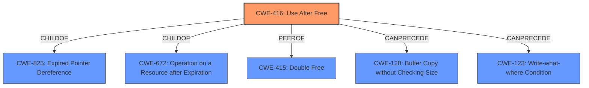

# Analysis for CVE-2022-4194

# Summary
| CWE ID | CWE Name | Confidence | CWE Abstraction Level | CWE Vulnerability Mapping Label | CWE-Vulnerability Mapping Notes |
|---|---|---|---|---|---|
| CWE-416 | Use After Free | 1.0 | Variant | Allowed | Primary CWE |

## Evidence and Confidence

*   **Confidence Score:** 1.0
*   **Evidence Strength:** HIGH

## Relationship Analysis
The primary relationship that influenced the decision was the ChildOf relationship between CWE-416 (Use After Free) and its parents, and its peer relationships with CWE-415 (Double Free) and CWE-123 (Write-what-where Condition). Since the vulnerability description clearly states "**Use after free**" as the **rootcause**, CWE-416 is the most specific and accurate choice.

## Vulnerability Chain
The vulnerability chain starts with a "**use after free**" condition, which leads to "**heap corruption**." The remote attacker can exploit this through a crafted HTML page.

## Summary of Analysis
The initial analysis clearly points to CWE-416 (Use After Free) as the most appropriate CWE due to the vulnerability description explicitly mentioning "Use after free."

The "CVE Reference Links Content Summary" section further confirms this by stating:
- **Root cause of vulnerability:** Use-after-free in Accessibility component of Chromium
- The vulnerability is a use-after-free (UAF), meaning that the program attempts to access memory that has already been freed.
- The attack vector is not explicitly detailed but being a use-after-free in the accessibility component suggests it could be triggered by manipulating how accessibility features interact with the browser.

The retriever results also list CWE-416 as the top match.

Other CWEs were considered but deemed less suitable:
- CWE-843 (Access of Resource Using Incompatible Type ('Type Confusion')): While heap corruption can sometimes involve type confusion, the primary **rootcause** here is the use of freed memory, making CWE-416 a more direct and accurate representation of the vulnerability.
- CWE-366 (Race Condition within a Thread): A race condition isn't mentioned in the vulnerability description.
- CWE-122 (Heap-based Buffer Overflow): The vulnerability description mentions "**heap corruption**" but the **rootcause** is "**use after free**"
- CWE-911 (Improper Update of Reference Count): The vulnerability description doesn't mention reference counting.
- CWE-415 (Double Free): Although Double Free is a peer of Use After Free, the vulnerability description explicitly mentions "**use after free**" and not a double free.
- CWE-123 (Write-what-where Condition): While a UAF can lead to an arbitrary write, the direct cause is the use of freed memory.

The selection of CWE-416 is at the optimal level of specificity, as it directly describes the **rootcause** of the vulnerability, which is the use of memory after it has been freed.