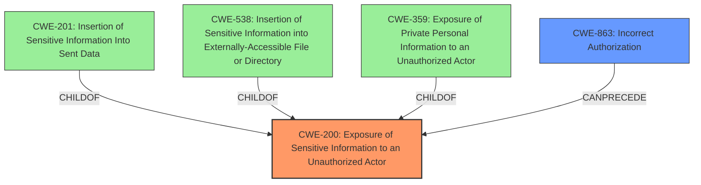

# Analysis for CVE-2022-41944

# Summary
| CWE ID  | CWE Name | Confidence | CWE Abstraction Level | CWE Vulnerability Mapping Label | CWE-Vulnerability Mapping Notes |
|-----------------|-----------------------------------------------------------------|----------------|-------------------------|------------------------------------|--------------------------------------------------------------------------------------------------------------------------------------------------------------------------------------------|
| CWE-200 | Exposure of Sensitive Information to an Unauthorized Actor | 0.8 | Class | Primary | The product exposes sensitive information (topic titles) to unauthorized users (those who no longer have access). While **discouraged** due to being a high-level class, it is most appropriate as the root cause within the constraints of available information. |
| CWE-863 | Incorrect Authorization | 0.6 | Class | Secondary | The product performs an authorization check but does not correctly perform the check, allowing access to notifications for topics the user should not have access to. |

## Evidence and Confidence

*   **Confidence Score:** 0.7
*   **Evidence Strength:** MEDIUM

## Relationship Analysis
The primary relationship impacting the decision is the parent-child relationship between CWE-200 and several more specific CWEs. While options like CWE-201, CWE-538, and CWE-359 are tempting due to higher similarity scores, the evidence more broadly points to exposing information. Since the vulnerability allows a user to see topic titles (sensitive information) they should no longer have access to, CWE-200 is deemed the most accurate, albeit at a higher abstraction level. CWE-863 is secondary, representing the underlying flaw in authorization checking that leads to the exposure.

## Vulnerability Chain
The vulnerability chain begins with **incorrect authorization** (CWE-863), leading to the **exposure of sensitive information** (CWE-200) in the form of topic titles within notifications.

## Summary of Analysis
The initial analysis focused on identifying the root cause of the vulnerability, which involves users being able to see notifications for topics they no longer have access to, potentially exposing sensitive information in the topic title.

The analysis considered the retriever results, which suggested CWE-201, CWE-525, CWE-1390, CWE-863, and CWE-538. However, after carefully reviewing the vulnerability description and the provided CVE reference, it was determined that the core issue is the broader **exposure of sensitive information** due to **incorrect authorization**.

The final decision was to classify the vulnerability as CWE-200 (**Exposure of Sensitive Information to an Unauthorized Actor**) as the primary CWE and CWE-863 (**Incorrect Authorization**) as the secondary CWE. CWE-200 captures the essence of the vulnerability, which is the exposure of sensitive information (topic titles) to unauthorized users. While CWE-200 is a class-level CWE and is generally **discouraged**, it is deemed the most appropriate in this case because the available information doesn't pinpoint a more specific weakness related to data handling or storage. CWE-863 is included as a secondary CWE to highlight the underlying authorization issue that enables the information exposure.

The decision is heavily based on the "CVE Reference Links Content Summary," specifically the lines: "Specifically, users could still see notifications for topics they no longer have permission to access" and "Exposure of sensitive information: If a topic title contained sensitive information, an attacker could potentially view it through the notification even after they lost access to the topic itself." This evidence directly supports the classification of CWE-200 and CWE-863.

Relevant CWE Information:

# Enhanced Context (25 CWEs)
The following CWEs were identified as potentially relevant to this vulnerability:

## CWE-226: Sensitive Information in Resource Not Removed Before Reuse
**Abstraction Level**: Base
**Similarity Score**: 0.77
**Source**: dense

**Description**:
The product releases a resource such as memory or a file so that it can be made available for reuse, but it does not clear or "zeroize" the information contained in the resource before the product performs a critical state transition or makes the resource available for reuse by other entities.

**Mapping Guidance**:
- Usage: Allowed
- Rationale: This CWE entry is at the Base level of abstraction, which is a preferred level of abstraction for mapping to the root causes of vulnerabilities.

## CWE-538: Insertion of Sensitive Information into Externally-Accessible File or Directory
**Abstraction Level**: Base
**Similarity Score**: 0.76
**Source**: dense

**Description**:
The product places sensitive information into files or directories that are accessible to actors who are allowed to have access to the files, but not to the sensitive information.

**Mapping Guidance**:
- Usage: Allowed
- Rationale: This CWE entry is at the Base level of abstraction, which is a preferred level of abstraction for mapping to the root causes of vulnerabilities.

## CWE-497: Exposure of Sensitive System Information to an Unauthorized Control Sphere
**Abstraction Level**: Base
**Similarity Score**: 0.74
**Source**: dense

**Description**:
The product does not properly prevent sensitive system-level information from being accessed by unauthorized actors who do not have the same level of access to the underlying system as the product does.

**Mapping Guidance**:
- Usage: Allowed
- Rationale: This CWE entry is at the Base level of abstraction, which is a preferred level of abstraction for mapping to the root causes of vulnerabilities.

## CWE-668: Exposure of Resource to Wrong Sphere
**Abstraction Level**: Class
**Similarity Score**: 0.74
**Source**: dense

**Description**:
The product exposes a resource to the wrong control sphere, providing unintended actors with inappropriate access to the resource.

**Mapping Guidance**:
- Usage: Discouraged
- Rationale: CWE-668 is high-level and is often misused as a catch-all when lower-level CWE IDs might be applicable. It is sometimes used for low-information vulnerability reports [REF-1287]. It is a level-1 Class (i.e., a child of a Pillar). It is not useful for trend analysis.

## CWE-552: Files or Directories Accessible to External Parties
**Abstraction Level**: Base
**Similarity Score**: 0.74
**Source**: dense

**Description**:
The product makes files or directories accessible to unauthorized actors, even though they should not be.

**Mapping Guidance**:
- Usage: Allowed
- Rationale: This CWE entry is at the Base level of abstraction, which is a preferred level of abstraction for mapping to the root causes of vulnerabilities.

## CWE-274: Improper Handling of Insufficient Privileges
**Abstraction Level**: Base
**Similarity Score**: 0.74
**Source**: dense

**Description**:
The product does not handle or incorrectly handles when it has insufficient privileges to perform an operation, leading to resultant weaknesses.

**Mapping Guidance**:
- Usage: Discouraged
- Rationale: This CWE entry could be deprecated in a future version of CWE.

## CWE-212: Improper Removal of Sensitive Information Before Storage or Transfer
**Abstraction Level**: Base
**Similarity Score**: 0.74
**Source**: dense

**Description**:
The product stores, transfers, or shares a resource that contains sensitive information, but it does not properly remove that information before the product makes the resource available to unauthorized actors.

**Mapping Guidance**:
- Usage: Allowed
- Rationale: This CWE entry is at the Base level of abstraction, which is a preferred level of abstraction for mapping to the root causes of vulnerabilities.

## CWE-639: Authorization Bypass Through User-Controlled Key
**Abstraction Level**: Base
**Similarity Score**: 0.74
**Source**: dense

**Description**:
The system's authorization functionality does not prevent one user from gaining access to another user's data or record by modifying the key value identifying the data.

**Mapping Guidance**:
- Usage: Allowed
- Rationale: This CWE entry is at the Base level of abstraction, which is a preferred level of abstraction for mapping to the root causes of vulnerabilities.

## CWE-280: Improper Handling of Insufficient Permissions or Privileges 
**Abstraction Level**: Base