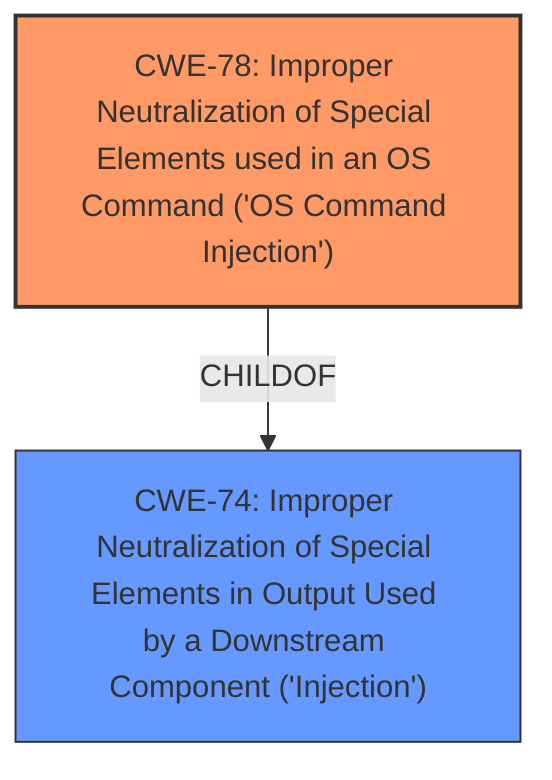

# Enhanced Analysis for CVE-2022-41945

# Summary
| CWE ID | CWE Name | Confidence | CWE Abstraction Level | CWE Vulnerability Mapping Label | CWE-Vulnerability Mapping Notes |
|---|---|---|---|---|---|
| CWE-78 | Improper Neutralization of Special Elements used in an OS Command ('OS Command Injection') | 1.0 | Base | Allowed | Primary CWE |
| CWE-74 | Improper Neutralization of Special Elements in Output Used by a Downstream Component ('Injection') | 0.7 | Class | Discouraged | Secondary Candidate |

## Evidence and Confidence

*   **Confidence Score:** 1.0
*   **Evidence Strength:** HIGH

## Relationship Analysis
The primary relationship influencing the CWE selection is the hierarchical relationship between CWE-78 (OS Command Injection) and its parent, CWE-74 (Improper Neutralization of Special Elements in Output Used by a Downstream Component ('Injection')). CWE-78 is a more specific case of CWE-74, focusing on OS command context. The vulnerability involves injecting commands directly into the OS, making CWE-78 the more appropriate and specific choice.



## Vulnerability Chain
The vulnerability chain is as follows:
1.  **Root Cause:** **Improper URL filtering** (**improper input validation/neutralization**).
2.  **Weakness:** The unfiltered URL is directly spliced into a command.
3.  **Impact:** Remote Code Execution (RCE).

## Summary of Analysis
Initially, the vulnerability description points towards an issue of **improper URL filtering** leading to Remote Code Execution. The key evidence for this assessment comes from the vulnerability description itself, which states: "the URL is not filtered and directly spliced into the command, resulting in a possible RCE vulnerability."

The CVE Reference Links Content Summary reinforces this, stating: "The vulnerability stems from the **lack of sanitization of URL inputs**, which are directly incorporated into command execution strings" and "Command injection vulnerability due to **unsanitized URL input** being concatenated into shell commands."

Based on this evidence, the primary CWE mapping is CWE-78, which directly addresses **improper neutralization** leading to OS command injection. This is further supported by the observation that "the application uses `cmd.exe` on Windows and `/bin/bash` on Linux, which directly executes the crafted command."

The choice of CWE-78 is also driven by its Base level of abstraction, which aligns with the goal of identifying the most specific root cause.

CWE-74 was considered as a parent class, but CWE-78 provides a more precise categorization of the weakness.

Relevant CWE Information:

# Enhanced Context (25 CWEs)
The following CWEs were identified as potentially relevant to this vulnerability:

## CWE-74: Improper Neutralization of Special Elements in Output Used by a Downstream Component ('Injection')
**Abstraction Level**: Class
**Similarity Score**: 0.77
**Source**: dense

**Description**:
The product constructs all or part of a command, data structure, or record using externally-influenced input from an upstream component, but it does not neutralize or incorrectly neutralizes special elements that could modify how it is parsed or interpreted when it is sent to a downstream component.

**Mapping Guidance**:
- Usage: Discouraged
- Rationale: CWE-74 is high-level and often misused when lower-level weaknesses are more appropriate.

**Technical Explanation:**

CWE-78: Improper Neutralization of Special Elements used in an OS Command ('OS Command Injection')

*   **How the Vulnerability Matches:** The core of the vulnerability is the **improper neutralization** of input (the URL) before it's used in an OS command. An attacker can inject malicious commands by manipulating the URL.
*   **Security Implications:** This leads to Remote Code Execution (RCE), allowing an attacker to run arbitrary commands on the system.
*   **Parent-Child Relationships:** CWE-78 is a child of CWE-77 (Improper Neutralization of Special Elements used in a Command) and CWE-74 (Improper Neutralization of Special Elements in Output Used by a Downstream Component ('Injection')). This indicates that it's a specific type of command injection.
*   **Primary or Secondary:** This is the primary weakness as it directly leads to the RCE.
*   **MITRE Mapping Guidance:** CWE-78 is at the Base level of abstraction, which is preferred.

CWE-74: Improper Neutralization of Special Elements in Output Used by a Downstream Component ('Injection')

*   **How the Vulnerability Matches:** This CWE describes a general case where input is not properly neutralized before being used by a downstream component. While technically accurate, it's less specific than CWE-78.
*   **Security Implications:** The implications are broad, as it depends on the downstream component. In this case, it leads to command execution.
*   **Parent-Child Relationships:** CWE-74 is a parent of CWE-78, representing a broader class of injection vulnerabilities.
*   **Primary or Secondary:** This could be considered a secondary weakness as it's a generalization of the primary issue.
*   **MITRE Mapping Guidance:** CWE-74 is discouraged as a primary mapping because it's too high-level, and more specific weaknesses are available.


## CWE Relationship Analysis

Current CWEs represent these abstraction levels: .


### Vulnerability Chain Analysis

**Chain starting from CWE-78:**
- 78 (Improper Neutralization of Special Elements used in an OS Command ('OS Command Injection')) - ROOT


**Chain starting from CWE-77:**
- 77 (Improper Neutralization of Special Elements used in a Command ('Command Injection')) - ROOT


### CWE Relationship Diagram

```mermaid
graph TD
    classDef primary fill:#f96,stroke:#333,stroke-width:2px
    classDef secondary fill:#69f,stroke:#333
    classDef tertiary fill:#9e9,stroke:#333
```