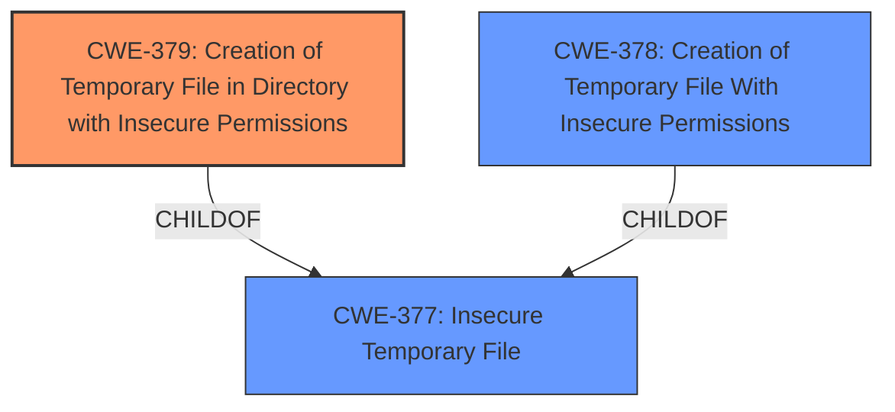

# Analysis Report for CVE-2022-41946

# Vulnerability Analysis Report: CVE-2022-41946

## Description


## Analysis (with Relationship Data)

# Summary
| CWE ID | CWE Name | Confidence | CWE Abstraction Level | CWE Vulnerability Mapping Label | CWE-Vulnerability Mapping Notes |
|---|---|---|---|---|---|
| CWE-379 | Creation of Temporary File in Directory with Insecure Permissions | 1.0 | Base | Allowed | Primary CWE |
| CWE-378 | Creation of Temporary File With Insecure Permissions | 0.7 | Base | Allowed | Secondary Candidate |
| CWE-377 | Insecure Temporary File | 0.6 | Class | Allowed-with-Review | Secondary Candidate |

## Evidence and Confidence

*   **Confidence Score:** 0.9
*   **Evidence Strength:** HIGH

## Relationship Analysis
The primary CWE is CWE-379, which is a child of CWE-377 (Insecure Temporary File). CWE-378 is also a child of CWE-377, representing a broader category of insecure temporary file creation. The vulnerability involves creating temporary files with insecure permissions, making CWE-379 the most specific and relevant choice.



## Vulnerability Chain
The vulnerability chain involves the creation of a temporary file due to the size of the InputStream, followed by the assignment of insecure permissions to that file, leading to potential information disclosure.

## Summary of Analysis
The analysis indicates a clear case of creating temporary files with insecure permissions. The vulnerability description explicitly mentions that the created temporary files are readable by other users on Unix-like systems due to **improper file permissions**. This aligns directly with CWE-379, which describes the creation of temporary files in directories with insecure permissions. The "CVE Reference Links Content Summary" section also confirms that **insecure temporary file creation** is a key weakness.

The choice of CWE-379 is supported by the evidence provided and the CWE's description. It is also the most specific CWE available, residing at the Base level of abstraction. While CWE-377 and CWE-378 were considered, they are less specific than CWE-379.

Relevant CWE Information:

# Enhanced Context (25 CWEs)

## CWE-379: Creation of Temporary File in Directory with Insecure Permissions
**Abstraction Level**: Base
**Similarity Score**: 0.83
**Source**: dense

**Description**:
The product creates a temporary file in a directory whose permissions allow unintended actors to determine the file's existence or otherwise access that file.

**Mapping Guidance**:
- Usage: Allowed
- Rationale: This CWE entry is at the Base level of abstraction, which is a preferred level of abstraction for mapping to the root causes of vulnerabilities.

## CWE-378: Creation of Temporary File With Insecure Permissions
**Abstraction Level**: Base
**Similarity Score**: 0.82
**Source**: dense

**Description**:
Opening temporary files without appropriate measures or controls can leave the file, its contents and any function that it impacts vulnerable to attack.

**Mapping Guidance**:
- Usage: Allowed
- Rationale: This CWE entry is at the Base level of abstraction, which is a preferred level of abstraction for mapping to the root causes of vulnerabilities.

## CWE-377: Insecure Temporary File
**Abstraction Level**: Class
**Similarity Score**: 0.79
**Source**: dense

**Description**:
Creating and using insecure temporary files can leave application and system data vulnerable to attack.

**Mapping Guidance**:
- Usage: Allowed
- Rationale: This CWE entry is at the Base level of abstraction, which is a preferred level of abstraction for mapping to the root causes of vulnerabilities.


## CWE Relationship Analysis

Current CWEs represent these abstraction levels: .


### Vulnerability Chain Analysis

**Chain starting from CWE-377:**
- 377 (Insecure Temporary File) - ROOT


**Chain starting from CWE-379:**
- 379 (Creation of Temporary File in Directory with Insecure Permissions) - ROOT


### CWE Relationship Diagram

```mermaid
graph TD
    classDef primary fill:#f96,stroke:#333,stroke-width:2px
    classDef secondary fill:#69f,stroke:#333
    classDef tertiary fill:#9e9,stroke:#333
```


*Report generated on 2025-03-31 06:01:44*
