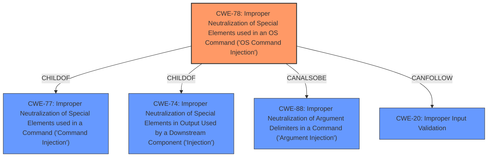

# Raw Analyzer Response for CVE-2022-41955

# Summary
| CWE ID | CWE Name | Confidence | CWE Abstraction Level | CWE Vulnerability Mapping Label | CWE-Vulnerability Mapping Notes |
|---|---|---|---|---|---|
| CWE-78 | Improper Neutralization of Special Elements used in an OS Command ('OS Command Injection') | 1 | Base | Allowed | Primary CWE |
| CWE-20 | Improper Input Validation | 0.6 | Class | Allowed-with-Review | Secondary CWE Candidate |

## Evidence and Confidence

*   **Confidence Score:** 0.9
*   **Evidence Strength:** HIGH

## Relationship Analysis
The primary relationship is that CWE-78 is a base-level CWE, which makes it more specific than its parent class CWE-77.
CWE-78 is also related to CWE-74 (Improper Neutralization of Special Elements in Output Used by a Downstream Component ('Injection')), as it is a child of it. This indicates that command injection is a specific type of injection.
CWE-78 can also be related to CWE-88 (Improper Neutralization of Argument Delimiters in a Command ('Argument Injection')), which is another type of injection.

## Vulnerability Chain
The vulnerability chain starts with **improper input validation** (potentially CWE-20), leading to **OS command injection** (CWE-78), which results in **remote code execution**.

## Summary of Analysis
The analysis indicates a clear case of **OS command injection** (CWE-78). The root cause is the **lack of proper sanitization** of the `max_lines` and `language_selection` parameters, which allows an attacker to inject arbitrary shell commands. This is directly supported by the "CVE Reference Links Content Summary," which states that the "root cause is an **uncontrolled command line injection** vulnerability" and emphasizes the "lack of input sanitization." The impact is remote code execution, further solidifying this classification.

The high retriever score for CWE-78 and its base-level abstraction make it the most appropriate choice. Other CWEs like CWE-79 (Cross-site Scripting) and CWE-1336 (Improper Neutralization of Special Elements Used in a Template Engine) were considered but deemed less relevant because the vulnerability is not related to web page generation or template engine usage, but to OS command construction.

The selection of CWE-78 is based on the provided evidence and the CWE specifications, which align with the **uncontrolled command line injection** vulnerability described.

CWE-20 (Improper Input Validation) was considered because the **lack of input sanitization** is a contributing factor to the vulnerability. While not as specific as CWE-78 (OS Command Injection), it represents the broader class of errors that led to the command injection. However, since the primary weakness is the command injection itself, CWE-78 is the more accurate and specific mapping.

Relevant CWE Information:
# Enhanced Context (25 CWEs)
The following CWEs were identified as potentially relevant to this vulnerability:

## CWE-78: Improper Neutralization of Special Elements used in an OS Command ('OS Command Injection')
**Abstraction Level**: Base
**Similarity Score**: 0.163
**Source**: sparse

**Description**:
The product constructs all or part of an OS command using externally-influenced input from an upstream component, but it does not neutralize or incorrectly neutralizes special elements that could modify the intended OS command when it is sent to a downstream component.

## CWE-20: Improper Input Validation
**Abstraction Level**: Class
**Similarity Score**: N/A
**Source**: N/A

**Description**:
The product receives input or data, but it does not validate or incorrectly validates that the input has the properties that are required to process the data safely and correctly.

CWE-78 is the primary cause and CWE-20 is the secondary cause.