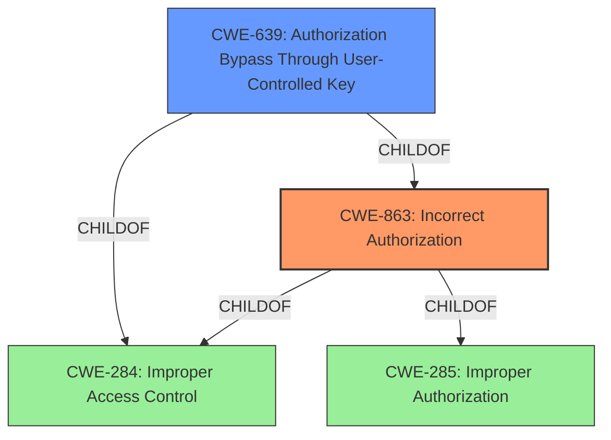

# Enhanced Analysis for CVE-2022-41962

# Summary
| CWE ID  | CWE Name                            | Confidence | CWE Abstraction Level | CWE Vulnerability Mapping Label | CWE-Vulnerability Mapping Notes |
| :-------- | :---------------------------------- | :--------- | :-------------------- | :------------------------------ | :------------------------------ |
| CWE-863   | Incorrect Authorization             | 0.9        | Class                 | Primary                       | Allowed-with-Review             |
| CWE-639   | Authorization Bypass Through User-Controlled Key | 0.7        | Base                  | Secondary                       | Allowed            |

## Evidence and Confidence

*   **Confidence Score:** 0.8
*   **Evidence Strength:** HIGH

## Relationship Analysis
The primary CWE, CWE-863 **Incorrect Authorization**, is a class-level CWE with two parent CWEs, CWE-284 **Improper Access Control** and CWE-285 **Improper Authorization**. The secondary CWE, CWE-639 **Authorization Bypass Through User-Controlled Key**, is a base-level CWE and a child of CWE-863 **Incorrect Authorization** and CWE-284 **Improper Access Control**.



## Vulnerability Chain
The vulnerability chain starts with an **incorrect authorization** mechanism (CWE-863), which allows a moderator to set arbitrary emoji statuses for other users. This can be seen as an **authorization bypass through user-controlled key** (CWE-639) because the moderator is using the "clear status" feature (a key) in an unintended way due to the **incorrect authorization**.

## Summary of Analysis
The vulnerability is due to **incorrect authorization** in the BigBlueButton application, where a moderator can set any emoji status for other users instead of only clearing the status. The primary CWE is CWE-863 **Incorrect Authorization** because the system performs an authorization check (moderator privileges), but the check is not correctly implemented. This allows the moderator to perform actions they should not be authorized to do. The secondary CWE is CWE-639 **Authorization Bypass Through User-Controlled Key** because the moderator is using a feature (`clear status`) as a key to bypass the intended authorization.

The selection of CWE-863 **Incorrect Authorization** is supported by the vulnerability description, which explicitly states **"Incorrect Authorization for setting emoji status"**. The CVE Reference Links Content Summary also mentions **"Improper access control in setting emoji status."**

CWE-284 **Improper Access Control** was considered but not chosen as the primary CWE because it is a very high-level "Pillar" CWE, and more specific CWEs like CWE-863 **Incorrect Authorization** are more appropriate. CWE-285 **Improper Authorization** was also considered, but it is discouraged, and CWE-863 **Incorrect Authorization**, a child of CWE-285 **Improper Authorization**, is a better fit.

The final selection of CWE-863 **Incorrect Authorization** and CWE-639 **Authorization Bypass Through User-Controlled Key** provides a comprehensive and accurate representation of the vulnerability, addressing both the **incorrect authorization** mechanism and the potential for **authorization bypass**. The chosen CWEs are at the optimal level of specificity, with CWE-863 **Incorrect Authorization** as the Class and CWE-639 **Authorization Bypass Through User-Controlled Key** as the Base.


## CWE Relationship Analysis

Current CWEs represent these abstraction levels: .


### Vulnerability Chain Analysis

**Chain starting from CWE-285:**
- 285 (Improper Authorization) - ROOT


**Chain starting from CWE-639:**
- 639 (Authorization Bypass Through User-Controlled Key) - ROOT


### CWE Relationship Diagram

```mermaid
graph TD
    classDef primary fill:#f96,stroke:#333,stroke-width:2px
    classDef secondary fill:#69f,stroke:#333
    classDef tertiary fill:#9e9,stroke:#333
```