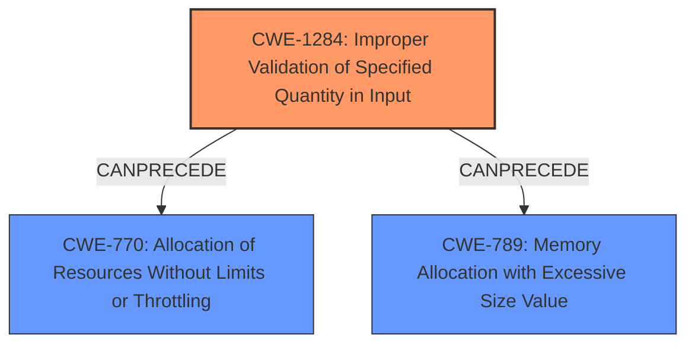

# Raw Analyzer Response for CVE-2022-41968

# Summary

| CWE ID    | CWE Name                                                                 | Confidence | CWE Abstraction Level | CWE Vulnerability Mapping Label | CWE-Vulnerability Mapping Notes |
| :-------- | :----------------------------------------------------------------------- | :--------- | :-------------------- | :------------------------------ | :---------------------------- |
| CWE-1284  | Improper Validation of Specified Quantity in Input                       | 0.9        | Base                  | Primary                         | Allowed                     |
| CWE-770  | Allocation of Resources Without Limits or Throttling                         | 0.7        | Base                  | Secondary                         | Allowed                     |

## Evidence and Confidence

*   **Confidence Score:** 0.8
*   **Evidence Strength:** HIGH

## Relationship Analysis

The primary relationship that influenced the choice of CWEs is the CANPRECEDE relationship between CWE-1284 and CWE-770/CWE-789. CWE-1284 describes the **improper validation of a quantity in input**, which in this case is the calendar name length. Because the length is not validated, this can lead to **excessive resource allocation (CWE-770)** or memory allocation with excessive size value (**CWE-789**). In this case, excessive resource allocation is a better fit than excessive memory allocation.

## Vulnerability Chain

The vulnerability chain starts with the **lack of validation** of the calendar name length (**CWE-1284**). This leads to the ability to send unnecessary amounts of data against the database, potentially causing **excessive resource allocation (CWE-770)**, leading to potential database overload and performance degradation.

## Summary of Analysis

The initial analysis focused on the **root cause**, which is the **lack of validation** of calendar name lengths before writing to the database. The provided evidence is strong, with the "Vulnerability Description Key Phrases" explicitly stating "**calendar name lengths are not validated**" as the root cause. The "CVE Reference Links Content Summary" also supports this, stating "**Improper Input Validation**: The application fails to validate the length of calendar names before persisting them in the database."

The retriever results suggested CWE-1284 (Improper Validation of Specified Quantity in Input) as a potential match, which aligns with the **lack of validation of calendar name lengths**. CWE-789 (Memory Allocation with Excessive Size Value) and CWE-770 (Allocation of Resources Without Limits or Throttling) were also considered because the attacker can send unnecessary amounts of data to the database.

The graph relationships show that CWE-1284 can precede CWE-789 and CWE-770. This means that **improper validation of the input quantity** can lead to **excessive memory allocation** or **resource allocation without limits**, which is the case in this vulnerability.

The final decision was to select CWE-1284 as the primary CWE because it directly represents the **root cause of the vulnerability**: the **lack of validation** of the calendar name length. CWE-770 was selected as the secondary CWE because the **lack of input validation** leads to a potential resource consumption issue. These CWEs are at the base level of specificity, which is the optimal level for representing the vulnerability.

CWE-789 was considered but not used because it focuses specifically on memory allocation, while the vulnerability description mentions sending unnecessary amounts of data against the database, which is a more general resource allocation issue.
CWE-93 was considered but not used because the vulnerability description did not mention CRLF Injection.
CWE-639 was considered but not used because the authorization process was not mentioned in the vulnerability description.

Relevant CWE Information:

# Enhanced Context (25 CWEs)

## CWE-23: Relative Path Traversal
**Abstraction Level**: Base
**Similarity Score**: 0.81
**Source**: dense

**Description**:
The product uses external input to construct a pathname that should be within a restricted directory, but it does not properly neutralize sequences such as ".." that can resolve to a location that is outside of that directory.

**Mapping Guidance**:
- Usage: Allowed
- Rationale: This CWE entry is at the Base level of abstraction, which is a preferred level of abstraction for mapping to the root causes of vulnerabilities.

## CWE-41: Improper Resolution of Path Equivalence
**Abstraction Level**: Base
**Similarity Score**: 0.79
**Source**: dense

**Description**:
The product is vulnerable to file system contents disclosure through path equivalence. Path equivalence involves the use of special characters in file and directory names. The associated manipulations are intended to generate multiple names for the same object.

**Mapping Guidance**:
- Usage: Allowed
- Rationale: This CWE entry is at the Base level of abstraction, which is a preferred level of abstraction for mapping to the root causes of vulnerabilities.

## CWE-36: Absolute Path Traversal
**Abstraction Level**: Base
**Similarity Score**: 0.79
**Source**: dense

**Description**:
The product uses external input to construct a pathname that should be within a restricted directory, but it does not properly neutralize absolute path sequences such as "/abs/path" that can resolve to a location that is outside of that directory.

**Mapping Guidance**:
- Usage: Allowed
- Rationale: This CWE entry is at the Base level of abstraction, which is a preferred level of abstraction for mapping to the root causes of vulnerabilities.

## CWE-59: Improper Link Resolution Before File Access ('Link Following')
**Abstraction Level**: Base
**Similarity Score**: 0.78
**Source**: dense

**Description**:
The product attempts to access a file based on the filename, but it does not properly prevent that filename from identifying a link or shortcut that resolves to an unintended resource.

**Mapping Guidance**:
- Usage: Allowed
- Rationale: This CWE entry is at the Base level of abstraction, which is a preferred level of abstraction for mapping to the root causes of vulnerabilities.

## CWE-73: External Control of File Name or Path
**Abstraction Level**: Base
**Similarity Score**: 0.78
**Source**: dense

**Description**:
The product allows user input to control or influence paths or file names that are used in filesystem operations.

**Mapping Guidance**:
- Usage: Allowed
- Rationale: This CWE entry is at the Base level of abstraction, which is a preferred level of abstraction for mapping to the root causes of vulnerabilities.

## CWE-538: Insertion of Sensitive Information into Externally-Accessible File or Directory
**Abstraction Level**: Base
**Similarity Score**: 0.78
**Source**: dense

**Description**:
The product places sensitive information into files or directories that are accessible to actors who are allowed to have access to the files, but not to the sensitive information.

**Mapping Guidance**:
- Usage: Allowed
- Rationale: This CWE entry is at the Base level of abstraction, which is a preferred level of abstraction for mapping to the root causes of vulnerabilities.

## CWE-74: Improper Neutralization of Special Elements in Output Used by a Downstream Component ('Injection')
**Abstraction Level**: Class
**Similarity Score**: 0.77
**Source**: dense

**Description**:
The product constructs all or part of a command, data structure, or record using externally-influenced input from an upstream component, but it does not neutralize or incorrectly neutralizes special elements that could modify how it is parsed or interpreted when it is sent to a downstream component.

**Mapping Guidance**:
- Usage: Discouraged
- Rationale: CWE-74 is high-level and often misused when lower-level weaknesses are more appropriate.

## CWE-668: Exposure of Resource to Wrong Sphere
**Abstraction Level**: Class
**Similarity Score**: 0.77
**Source**: dense

**Description**:
The product exposes a resource to the wrong control sphere, providing unintended actors with inappropriate access to the resource.

**Mapping Guidance**:
- Usage: Discouraged
- Rationale: CWE-668 is high-level and is often misused as a catch-all when lower-level CWE IDs might be applicable. It is sometimes used for low-information vulnerability reports [REF-1287]. It is a level-1 Class (i.e., a child of a Pillar). It is not useful for trend analysis.

## CWE-212: Improper Removal of Sensitive Information Before Storage or Transfer
**Abstraction Level**: Base
**Similarity Score**: 0.77
**Source**: dense

**Description**:
The product stores, transfers, or shares a resource that contains sensitive information, but it does not