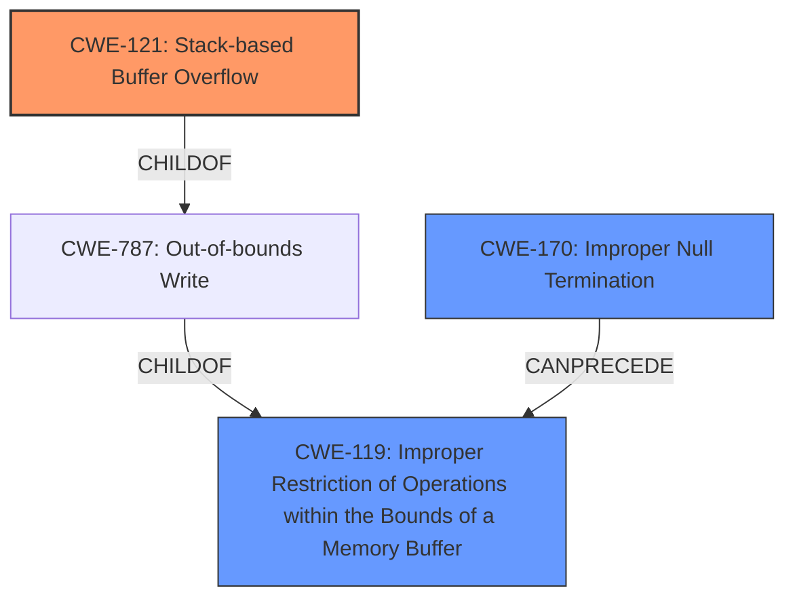

# Raw Analyzer Response for CVE-2022-41981

# Summary
| CWE ID | CWE Name | Confidence | CWE Abstraction Level | CWE Vulnerability Mapping Label | CWE-Vulnerability Mapping Notes |
|---|---|---|---|---|---|
| CWE-121 | Stack-based Buffer Overflow | 1.0 | Variant | Allowed | Primary CWE |
| CWE-119 | Improper Restriction of Operations within the Bounds of a Memory Buffer | 0.75 | Class | Discouraged | Secondary Candidate |
| CWE-170 | Improper Null Termination | 0.6 | Base | Allowed | Secondary Candidate |

## Evidence and Confidence

*   **Confidence Score:** 0.9
*   **Evidence Strength:** HIGH

## Relationship Analysis
The primary CWE is CWE-121 (Stack-based Buffer Overflow), which is a variant of CWE-787 (Out-of-bounds Write) and CWE-788, both of which are children of CWE-119 (Improper Restriction of Operations within the Bounds of a Memory Buffer). CWE-170 (Improper Null Termination) can lead to out-of-bounds reads due to functions like strlen, potentially preceding CWE-119. The relationship analysis guided the selection of the most specific CWE, which is CWE-121, while also acknowledging the broader class CWE-119 and the related CWE-170.

## Vulnerability Chain
The vulnerability chain starts with **missing null termination** (CWE-170), leading to the use of `strlen` on a non-null-terminated buffer, causing an out-of-bounds read. Subsequently, `sprintf` is used at `buf[strlen(buf)]`, which can lead to an **out-of-bounds write** (CWE-787) on the stack, specifically a **stack-based buffer overflow** (CWE-121). The final impact is arbitrary code execution.

## Summary of Analysis
The initial assessment identified the vulnerability as a stack-based buffer overflow. The "Vulnerability Description Key Phrases" clearly indicates "**stack-based buffer overflow**" as a root cause and "arbitrary code execution" as an impact. The "CVE Reference Links Content Summary" confirms that the root cause is indeed a stack-based buffer overflow due to **missing null termination** and subsequent out-of-bounds read and write.

The Retriever Results listed CWE-119, CWE-190, CWE-125, CWE-193, and CWE-121 among the top candidates. While CWE-119 is a broader class, the description explicitly points to a stack-based buffer overflow, making CWE-121 the most specific and appropriate choice. The analysis of the vulnerability chain and the evidence from the vulnerability description strongly support this conclusion.

The relationship analysis also solidifies the decision. CWE-121 is a variant of CWE-787 (Out-of-bounds Write), which is a child of CWE-119. Choosing CWE-121 provides the most detailed and accurate representation of the vulnerability.

The final decision is based on the provided evidence, the vulnerability chain, and the relationship analysis. CWE-121 is at the optimal level of specificity, accurately representing the root cause as a stack-based buffer overflow.

Relevant CWE Information:

# Enhanced Context (25 CWEs)
The following CWEs were identified as potentially relevant to this vulnerability:

## CWE-131: Incorrect Calculation of Buffer Size
**Abstraction Level**: Base
**Similarity Score**: 0.78
**Source**: dense

**Description**:
The product does not correctly calculate the size to be used when allocating a buffer, which could lead to a buffer overflow.
*NOT USED*: The description does not indicate an incorrect calculation of buffer size.

## CWE-191: Integer Underflow (Wrap or Wraparound)
**Abstraction Level**: Base
**Similarity Score**: 0.77
**Source**: dense

**Description**:
The product subtracts one value from another, such that the result is less than the minimum allowable integer value, which produces a value that is not equal to the correct result.
*NOT USED*: Integer underflow is not indicated in the description.

## CWE-125: Out-of-bounds Read
**Abstraction Level**: Base
**Similarity Score**: 0.77
**Source**: dense

**Description**:
The product reads data past the end, or before the beginning, of the intended buffer.
*NOT USED*: While an out-of-bounds read occurs, it's a consequence of the missing null termination which leads to strlen reading past the end of the buffer. CWE-121 is a more encompassing description.

## CWE-129: Improper Validation of Array Index
**Abstraction Level**: Variant
**Similarity Score**: 0.76
**Source**: dense

**Description**:
The product uses untrusted input when calculating or using an array index, but the product does not validate or incorrectly validates the index to ensure the index references a valid position within the array.
*NOT USED*: There is no array index involved.

## CWE-805: Buffer Access with Incorrect Length Value
**Abstraction Level**: Base
**Similarity Score**: 0.76
**Source**: dense

**Description**:
The product uses a sequential operation to read or write a buffer, but it uses an incorrect length value that causes it to access memory that is outside of the bounds of the buffer.
*NOT USED*: The root cause is the missing null termination not an incorrect length value.

## CWE-126: Buffer Over-read
**Abstraction Level**: Variant
**Similarity Score**: 0.75
**Source**: dense

**Description**:
The product reads from a buffer using buffer access mechanisms such as indexes or pointers that reference memory locations after the targeted buffer.
*NOT USED*: While an out-of-bounds read occurs, it's a consequence of the missing null termination, which leads to strlen reading past the end of the buffer. CWE-121 is a more encompassing description.

## CWE-193: Off-by-one Error
**Abstraction Level**: Base
**Similarity Score**: 0.75
**Source**: dense

**Description**:
A product calculates or uses an incorrect maximum or minimum value that is 1 more, or 1 less, than the correct value.
*NOT USED*: There is no off-by-one error.

## CWE-124: Buffer Underwrite ('Buffer Underflow')
**Abstraction Level**: Base
**Similarity Score**: 0.75
**Source**: dense

**Description**:
The product writes to a buffer using an index or pointer that references a memory location prior to the beginning of the buffer.
*NOT USED*: There is no buffer underwrite.

## CWE-197: Numeric Truncation Error
**Abstraction Level**: Base
**Similarity Score**: 0.75
**Source**: dense

**Description**:
Truncation errors occur when a primitive is cast to a primitive of a smaller size and data is lost in the conversion.
*NOT USED*: There is no numeric truncation.

## CWE-681: Incorrect Conversion between Numeric Types
**Abstraction Level**: Base
**Similarity Score**: 0.75
**Source**: dense

**Description**:
When converting from one data type to another, such as long to integer, data can be omitted or translated in a way that produces unexpected values. If the resulting values are used in a sensitive context, then dangerous behaviors may occur.
*NOT USED*: There is no conversion between numeric types.

## CWE-190: Integer Overflow or Wraparound
**Abstraction Level**: Base
**Similarity Score**: 7506.23
**Source**: sparse

**Description**:
The product performs a calculation that can
         produce an integer overflow or wraparound when the logic
         assumes that the resulting value will always be larger than
         the original value. This occurs when an integer value is
         incremented to a value that is too large to store in the
         associated representation. When this occurs, the value may
         become a very small or negative number.
*NOT USED*: There is no integer overflow.

## CWE-125: Out-of-bounds Read
**Abstraction Level**: Base
**Similarity Score**: 7221.46
**Source**: sparse

**Description**:
The product