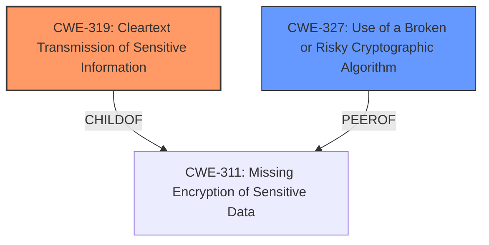

# Enhanced Analysis for CVE-2022-41983

# Summary
| CWE ID  | CWE Name                                                     | Confidence | CWE Abstraction Level | CWE Vulnerability Mapping Label | CWE-Vulnerability Mapping Notes |
| :-------- | :----------------------------------------------------------- | :--------- | :-------------------- | :------------------------------ | :------------------------------ |
| CWE-319 | Cleartext Transmission of Sensitive Information            | 0.9        | Base                  | Primary CWE                     | Allowed                       |
| CWE-327 | Use of a Broken or Risky Cryptographic Algorithm | 0.6        | Class                  | Secondary Candidate                     | Allowed-with-Review                       |

## Evidence and Confidence

*   **Confidence Score:** 0.75
*   **Evidence Strength:** MEDIUM

## Relationship Analysis
The primary relationship influencing the CWE selection is that CWE-319 "Cleartext Transmission of Sensitive Information" is a base-level CWE, which is preferred for mapping. Additionally, it has a ChildOf relationship with CWE-311 "Missing Encryption of Sensitive Data", indicating that the vulnerability stems from a lack of encryption, ultimately leading to the data being transmitted in cleartext. The secondary CWE, CWE-327, while relevant due to the mention of cryptographic algorithms, is a Class-level CWE and less specific.



## Vulnerability Chain
The vulnerability chain starts with an undisclosed condition related to the use of Intel QAT and AES-GCM/CCM cipher. This leads to the **impact** of BIG-IP sending data unencrypted even with an SSL profile applied. The **weakness** is the **failure to properly encrypt data** before transmission. The chain is: Undisclosed Condition + Intel QAT/AES-GCM/CCM Usage -> **Missing Encryption** -> CWE-319 Cleartext Transmission

## Summary of Analysis
The initial assessment, based on the vulnerability description, points towards CWE-319 "Cleartext Transmission of Sensitive Information" as the primary weakness. The description states that under certain conditions, "BIG-IP to send data unencrypted even with an SSL Profile applied." This directly indicates that sensitive information is being transmitted in cleartext.

The secondary candidate, CWE-327 "Use of a Broken or Risky Cryptographic Algorithm", is considered because the vulnerability involves cryptographic algorithms (AES-GCM/CCM). However, the description does not explicitly state that the algorithm itself is broken or risky, but rather that the data is being sent unencrypted despite the presence of an SSL profile. This suggests a configuration or implementation issue rather than a flaw in the algorithm itself.

The evidence from the vulnerability description key phrases supports this:
- **impact:** send data unencrypted

The relationship graph further supports the selection of CWE-319, as it is a base-level weakness that directly describes the observed behavior.

The final decision is to assign CWE-319 as the primary CWE because it precisely describes the vulnerability's core issue: the transmission of sensitive data in cleartext. This is a direct consequence of the described conditions where encryption is expected but not occurring. The level of specificity is optimal as it focuses on the observable outcome of the vulnerability. While CWE-327 is a plausible secondary factor given the involvement of cryptographic algorithms, the lack of explicit evidence indicating a flaw in the algorithm itself makes it a less direct fit.
Relevant CWE Information:

# Enhanced Context (25 CWEs)
The following CWEs were identified as potentially relevant to this vulnerability:

## CWE-1289: Improper Validation of Unsafe Equivalence in Input
**Abstraction Level**: Base
**Similarity Score**: 0.79
**Source**: dense

**Description**:
The product receives an input value that is used as a resource identifier or other type of reference, but it does not validate or incorrectly validates that the input is equivalent to a potentially-unsafe value.

**Mapping Guidance**:
- Usage: Allowed
- Rationale: This CWE entry is at the Base level of abstraction, which is a preferred level of abstraction for mapping to the root causes of vulnerabilities.

## CWE-807: Reliance on Untrusted Inputs in a Security Decision
**Abstraction Level**: Base
**Similarity Score**: 0.76
**Source**: dense

**Description**:
The product uses a protection mechanism that relies on the existence or values of an input, but the input can be modified by an untrusted actor in a way that bypasses the protection mechanism.

**Mapping Guidance**:
- Usage: Allowed
- Rationale: This CWE entry is at the Base level of abstraction, which is a preferred level of abstraction for mapping to the root causes of vulnerabilities.

## CWE-226: Sensitive Information in Resource Not Removed Before Reuse
**Abstraction Level**: Base
**Similarity Score**: 0.76
**Source**: dense

**Description**:
The product releases a resource such as memory or a file so that it can be made available for reuse, but it does not clear or "zeroize" the information contained in the resource before the product performs a critical state transition or makes the resource available for reuse by other entities.

**Mapping Guidance**:
- Usage: Allowed
- Rationale: This CWE entry is at the Base level of abstraction, which is a preferred level of abstraction for mapping to the root causes of vulnerabilities.

## CWE-799: Improper Control of Interaction Frequency
**Abstraction Level**: Class
**Similarity Score**: 0.75
**Source**: dense

**Description**:
The product does not properly limit the number or frequency of interactions that it has with an actor, such as the number of incoming requests.

**Mapping Guidance**:
- Usage: Allowed-with-Review
- Rationale: This CWE entry is a Class and might have Base-level children that would be more appropriate

## CWE-1288: Improper Validation of Consistency within Input
**Abstraction Level**: Base
**Similarity Score**: 0.75
**Source**: dense

**Description**:
The product receives a complex input with multiple elements or fields that must be consistent with each other, but it does not validate or incorrectly validates that the input is actually consistent.

**Mapping Guidance**:
- Usage: Allowed
- Rationale: This CWE entry is at the Base level of abstraction, which is a preferred level of abstraction for mapping to the root causes of vulnerabilities.

## CWE-703: Improper Check or Handling of Exceptional Conditions
**Abstraction Level**: Pillar
**Similarity Score**: 0.75
**Source**: dense

**Description**:
The product does not properly anticipate or handle exceptional conditions that rarely occur during normal operation of the product.

**Mapping Guidance**:
- Usage: Discouraged
- Rationale: This CWE entry is extremely high-level, a Pillar.

## CWE-404: Improper Resource Shutdown or Release
**Abstraction Level**: Class
**Similarity Score**: 0.75
**Source**: dense

**Description**:
The product does not release or incorrectly releases a resource before it is made available for re-use.

**Mapping Guidance**:
- Usage: Allowed-with-Review
- Rationale: This CWE entry is a Class and might have Base-level children that would be more appropriate

## CWE-606: Unchecked Input for Loop Condition
**Abstraction Level**: Base
**Similarity Score**: 0.75
**Source**: dense

**Description**:
The product does not properly check inputs that are used for loop conditions, potentially leading to a denial of service or other consequences because of excessive looping.

**Mapping Guidance**:
- Usage: Allowed
- Rationale: This CWE entry is at the Base level of abstraction, which is a preferred level of abstraction for mapping to the root causes of vulnerabilities.

## CWE-1286: Improper Validation of Syntactic Correctness of Input
**Abstraction Level**: Base
**Similarity Score**: 0.75
**Source**: dense

**Description**:
The product receives input that is expected to be well-formed - i.e., to comply with a certain syntax - but it does not validate or incorrectly validates that the input complies with the syntax.

**Mapping Guidance**:
- Usage: Allowed
- Rationale: This CWE entry is at the Base level of abstraction, which is a preferred level of abstraction for mapping to the root causes of vulnerabilities.

## CWE-668: Exposure of Resource to Wrong Sphere
**Abstraction Level**: Class
**Similarity Score**: 0.75
**Source**: dense

**Description**:
The product exposes a resource to the wrong control sphere, providing unintended actors with inappropriate access to the resource.

**Mapping Guidance**:
- Usage: Discouraged
- Rationale: CWE-668 is high-level and is often misused as a catch-all when lower-level CWE IDs might


## CWE Relationship Analysis

Current CWEs represent these abstraction levels: .


### Vulnerability Chain Analysis

**Chain starting from CWE-327:**
- 327 (Use of a Broken or Risky Cryptographic Algorithm) - ROOT


**Chain starting from CWE-319:**
- 319 (Cleartext Transmission of Sensitive Information) - ROOT


### CWE Relationship Diagram

```mermaid
graph TD
    classDef primary fill:#f96,stroke:#333,stroke-width:2px
    classDef secondary fill:#69f,stroke:#333
    classDef tertiary fill:#9e9,stroke:#333
```