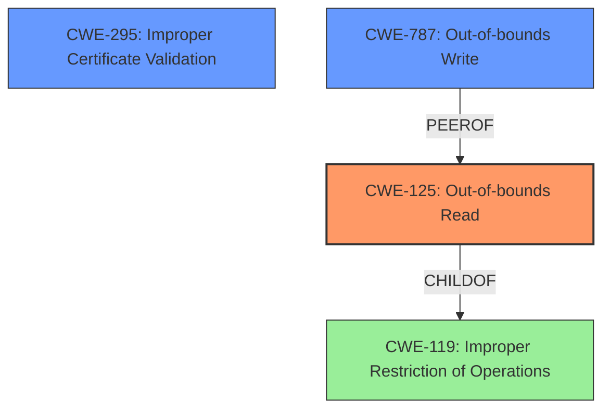

# Enhanced Analysis for CVE-2022-4203

# Summary
| CWE ID | CWE Name | Confidence | CWE Abstraction Level | CWE Vulnerability Mapping Label | CWE-Vulnerability Mapping Notes |
|---|---|---|---|---|---|
| CWE-125 | Out-of-bounds Read | 0.9 | Base | Allowed | Primary CWE: The vulnerability is a read buffer overrun, which is a type of out-of-bounds read. |
| CWE-295 | Improper Certificate Validation | 0.7 | Base | Allowed | Secondary CWE: The vulnerability occurs during X.509 certificate verification, indicating an issue with certificate validation. |
| CWE-787 | Out-of-bounds Write | 0.6 | Base | Allowed | Secondary CWE: The description mentions memory corruption caused by a buffer overflow, which could potentially lead to an out-of-bounds write, although the primary symptom is an out-of-bounds read. |
| CWE-119 | Improper Restriction of Operations within the Bounds of a Memory Buffer | 0.5 | Class | Discouraged | Secondary CWE: This is a general class for buffer issues and less specific than CWE-125. |

## Evidence and Confidence

*   **Confidence Score:** 0.8
*   **Evidence Strength:** HIGH

## Relationship Analysis
The primary weakness is an out-of-bounds read (CWE-125), which is a specific type of improper restriction of operations within the bounds of a memory buffer (CWE-119). The vulnerability occurs during certificate validation (CWE-295). While the description mentions a read buffer overrun which might result in memory corruption or disclosure, the initial error stems from reading beyond buffer boundaries. Out-of-bounds write (CWE-787) is considered because the description mentions memory corruption due to buffer overflow, although the read is the primary action.



## Vulnerability Chain
The vulnerability chain starts with a type confusion in the `nc_match_single()` function, leading to an incorrect interpretation of data and ultimately resulting in a read buffer overrun.

Type Confusion -> Out-of-bounds Read (CWE-125) -> Potential Denial of Service or Memory Disclosure

## Summary of Analysis
The primary CWE is CWE-125 (Out-of-bounds Read) because the core issue is that the software reads data past the end of the intended buffer. This is supported by the vulnerability description, which states that a "read buffer overrun can be triggered". The "CVE Reference Links Content Summary" further details that "The type confusion leads to a read buffer overrun during X.509 certificate verification, specifically during name constraint checking."

CWE-295 (Improper Certificate Validation) is included because the vulnerability occurs during X.509 certificate verification, which falls under the domain of certificate validation.

CWE-787 (Out-of-bounds Write) is considered a secondary candidate because the description also states that the read buffer overrun "might result in a crash which could lead to a denial of service attack. In theory it could also result in the disclosure of private memory contents (such as private keys, or sensitive plaintext)". Although the primary action is a read, the potential memory corruption could involve writing to unintended memory locations.

CWE-119 (Improper Restriction of Operations within the Bounds of a Memory Buffer) is a more general classification and therefore less specific than CWE-125. It is included to show the broader category that the out-of-bounds read belongs to, but is not the primary focus.

The final selection is based on the evidence that the primary vulnerability is a read buffer overrun due to a type confusion during certificate verification, which can potentially lead to memory corruption and disclosure. CWE-125 accurately represents the root cause, while CWE-295 highlights the context, and CWE-787 represents the possible memory corruption impact.

Relevant CWE Information:
- **CWE-125: Out-of-bounds Read:** The product reads data past the end, or before the beginning, of the intended buffer. This directly matches the "read buffer overrun" described in the vulnerability.
- **CWE-295: Improper Certificate Validation:** The product does not validate, or incorrectly validates, a certificate. The vulnerability occurs in X.509 certificate verification.
- **CWE-787: Out-of-bounds Write:** The product writes to a memory location outside of the intended buffer. This is a possible consequence of the memory corruption that might occur due to the buffer overrun.
- **CWE-119: Improper Restriction of Operations within the Bounds of a Memory Buffer:** The product performs operations on a memory buffer, but it reads from or writes to a memory location outside the buffer's intended boundary. This is a broader classification that encompasses the out-of-bounds read.

CWEs considered but not used:
- CWE-120 (Buffer Copy without Checking Size of Input): This CWE is not applicable because the vulnerability is not related to copying a buffer without checking its size. It's a read buffer overrun caused by type confusion.
- CWE-121 (Stack-based Buffer Overflow): Although buffer overflows can be stack-based, the provided information doesn't specify the memory location of the buffer, so this is not the most accurate CWE.
- CWE-124 (Buffer Underwrite ('Buffer Underflow')): Although the vulnerability description mentions a **buffer underflow**, the content summary mentions a **read buffer overrun**, which is an Out-of-Bounds Read, not an Underwrite.
- CWE-347 (Improper Verification of Cryptographic Signature): While the vulnerability occurs in the context of certificate processing, the core issue isn't related to signature verification.


## CWE Relationship Analysis

Current CWEs represent these abstraction levels: .


### Vulnerability Chain Analysis

**Chain starting from CWE-347:**
- 347 (Improper Verification of Cryptographic Signature) - ROOT


**Chain starting from CWE-121:**
- 121 (Stack-based Buffer Overflow) - ROOT


### CWE Relationship Diagram

```mermaid
graph TD
    classDef primary fill:#f96,stroke:#333,stroke-width:2px
    classDef secondary fill:#69f,stroke:#333
    classDef tertiary fill:#9e9,stroke:#333
```