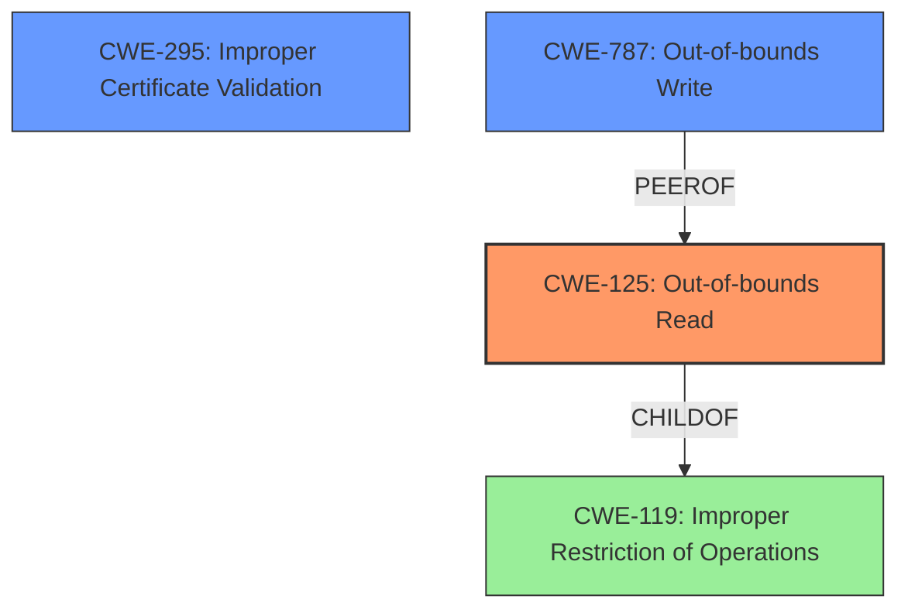

# Analysis for CVE-2022-4203

# Summary
| CWE ID | CWE Name | Confidence | CWE Abstraction Level | CWE Vulnerability Mapping Label | CWE-Vulnerability Mapping Notes |
|---|---|---|---|---|---|
| CWE-125 | Out-of-bounds Read | 0.9 | Base | Allowed | Primary CWE: The vulnerability is a read buffer overrun, which is a type of out-of-bounds read. |
| CWE-295 | Improper Certificate Validation | 0.7 | Base | Allowed | Secondary CWE: The vulnerability occurs during X.509 certificate verification, indicating an issue with certificate validation. |
| CWE-787 | Out-of-bounds Write | 0.6 | Base | Allowed | Secondary CWE: The description mentions memory corruption caused by a buffer overflow, which could potentially lead to an out-of-bounds write, although the primary symptom is an out-of-bounds read. |
| CWE-119 | Improper Restriction of Operations within the Bounds of a Memory Buffer | 0.5 | Class | Discouraged | Secondary CWE: This is a general class for buffer issues and less specific than CWE-125. |

## Evidence and Confidence

*   **Confidence Score:** 0.8
*   **Evidence Strength:** HIGH

## Relationship Analysis
The primary weakness is an out-of-bounds read (CWE-125), which is a specific type of improper restriction of operations within the bounds of a memory buffer (CWE-119). The vulnerability occurs during certificate validation (CWE-295). While the description mentions a read buffer overrun which might result in memory corruption or disclosure, the initial error stems from reading beyond buffer boundaries. Out-of-bounds write (CWE-787) is considered because the description mentions memory corruption due to buffer overflow, although the read is the primary action.

## Vulnerability Chain
The vulnerability chain starts with a type confusion in the `nc_match_single()` function, leading to an incorrect interpretation of data and ultimately resulting in a read buffer overrun.

Type Confusion -> Out-of-bounds Read (CWE-125) -> Potential Denial of Service or Memory Disclosure

## Summary of Analysis
The primary CWE is CWE-125 (Out-of-bounds Read) because the core issue is that the software reads data past the end of the intended buffer. This is supported by the vulnerability description, which states that a "read buffer overrun can be triggered". The "CVE Reference Links Content Summary" further details that "The type confusion leads to a read buffer overrun during X.509 certificate verification, specifically during name constraint checking."

CWE-295 (Improper Certificate Validation) is included because the vulnerability occurs during X.509 certificate verification, which falls under the domain of certificate validation.

CWE-787 (Out-of-bounds Write) is considered a secondary candidate because the description also states that the read buffer overrun "might result in a crash which could lead to a denial of service attack. In theory it could also result in the disclosure of private memory contents (such as private keys, or sensitive plaintext)". Although the primary action is a read, the potential memory corruption could involve writing to unintended memory locations.

CWE-119 (Improper Restriction of Operations within the Bounds of a Memory Buffer) is a more general classification and therefore less specific than CWE-125. It is included to show the broader category that the out-of-bounds read belongs to, but is not the primary focus.

The final selection is based on the evidence that the primary vulnerability is a read buffer overrun due to a type confusion during certificate verification, which can potentially lead to memory corruption and disclosure. CWE-125 accurately represents the root cause, while CWE-295 highlights the context, and CWE-787 represents the possible memory corruption impact.

Relevant CWE Information:
- **CWE-125: Out-of-bounds Read:** The product reads data past the end, or before the beginning, of the intended buffer. This directly matches the "read buffer overrun" described in the vulnerability.
- **CWE-295: Improper Certificate Validation:** The product does not validate, or incorrectly validates, a certificate. The vulnerability occurs in X.509 certificate verification.
- **CWE-787: Out-of-bounds Write:** The product writes to a memory location outside of the intended buffer. This is a possible consequence of the memory corruption that might occur due to the buffer overrun.
- **CWE-119: Improper Restriction of Operations within the Bounds of a Memory Buffer:** The product performs operations on a memory buffer, but it reads from or writes to a memory location outside the buffer's intended boundary. This is a broader classification that encompasses the out-of-bounds read.

CWEs considered but not used:
- CWE-120 (Buffer Copy without Checking Size of Input): This CWE is not applicable because the vulnerability is not related to copying a buffer without checking its size. It's a read buffer overrun caused by type confusion.
- CWE-121 (Stack-based Buffer Overflow): Although buffer overflows can be stack-based, the provided information doesn't specify the memory location of the buffer, so this is not the most accurate CWE.
- CWE-124 (Buffer Underwrite ('Buffer Underflow')): Although the vulnerability description mentions a **buffer underflow**, the content summary mentions a **read buffer overrun**, which is an Out-of-Bounds Read, not an Underwrite.
- CWE-347 (Improper Verification of Cryptographic Signature): While the vulnerability occurs in the context of certificate processing, the core issue isn't related to signature verification.

# Enhanced Query for CVE-2022-4203

## Vulnerability Description
A read buffer overrun can be triggered in X.509 certificate verification, specifically in name constraint checking. Note that this occurs after certificate chain signature verification and requires either a CA to have signed the malicious certificate or for the application to continue certificate verification despite failure to construct a path to a trusted issuer. The read buffer overrun might result in a crash which could lead to a denial of service attack. In theory it could also result in the disclosure of private memory contents (such as private keys, or sensitive plaintext) although we are not aware of any working exploit leading to memory contents disclosure as of the time of release of this advisory. In a TLS client, this can be triggered by connecting to a malicious server. In a TLS server, this can be triggered if the server requests client authentication and a malicious client connects.

### Vulnerability Description Key Phrases
- **rootcause:** **buffer underflow**
- **impact:** denial of service

## CVE Reference Links Content Summary
Based on the provided content, here's a breakdown of the vulnerability described in CVE-2022-4203:

**Root Cause of Vulnerability:**

*   The vulnerability stems from a type confusion in the `nc_match_single()` function within OpenSSL's X.509 name constraint checking implementation.
*   The function incorrectly assumes that if a `gen` (General Name) is an OtherName, then the `base` (base constraint) is always an `rfc822Name` constraint. This assumption is not always valid.
*   Specifically, if an end-entity certificate contains an OtherName SAN (Subject Alternative Name) of any type besides `SmtpUtf8Mailbox`, and the CA certificate contains a name constraint of OtherName (of any type), then `nc_email_eai` is invoked. This function incorrectly interprets the `base` OTHERNAME as an `ASN1_IA5STRING`.

**Weaknesses/Vulnerabilities Present:**

*   **Type Confusion:** The core issue is that the code doesn't correctly identify the type of the `base` parameter, leading to a misinterpretation of the data it holds.
*   **Read Buffer Overrun:** The type confusion leads to a read buffer overrun during X.509 certificate verification, specifically during name constraint checking. The `nc_email_eai` function attempts to read data from an address as if it were an ASN1_IA5STRING, when it is an arbitrary data that depends on the othername type.

**Impact of Exploitation:**

*   **Denial of Service (DoS):** The read buffer overrun can result in a crash, which could lead to a denial of service attack.
*   **Potential Memory Disclosure:** Although not confirmed with a working exploit at the time of advisory release, there is a theoretical possibility of disclosing private memory contents (e.g., private keys or sensitive plaintext) due to the memory corruption caused by the buffer overflow.

**Attack Vectors:**

*   **TLS Client:** A malicious server can trigger the vulnerability by sending a specially crafted certificate to a vulnerable TLS client during connection establishment.
*   **TLS Server:** A malicious client can trigger the vulnerability by connecting to a vulnerable TLS server that requests client authentication and providing a malicious certificate.
*  **Other scenarios** The vulnerability could also be triggered in scenarios that do not involve TLS if a certificate verification is performed with a vulnerable openssl version and a malformed certificate that triggers the type confusion.

**Required Attacker Capabilities/Position:**

*   The attacker needs to be able to present a malicious certificate to a vulnerable OpenSSL instance.
*   For a TLS client, the attacker needs to control the server the client connects to. For a TLS server, the attacker needs to be a client connecting to the server.
*   The malicious certificate needs to have specific properties: it must contain an OtherName SAN that is not `SmtpUtf8Mailbox`, and it must be checked against a CA certificate that has an OtherName type name constraint.
*   The attack occurs after the certificate chain signature verification, so the attacker's certificate needs to be signed by a CA or the application needs to continue the certificate verification despite not having a valid chain to a trusted issuer.

**Additional Notes:**

*   The vulnerability is considered to be of "Moderate" severity by OpenSSL but rated as "Critical" by GitHub.
*   The vulnerability affects OpenSSL versions 3.0.0 to 3.0.7. Versions 1.1.1 and 1.0.2 are not affected.
*   The fix involves correcting the type handling in the `nc_match_single` function.
*   The Gentoo security advisory indicates that OpenSSL versions prior to 3.0.10 are vulnerable.
*   The GitHub advisory for the `openssl-src` crate states that versions >=300.0.0 and <300.0.12 are affected.

In summary, CVE-2022-4203 is a type confusion vulnerability in OpenSSL's name constraint checking, which can lead to a read buffer overrun and potential DoS or memory disclosure. It can be exploited by a malicious server or client with a crafted certificate during TLS connections, or in other scenarios where certificate verification is performed, with a vulnerable openssl library.

## Retriever Results

### Top Combined Results

| Rank | CWE ID | Name | Abstraction | Usage  | Retrievers | Individual Scores |
|------|--------|------|-------------|-------|------------|-------------------|
| 1 | 125 | Out-of-bounds Read | Base | Allowed | sparse | 1.122 |
| 2 | 295 | Improper Certificate Validation | Base | Allowed | sparse | 0.967 |
| 3 | 119 | Improper Restriction of Operations within the Bounds of a Memory Buffer | Class | Discouraged | sparse | 0.893 |
| 4 | 121 | Stack-based Buffer Overflow | Variant | Allowed | sparse | 0.870 |
| 5 | 347 | Improper Verification of Cryptographic Signature | Base | Allowed | sparse | 0.863 |
| 6 | 124 | Buffer Underwrite ('Buffer Underflow') | Base | Allowed | dense | 0.600 |
| 7 | 120 | Buffer Copy without Checking Size of Input ('Classic Buffer Overflow') | Base | Allowed-with-Review | graph | 0.003 |
| 8 | 203 | Observable Discrepancy | Base | Allowed | sparse | 0.858 |
| 9 | 126 | Buffer Over-read | Variant | Allowed | sparse | 0.851 |
| 10 | 193 | Off-by-one Error | Base | Allowed | sparse | 0.850 |

# Complete CWE Specifications

## CWE-125: Out-of-bounds Read
**Abstraction:** Base
**Status:** Draft

### Description
The product reads data past the end, or before the beginning, of the intended buffer.

### Extended Description
Not provided

### Alternative Terms
OOB read: Shorthand for "Out of bounds" read

### Relationships
ChildOf -> CWE-119
ChildOf -> CWE-119
ChildOf -> CWE-119
ChildOf -> CWE-119

### Mapping Guidance
**Usage:** Allowed
**Rationale:** This CWE entry is at the Base level of abstraction, which is a preferred level of abstraction for mapping to the root causes of vulnerabilities.
**Comments:** Carefully read both the name and description to ensure that this mapping is an appropriate fit. Do not try to 'force' a mapping to a lower-level Base/Variant simply to comply with this preferred level of abstraction.
**Reasons:**
- Acceptable-Use

### Observed Examples
- **CVE-2023-1018:** The reference implementation code for a Trusted Platform Module does not implement length checks on data, allowing for an attacker to read 2 bytes past the end of a buffer.
- **CVE-2020-11899:** Out-of-bounds read in IP stack used in embedded systems, as exploited in the wild per CISA KEV.
- **CVE-2014-0160:** Chain: "Heartbleed" bug receives an inconsistent length parameter (CWE-130) enabling an out-of-bounds read (CWE-126), returning memory that could include private cryptographic keys and other sensitive data.

## CWE-295: Improper Certificate Validation
**Abstraction:** Base
**Status:** Draft

### Description
The product does not validate, or incorrectly validates, a certificate.

### Extended Description
When a certificate is invalid or malicious, it might allow an attacker to spoof a trusted entity by interfering in the communication path between the host and client. The product might connect to a malicious host while believing it is a trusted host, or the product might be deceived into accepting spoofed data that appears to originate from a trusted host.

### Alternative Terms
None

### Relationships
ChildOf -> CWE-287
ChildOf -> CWE-287
PeerOf -> CWE-322

### Mapping Guidance
**Usage:** Allowed
**Rationale:** This CWE entry is at the Base level of abstraction, which is a preferred level of abstraction for mapping to the root causes of vulnerabilities.
**Comments:** Carefully read both the name and description to ensure that this mapping is an appropriate fit. Do not try to 'force' a mapping to a lower-level Base/Variant simply to comply with this preferred level of abstraction.
**Reasons:**
- Acceptable-Use

### Observed Examples
- **CVE-2019-12496:** A Go framework for robotics, drones, and IoT devices skips verification of root CA certificates by default.
- **CVE-2014-1266:** chain: incorrect "goto" in Apple SSL product bypasses certificate validation, allowing Adversary-in-the-Middle (AITM) attack (Apple "goto fail" bug). CWE-705 (Incorrect Control Flow Scoping) -> CWE-561 (Dead Code) -> CWE-295 (Improper Certificate Validation) -> CWE-393 (Return of Wrong Status Code) -> CWE-300 (Channel Accessible by Non-Endpoint).
- **CVE-2021-22909:** Chain: router's firmware update procedure uses curl with "-k" (insecure) option that disables certificate validation (CWE-295), allowing adversary-in-the-middle (AITM) compromise with a malicious firmware image (CWE-494).

## CWE-119: Improper Restriction of Operations within the Bounds of a Memory Buffer
**Abstraction:** Class
**Status:** Stable

### Description
The product performs operations on a memory buffer, but it reads from or writes to a memory location outside the buffer's intended boundary. This may result in read or write operations on unexpected memory locations that could be linked to other variables, data structures, or internal program data.

### Extended Description
Not provided

### Alternative Terms
Buffer Overflow: This term has many different meanings to different audiences. From a CWE mapping perspective, this term should be avoided where possible. Some researchers, developers, and tools intend for it to mean "write past the end of a buffer," whereas others use the same term to mean "any read or write outside the boundaries of a buffer, whether before the beginning of the buffer or after the end of the buffer." Others could mean "any action after the end of a buffer, whether it is a read or write." Since the term is commonly used for exploitation and for vulnerabilities, it further confuses things.
buffer overrun: Some prominent vendors and researchers use the term "buffer overrun," but most people use "buffer overflow." See the alternate term for "buffer overflow" for context.
memory safety: Generally used for techniques that avoid weaknesses related to memory access, such as those identified by CWE-119 and its descendants. However, the term is not formal, and there is likely disagreement between practitioners as to which weaknesses are implicitly covered by the "memory safety" term.

### Relationships
ChildOf -> CWE-118
ChildOf -> CWE-20

### Mapping Guidance
**Usage:** Discouraged
**Rationale:** CWE-119 is commonly misused in low-information vulnerability reports when lower-level CWEs could be used instead, or when more details about the vulnerability are available.
**Comments:** Look at CWE-119's children and consider mapping to CWEs such as CWE-787: Out-of-bounds Write, CWE-125: Out-of-bounds Read, or others.
**Reasons:**
- Frequent Misuse

### Additional Notes
**[Applicable Platform]** 

It is possible in any programming languages without memory management support to attempt an operation outside of the bounds of a memory buffer, but the consequences will vary widely depending on the language, platform, and chip architecture.

### Observed Examples
- **CVE-2021-22991:** Incorrect URI normalization in application traffic product leads to buffer overflow, as exploited in the wild per CISA KEV.
- **CVE-2020-29557:** Buffer overflow in Wi-Fi router web interface, as exploited in the wild per CISA KEV.
- **CVE-2009-2550:** Classic stack-based buffer overflow in media player using a long entry in a playlist

## CWE-121: Stack-based Buffer Overflow
**Abstraction:** Variant
**Status:** Draft

### Description
A stack-based buffer overflow condition is a condition where the buffer being overwritten is allocated on the stack (i.e., is a local variable or, rarely, a parameter to a function).

### Extended Description
Not provided

### Alternative Terms
Stack Overflow: "Stack Overflow" is often used to mean the same thing as stack-based buffer overflow, however it is also used on occasion to mean stack exhaustion, usually a result from an excessively recursive function call. Due to the ambiguity of the term, use of stack overflow to describe either circumstance is discouraged.

### Relationships
ChildOf -> CWE-788
ChildOf -> CWE-787

### Mapping Guidance
**Usage:** Allowed
**Rationale:** This CWE entry is at the Variant level of abstraction, which is a preferred level of abstraction for mapping to the root causes of vulnerabilities.
**Comments:** Carefully read both the name and description to ensure that this mapping is an appropriate fit. Do not try to 'force' a mapping to a lower-level Base/Variant simply to comply with this preferred level of abstraction.
**Reasons:**
- Acceptable-Use

### Additional Notes
**[Other]** Stack-based buffer overflows can instantiate in return address overwrites, stack pointer overwrites or frame pointer overwrites. They can also be considered function pointer overwrites, array indexer overwrites or write-what-where condition, etc.

### Observed Examples
- **CVE-2021-35395:** Stack-based buffer overflows in SFK for wifi chipset used for IoT/embedded devices, as exploited in the wild per CISA KEV.

## CWE-347: Improper Verification of Cryptographic Signature
**Abstraction:** Base
**Status:** Draft

### Description
The product does not verify, or incorrectly verifies, the cryptographic signature for data.

### Extended Description
Not provided

### Alternative Terms
None

### Relationships
ChildOf -> CWE-345
ChildOf -> CWE-345

### Mapping Guidance
**Usage:** Allowed
**Rationale:** This CWE entry is at the Base level of abstraction, which is a preferred level of abstraction for mapping to the root causes of vulnerabilities.
**Comments:** Carefully read both the name and description to ensure that this mapping is an appropriate fit. Do not try to 'force' a mapping to a lower-level Base/Variant simply to comply with this preferred level of abstraction.
**Reasons:**
- Acceptable-Use

### Observed Examples
- **CVE-2002-1796:** Does not properly verify signatures for "trusted" entities.
- **CVE-2005-2181:** Insufficient verification allows spoofing.
- **CVE-2005-2182:** Insufficient verification allows spoofing.

## CWE-124: Buffer Underwrite ('Buffer Underflow')
**Abstraction:** Base
**Status:** Incomplete

### Description
The product writes to a buffer using an index or pointer that references a memory location prior to the beginning of the buffer.

### Extended Description
This typically occurs when a pointer or its index is decremented to a position before the buffer, when pointer arithmetic results in a position before the beginning of the valid memory location, or when a negative index is used.

### Alternative Terms
buffer underrun: Some prominent vendors and researchers use the term "buffer underrun". "Buffer underflow" is more commonly used, although both terms are also sometimes used to describe a buffer under-read (CWE-127).

### Relationships
ChildOf -> CWE-786
ChildOf -> CWE-787

### Mapping Guidance
**Usage:** Allowed
**Rationale:** This CWE entry is at the Base level of abstraction, which is a preferred level of abstraction for mapping to the root causes of vulnerabilities.
**Comments:** Carefully read both the name and description to ensure that this mapping is an appropriate fit. Do not try to 'force' a mapping to a lower-level Base/Variant simply to comply with this preferred level of abstraction.
**Reasons:**
- Acceptable-Use

### Additional Notes
**[Relationship]** This could be resultant from several errors, including a bad offset or an array index that decrements before the beginning of the buffer (see CWE-129).

### Observed Examples
- **CVE-2021-24018:** buffer underwrite in firmware verification routine allows code execution via a crafted firmware image
- **CVE-2002-2227:** Unchecked length of SSLv2 challenge value leads to buffer underflow.
- **CVE-2007-4580:** Buffer underflow from a small size value with a large buffer (length parameter inconsistency, CWE-130)

## CWE-120: Buffer Copy without Checking Size of Input ('Classic Buffer Overflow')
**Abstraction:** Base
**Status:** Incomplete

### Description
The product copies an input buffer to an output buffer without verifying that the size of the input buffer is less than the size of the output buffer, leading to a buffer overflow.

### Extended Description
A buffer overflow condition exists when a product attempts to put more data in a buffer than it can hold, or when it attempts to put data in a memory area outside of the boundaries of a buffer. The simplest type of error, and the most common cause of buffer overflows, is the "classic" case in which the product copies the buffer without restricting how much is copied. Other variants exist, but the existence of a classic overflow strongly suggests that the programmer is not considering even the most basic of security protections.

### Alternative Terms
Classic Buffer Overflow: This term was frequently used by vulnerability researchers during approximately 1995 to 2005 to differentiate buffer copies without length checks (which had been known about for decades) from other emerging weaknesses that still involved invalid accesses of buffers, as vulnerability researchers began to develop advanced exploitation techniques.
Unbounded Transfer

### Relationships
ChildOf -> CWE-119
ChildOf -> CWE-119
ChildOf -> CWE-119
ChildOf -> CWE-119
CanPrecede -> CWE-123
ChildOf -> CWE-20

### Mapping Guidance
**Usage:** Allowed-with-Review
**Rationale:** There are some indications that this CWE ID might be misused and selected simply because it mentions "buffer overflow" - an increasingly vague term. This CWE entry is only appropriate for "Buffer Copy" operations (not buffer reads), in which where there is no "Checking [the] Size of Input", and (by implication of the copy) writing past the end of the buffer.
**Comments:** If the vulnerability being analyzed involves out-of-bounds reads, then consider CWE-125 or descendants. For root cause analysis: if there is any input validation, consider children of CWE-20 such as CWE-1284. If there is a calculation error for buffer sizes, consider CWE-131 or similar.
**Reasons:**
- Frequent Misuse

### Additional Notes
**[Relationship]** At the code level, stack-based and heap-based overflows do not differ significantly, so there usually is not a need to distinguish them. From the attacker perspective, they can be quite different, since different techniques are required to exploit them.

**[Terminology]** Many issues that are now called "buffer overflows" are substantively different than the "classic" overflow, including entirely different bug types that rely on overflow exploit techniques, such as integer signedness errors, integer overflows, and format string bugs. This imprecise terminology can make it difficult to determine which variant is being reported.

### Observed Examples
- **CVE-2000-1094:** buffer overflow using command with long argument
- **CVE-1999-0046:** buffer overflow in local program using long environment variable
- **CVE-2002-1337:** buffer overflow in comment characters, when product increments a counter for a ">" but does not decrement for "<"

## CWE-203: Observable Discrepancy
**Abstraction:** Base
**Status:** Incomplete

### Description
The product behaves differently or sends different responses under different circumstances in a way that is observable to an unauthorized actor, which exposes security-relevant information about the state of the product, such as whether a particular operation was successful or not.

### Extended Description
Discrepancies can take many forms, and variations may be detectable in timing, control flow, communications such as replies or requests, or general behavior. These discrepancies can reveal information about the product's operation or internal state to an unauthorized actor. In some cases, discrepancies can be used by attackers to form a side channel.

### Alternative Terms
Side Channel Attack: Observable Discrepancies are at the root of side channel attacks.

### Relationships
ChildOf -> CWE-200
ChildOf -> CWE-200

### Mapping Guidance
**Usage:** Allowed
**Rationale:** This CWE entry is at the Base level of abstraction, which is a preferred level of abstraction for mapping to the root causes of vulnerabilities.
**Comments:** Carefully read both the name and description to ensure that this mapping is an appropriate fit. Do not try to 'force' a mapping to a lower-level Base/Variant simply to comply with this preferred level of abstraction.
**Reasons:**
- Acceptable-Use

### Observed Examples
- **CVE-2020-8695:** Observable discrepancy in the RAPL interface for some Intel processors allows information disclosure.
- **CVE-2019-14353:** Crypto hardware wallet's power consumption relates to total number of pixels illuminated, creating a side channel in the USB connection that allows attackers to determine secrets displayed such as PIN numbers and passwords
- **CVE-2019-10071:** Java-oriented framework compares HMAC signatures using String.equals() instead of a constant-time algorithm, causing timing discrepancies

## CWE-126: Buffer Over-read
**Abstraction:** Variant
**Status:** Draft

### Description
The product reads from a buffer using buffer access mechanisms such as indexes or pointers that reference memory locations after the targeted buffer.

### Extended Description
This typically occurs when the pointer or its index is incremented to a position beyond the bounds of the buffer or when pointer arithmetic results in a position outside of the valid memory location to name a few. This may result in exposure of sensitive information or possibly a crash.

### Alternative Terms
None

### Relationships
ChildOf -> CWE-125
ChildOf -> CWE-788

### Mapping Guidance
**Usage:** Allowed
**Rationale:** This CWE entry is at the Variant level of abstraction, which is a preferred level of abstraction for mapping to the root causes of vulnerabilities.
**Comments:** Carefully read both the name and description to ensure that this mapping is an appropriate fit. Do not try to 'force' a mapping to a lower-level Base/Variant simply to comply with this preferred level of abstraction.
**Reasons:**
- Acceptable-Use

### Additional Notes
**[Relationship]** These problems may be resultant from missing sentinel values (CWE-463) or trusting a user-influenced input length variable.

### Observed Examples
- **CVE-2022-1733:** Text editor has out-of-bounds read past end of line while indenting C code
- **CVE-2014-0160:** Chain: "Heartbleed" bug receives an inconsistent length parameter (CWE-130) enabling an out-of-bounds read (CWE-126), returning memory that could include private cryptographic keys and other sensitive data.
- **CVE-2009-2523:** Chain: product does not handle when an input string is not NULL terminated, leading to buffer over-read or heap-based buffer overflow.

## CWE-193: Off-by-one Error
**Abstraction:** Base
**Status:** Draft

### Description
A product calculates or uses an incorrect maximum or minimum value that is 1 more, or 1 less, than the correct value.

### Extended Description
Not provided

### Alternative Terms
off-by-five: An "off-by-five" error was reported for sudo in 2002 (CVE-2002-0184), but that is more like a "length calculation" error.

### Relationships
ChildOf -> CWE-682
ChildOf -> CWE-682
CanPrecede -> CWE-617
CanPrecede -> CWE-170
CanPrecede -> CWE-119

### Mapping Guidance
**Usage:** Allowed
**Rationale:** This CWE entry is at the Base level of abstraction, which is a preferred level of abstraction for mapping to the root causes of vulnerabilities.
**Comments:** Carefully read both the name and description to ensure that this mapping is an appropriate fit. Do not try to 'force' a mapping to a lower-level Base/Variant simply to comply with this preferred level of abstraction.
**Reasons:**
- Acceptable-Use

### Additional Notes
**[Relationship]** This is not always a buffer overflow. For example, an off-by-one error could be a factor in a partial comparison, a read from the wrong memory location, an incorrect conditional, etc.

### Observed Examples
- **CVE-2003-0252:** Off-by-one error allows remote attackers to cause a denial of service and possibly execute arbitrary code via requests that do not contain newlines.
- **CVE-2001-1391:** Off-by-one vulnerability in driver allows users to modify kernel memory.
- **CVE-2002-0083:** Off-by-one error allows local users or remote malicious servers to gain privileges.

