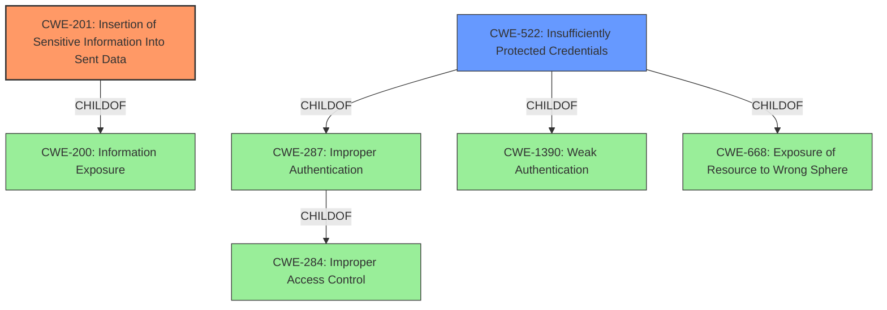

# Analysis for CVE-2022-42132

# Summary
| CWE ID | CWE Name | Confidence | CWE Abstraction Level | CWE Vulnerability Mapping Label | CWE-Vulnerability Mapping Notes |
|---|---|---|---|---|---|
| CWE-201 | Insertion of Sensitive Information Into Sent Data | 1.0 | Base | Allowed | Primary CWE |
| CWE-522 | Insufficiently Protected Credentials | 0.7 | Class | Allowed-with-Review | Secondary CWE |

## Evidence and Confidence

*   **Confidence Score:** 0.9
*   **Evidence Strength:** HIGH

## Relationship Analysis
The primary CWE, CWE-201, is a Base level CWE, which is generally preferred. It is related to CWE-200 (Information Exposure) as a ChildOf. CWE-522 is a Class level CWE. CWE-522 is a ChildOf CWE-287(Improper Authentication). The relationship analysis reinforces the selection of CWE-201 as it directly addresses the insertion of sensitive information into sent data.

## Vulnerability Chain
The vulnerability chain starts with the **LDAP credential in the page URL**. This leads to the **exposure of sensitive information**, specifically the LDAP credentials. An attacker can then gain unauthorized access by intercepting the traffic or accessing logs.

## Summary of Analysis
The analysis started with identifying the root cause and weaknesses based on the provided evidence. The **LDAP credential in the page URL** is the **rootcause** which leads to sensitive information being exposed.

The evidence provided in the CVE Reference Links Content Summary confirms that the **LDAP credential in the page URL** when paginating through the list of users is the root cause of the vulnerability.
> **Root Cause of Vulnerability:**
> The "Test LDAP Users" functionality in Liferay Portal includes the LDAP credential in the page URL when paginating through the list of users.

The primary CWE is CWE-201 because the application is inserting sensitive information into the URL.
> **Weaknesses/Vulnerabilities Present:**
> - **Exposure of Sensitive Information:** LDAP credentials (usernames and passwords) are being exposed within the URL, which is not considered a secure location for transmitting this type of data.

The other weakness could be that the credentials are not sufficiently protected (CWE-522).
> **Lack of proper credential handling:** The application does not securely handle LDAP credentials during the testing process, embedding them in URLs instead of using a secure method for transmission and storage.

The selection of CWE-201 is at the optimal level of specificity because it directly describes the action of inserting sensitive information into sent data.

Relevant CWE Information:

# Enhanced Context (25 CWEs)

## CWE-201: Insertion of Sensitive Information Into Sent Data
**Abstraction:** Base
**Status:** Draft

### Description
The code transmits data to another actor, but a portion of the data includes sensitive information that should not be accessible to that actor.

### Extended Description
Not provided

### Alternative Terms
None

### Relationships
ChildOf -> CWE-200
CanAlsoBe -> CWE-209
CanAlsoBe -> CWE-202

### Mapping Guidance
**Usage:** Allowed
**Rationale:** This CWE entry is at the Base level of abstraction, which is a preferred level of abstraction for mapping to the root causes of vulnerabilities.
**Comments:** Carefully read both the name and description to ensure that this mapping is an appropriate fit. Do not try to 'force' a mapping to a lower-level Base/Variant simply to comply with this preferred level of abstraction.
**Reasons:**
- Acceptable-Use

### Additional Notes
**[Other]** Sensitive information could include data that is sensitive in and of itself (such as credentials or private messages), or otherwise useful in the further exploitation of the system (such as internal file system structure).

### Observed Examples
- **CVE-2022-0708:** Collaboration platform does not clear team emails in a response, allowing leak of email addresses

**Explanation:** The vulnerability directly matches the description of CWE-201. The LDAP credentials, which are sensitive, are included in the URL, making them accessible to unauthorized actors. This has a high impact because it can lead to unauthorized access to systems authenticated against the compromised LDAP server. The mapping guidance allows the use of CWE-201, and it is at the Base level of abstraction.

## CWE-522: Insufficiently Protected Credentials
**Abstraction:** Class
**Status:** Incomplete

### Description
The product transmits or stores authentication credentials, but it uses an insecure method that is susceptible to unauthorized interception and/or retrieval.

### Extended Description
Not provided

### Alternative Terms
None

### Relationships
ChildOf -> CWE-1390
ChildOf -> CWE-287
ChildOf -> CWE-668

### Mapping Guidance
**Usage:** Allowed-with-Review
**Rationale:** This CWE entry is a Class and might have Base-level children that would be more appropriate
**Comments:** Examine children of this entry to see if there is a better fit
**Reasons:**
- Abstraction

### Observed Examples
- **CVE-2022-30018:** A messaging platform serializes all elements of User/Group objects, making private information available to adversaries
- **CVE-2022-29959:** Initialization file contains credentials that can be decoded using a "simple string transformation"
- **CVE-2022-35411:** Python-based RPC framework enables pickle functionality by default, allowing clients to unpickle untrusted data.

**Explanation:** CWE-522 could also apply as the credentials are not sufficiently protected, leading to potential interception and retrieval. However, CWE-201 is more specific to the action of inserting sensitive information into sent data, making it the primary CWE. CWE-522 is a class-level CWE, and the mapping guidance suggests examining children for a better fit, but none of the children are as relevant as CWE-201.

## Other CWEs Considered and Rejected:

*   **CWE-79:** Improper Neutralization of Input During Web Page Generation ('Cross-site Scripting') - Rejected because the vulnerability is not related to XSS.
*   **CWE-287:** Improper Authentication - Rejected because the vulnerability is not directly related to authentication failure.
*   **CWE-90:** Improper Neutralization of Special Elements used in an LDAP Query ('LDAP Injection') - Rejected because there is no indication of LDAP injection.
*   **CWE-863:** Incorrect Authorization - Rejected because the issue is not related to incorrect authorization checks.
*   **CWE-346:** Origin Validation Error - Rejected because the vulnerability is not related to origin validation.