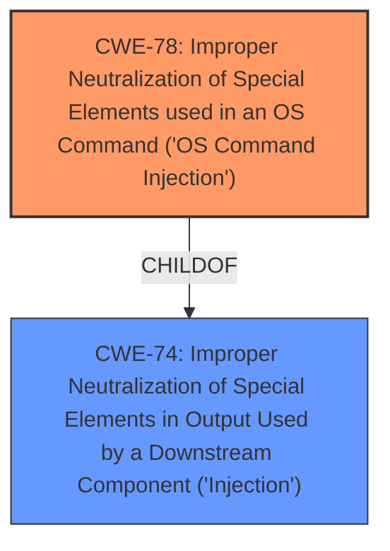

# Analysis for CVE-2022-42139

# Summary
| CWE ID | CWE Name | Confidence | CWE Abstraction Level | CWE Vulnerability Mapping Label | CWE-Vulnerability Mapping Notes |
|---|---|---|---|---|---|
| CWE-78 | Improper Neutralization of Special Elements used in an OS Command ('OS Command Injection') | 1.0 | Base | Allowed | Primary CWE |
| CWE-74 | Improper Neutralization of Special Elements in Output Used by a Downstream Component ('Injection') | 0.7 | Class | Discouraged | Secondary Candidate |

## Evidence and Confidence

*   **Confidence Score:** 1.0
*   **Evidence Strength:** HIGH

## Relationship Analysis
The primary relationship is that CWE-78 is a child of CWE-74, indicating that OS Command Injection is a specific type of injection. Selecting CWE-78 provides a more specific and accurate classification of the vulnerability.

## Vulnerability Chain
The vulnerability chain starts with the web server's **insecure handling of the `destination` POST parameter**, leading to **command injection** and ultimately resulting in **arbitrary command execution** and potential **full system access**.

## Summary of Analysis
The initial assessment identified **command injection** as the primary **weakness**. The analysis focused on the root cause and the specific type of command injection. The provided evidence from the "CVE Reference Links Content Summary" confirms that the web server is vulnerable to command injection through POST parameters, specifically the `destination` parameter.

The selection of CWE-78 is based on the explicit evidence of **OS command injection** via the `destination` parameter. This aligns with the CWE-78 description: "The product constructs all or part of an OS command using externally-influenced input...". The mapping guidance for CWE-78 allows its usage and specifies it is at the Base level of abstraction, which is a preferred level.

CWE-74 was considered but not selected as the primary CWE because it is a more general class of injection vulnerabilities. While the vulnerability does involve injection, the specific type is OS command injection, making CWE-78 a more precise and informative classification. The MITRE mapping guidance discourages the use of CWE-74 when lower-level weaknesses are more appropriate.

Relevant CWE Information:

# Enhanced Context (25 CWEs)
The following CWEs were identified as potentially relevant to this vulnerability:

## CWE-74: Improper Neutralization of Special Elements in Output Used by a Downstream Component ('Injection')
**Abstraction Level**: Class
**Similarity Score**: 0.77
**Source**: dense

**Description**:
The product constructs all or part of a command, data structure, or record using externally-influenced input from an upstream component, but it does not neutralize or incorrectly neutralizes special elements that could modify how it is parsed or interpreted when it is sent to a downstream component.

**Mapping Guidance**:
- Usage: Discouraged
- Rationale: CWE-74 is high-level and often misused when lower-level weaknesses are more appropriate.

## CWE-78: Improper Neutralization of Special Elements used in an OS Command ('OS Command Injection')
**Abstraction Level**: Base
**Similarity Score**: 5.03
**Source**: graph

**Description**:
CWE-78: Improper Neutralization of Special Elements used in an OS Command ('OS Command Injection')

**Mapping Guidance**:
- Usage: Allowed
- Rationale: This CWE entry is at the Base level of abstraction, which is a preferred level of abstraction for mapping to the root causes of vulnerabilities.

**Relationships**:
- CANFOLLOW -> CWE-184
- CANALSOBE -> CWE-88
- CHILDOF -> CWE-77
- CHILDOF -> CWE-77
- CHILDOF -> CWE-74

## CWE-78: Improper Neutralization of Special Elements used in an OS Command ('OS Command Injection')
**Abstraction Level**: Base
**Similarity Score**: 6924.30
**Source**: sparse

**Description**:
The product constructs all or part of an OS command using externally-influenced input from an upstream component, but it does not neutralize or incorrectly neutralizes special elements that could modify the intended OS command when it is sent to a downstream component.

**Mapping Guidance**:
- Usage: Allowed
- Rationale: This CWE entry is at the Base level of abstraction, which is a preferred level of abstraction for mapping to the root causes of vulnerabilities.

## CWE-77: Improper Neutralization of Special Elements used in a Command ('Command Injection')
**Abstraction Level**: Class
**Similarity Score**: 1.00
**Source**: alternate_terms

**Description**:
The product constructs all or part of a command using externally-influenced input from an upstream component, but it does not neutralize or incorrectly neutralizes special elements that could modify the intended command when it is sent to a downstream component.

### Alternative Terms
Command injection: an attack-oriented phrase for this weakness. Note: often used when "OS command injection" (CWE-78) was intended.

### Mapping Guidance
**Usage:** Allowed-with-Review
**Rationale:** CWE-77 is often misused when OS command injection (CWE-78) was intended instead [REF-1287].
**Comments:** Ensure that the analysis focuses on the root-cause error that allows the execution of commands, as there are many weaknesses that can lead to this consequence. See Terminology Notes. If the weakness involves a command language besides OS shell invocation, then CWE-77 could be used.
**Reasons:**
- Frequent Misuse
**Suggested Alternatives:**
- CWE-78: OS Command Injection

### Complete CWE Specifications

## CWE-78: Improper Neutralization of Special Elements used in an OS Command ('OS Command Injection')

**CWE-78**: Improper Neutralization of Special Elements used in an OS Command ('OS Command Injection')

**Technical Explanation:**

The vulnerability occurs because the application constructs an OS command using externally-influenced input (the `destination` parameter) without properly neutralizing special elements. This allows an attacker to inject arbitrary commands into the OS command string.

**Security Implications and Potential Impact:**

Successful exploitation allows the attacker to execute arbitrary commands on the underlying operating system with the privileges of the vulnerable application. This can lead to full system compromise, data theft, denial of service, or further network compromise.

**Relationship Explanation:**

CWE-78 is a specific type of command injection (CWE-77) and a child of the more general injection category (CWE-74). It focuses specifically on OS commands, providing a more precise classification.

**MITRE Mapping Guidance Influence:**

The official MITRE mapping guidance recommends using the Base level of abstraction when possible. CWE-78 is a Base level CWE and accurately describes the vulnerability, making it the preferred choice.

**Final Conclusion:**
CWE-78 is the most appropriate CWE for this vulnerability because it accurately reflects the root cause, aligns with the MITRE mapping guidance, and is at the optimal level of specificity.