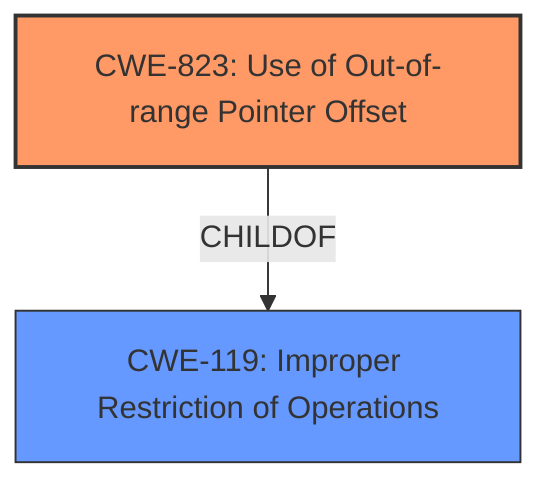

# Raw Analyzer Response for CVE-2022-42264

# Summary
| CWE ID | CWE Name | Confidence | CWE Abstraction Level | CWE Vulnerability Mapping Label | CWE-Vulnerability Mapping Notes |
|---|---|---|---|---|---|
| CWE-823 | Use of Out-of-range Pointer Offset | 1.0 | Base | Allowed | Primary CWE |
| CWE-119 | Improper Restriction of Operations within the Bounds of a Memory Buffer | 0.5 | Class | Discouraged | Secondary Candidate |

## Evidence and Confidence

*   **Confidence Score:** 1.0
*   **Evidence Strength:** HIGH

## Relationship Analysis
The primary CWE, CWE-823, is a base-level CWE and a child of CWE-119, indicating a more specific type of buffer access issue. CWE-119 is a class-level CWE, representing a broader category of buffer-related vulnerabilities. The selection of CWE-823 is based on the vulnerability description explicitly mentioning the use of an out-of-range pointer offset.

## Vulnerability Chain
The chain starts with an **unprivileged regular user** causing an **out-of-range pointer offset**, leading to potential data tampering, data loss, information disclosure, or denial of service.
  - Root Cause: **unprivileged regular user can cause the use of an out-of-range pointer offset** (CWE-823)
  - Impact: data tampering, data loss, information disclosure, or denial of service

## Summary of Analysis
The initial analysis identified CWE-823 as the primary candidate based on the vulnerability description, which states that an **unprivileged regular user can cause the use of an out-of-range pointer offset**. This statement directly aligns with the description of CWE-823. The "CVE Reference Links Content Summary" also confirms that the **weakness** is "CWE-823: Use of Out-of-range Pointer Offset".

The graph relationships confirm that CWE-823 is a specific type of CWE-119, which is a more general class. This supports the decision to choose CWE-823 for its specificity.

The final selection of CWE-823 is based on the direct evidence from the vulnerability description and the confirmatory information from the "CVE Reference Links Content Summary". This CWE is at the optimal level of specificity because it accurately describes the **root cause** of the vulnerability, which is the use of an out-of-range pointer offset.

Relevant CWE Information:

# Enhanced Context (25 CWEs)
The following CWEs were identified as potentially relevant to this vulnerability:

## CWE-823: Use of Out-of-range Pointer Offset
**Abstraction Level**: Base
**Similarity Score**: 0.81
**Source**: dense

**Description**:
The product performs pointer arithmetic on a valid pointer, but it uses an offset that can point outside of the intended range of valid memory locations for the resulting pointer.

**Mapping Guidance**:
- Usage: Allowed
- Rationale: This CWE entry is at the Base level of abstraction, which is a preferred level of abstraction for mapping to the root causes of vulnerabilities.

## CWE-1285: Improper Validation of Specified Index, Position, or Offset in Input
**Abstraction Level**: Base
**Similarity Score**: 0.364
**Source**: sparse

**Description**:
The product receives input that is expected to specify an index, position, or offset into an indexable resource such as a buffer or file, but it does not validate or incorrectly validates that the specified index/position/offset has the required properties.

**Mapping Guidance**:
- Usage: Allowed
- Rationale: This CWE entry is at the Base level of abstraction, which is a preferred level of abstraction for mapping to the root causes of vulnerabilities.

## CWE-119: Improper Restriction of Operations within the Bounds of a Memory Buffer
**Abstraction Level**: Class
**Similarity Score**: 0.78
**Source**: dense

**Description**:
The product performs operations on a memory buffer, but it reads from or writes to a memory location outside the buffer's intended boundary. This may result in read or write operations on unexpected memory locations that could be linked to other variables, data structures, or internal program data.

**Mapping Guidance**:
- Usage: Discouraged
- Rationale: CWE-119 is commonly misused in low-information vulnerability reports when lower-level CWEs could be used instead, or when more details about the vulnerability are available.

## CWE-823: Use of Out-of-range Pointer Offset
**Abstraction Level**: Base
**Similarity Score**: 6240.17
**Source**: sparse

**Description**:
The product performs pointer arithmetic on a valid pointer, but it uses an offset that can point outside of the intended range of valid memory locations for the resulting pointer.

**Mapping Guidance**:
- Usage: Allowed
- Rationale: This CWE entry is at the Base level of abstraction, which is a preferred level of abstraction for mapping to the root causes of vulnerabilities.

## CWE-125: Out-of-bounds Read
**Abstraction Level**: Base
**Similarity Score**: 2.91
**Source**: graph

**Description**:
The product reads data past the end, or before the beginning, of the intended buffer.

**Mapping Guidance**:
- Usage: Allowed
- Rationale: This CWE entry is at the Base level of abstraction, which is a preferred level of abstraction for mapping to the root causes of vulnerabilities.

### Detailed Analysis of Selected CWEs:

*   **CWE-823: Use of Out-of-range Pointer Offset**
    *   **Technical Explanation:** This CWE describes the scenario where pointer arithmetic leads to accessing memory outside the intended bounds. The vulnerability description explicitly mentions an "**unprivileged regular user can cause the use of an out-of-range pointer offset**". This aligns directly with the CWE's definition.
    *   **Security Implications:** An out-of-range pointer offset can lead to reading or writing to unintended memory locations, causing data tampering, data loss, information disclosure, or denial of service.
    *   **Relationships:** CWE-823 is a child of CWE-119, indicating it's a specific type of buffer access issue.
    *   **Mapping Guidance:** The MITRE mapping guidance allows for the use of CWE-823, stating that it is at the Base level of abstraction, which is preferred.
    *   **Confidence:** 1.0
*   **CWE-119: Improper Restriction of Operations within the Bounds of a Memory Buffer**
    *   **Technical Explanation:** This is a more general class of errors related to buffer boundary violations. While the vulnerability is more specific (out-of-range pointer offset), it falls under this broader category.
    *   **Security Implications:** Similar to CWE-823, this can lead to memory corruption, data loss, or denial of service.
    *   **Relationships:** CWE-119 is a parent of CWE-823.
    *   **Mapping Guidance:** The MITRE mapping guidance discourages the use of CWE-119 when more specific CWEs are available.
    *   **Reason for Not Selecting as Primary:** While technically correct, CWE-119 is too general. CWE-823 more accurately captures the specific vulnerability. The "CVE Reference Links Content Summary" section also confirms that the **weakness** is "CWE-823: Use of Out-of-range Pointer Offset".
    *   **Confidence:** 0.5

### Other CWEs Considered But Not Used:

*   **CWE-125: Out-of-bounds Read**: While the impact includes information disclosure, the root cause is the out-of-range pointer offset, not directly an out-of-bounds read.
*   **CWE-787: Out-of-bounds Write**: Similar to CWE-125, the root cause is the offset, not a write.
*   **CWE-1285: Improper Validation of Specified Index, Position, or Offset in Input**: This CWE could be relevant if the offset was derived from an input value, but the description doesn't specify that.
*   **CWE-822: Untrusted Pointer Dereference**: This CWE involves using an untrusted value as a pointer, which is not explicitly stated in the vulnerability description.
*   **CWE-476: NULL Pointer Dereference**: There is no indication of NULL pointer dereference in the description.
*   **CWE-280: Improper Handling of Insufficient Permissions or Privileges**: While the attacker is an **unprivileged regular user**, the **root cause** is the **out-of-range pointer offset**, not a privilege issue.