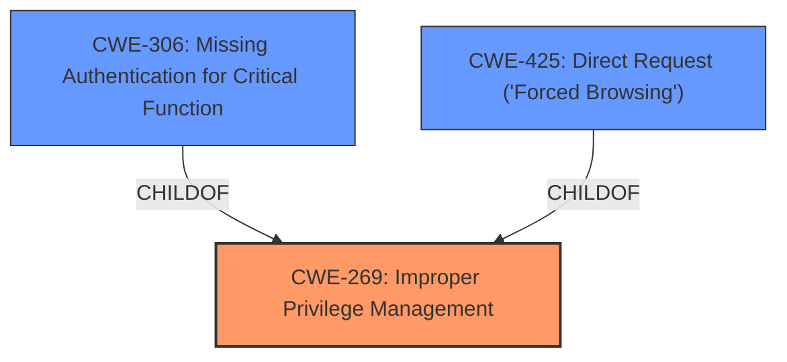

# Analysis Report for CVE-2022-4229

# Vulnerability Analysis Report: CVE-2022-4229

## Description


## Analysis (with Relationship Data)

# Summary

| CWE ID | CWE Name | Confidence | CWE Abstraction Level | CWE Vulnerability Mapping Label | CWE-Vulnerability Mapping Notes |
|---|---|---|---|---|---|
| CWE-269 | Improper Privilege Management | 0.9 | Class | Allowed-with-Review | Primary CWE. The application **does not implement proper access controls, allowing unauthenticated users to access sensitive functionalities and data**. |
| CWE-306 | Missing Authentication for Critical Function | 0.8 | Base | Allowed | Secondary CWE. The Book Store Management System **does not require users to be logged in to access and modify administrative functionalities.** |
| CWE-425 | Direct Request ('Forced Browsing') | 0.7 | Base | Allowed | Secondary CWE.  The application fails to restrict access to administrative functions and data to authenticated users, allowing anyone to perform actions like adding, editing, and deleting user accounts. |

## Evidence and Confidence

*   **Confidence Score:** 0.9
*   **Evidence Strength:** HIGH

## Relationship Analysis
The primary CWE is CWE-269 Improper Privilege Management, which is a class level CWE. CWE-269 has child relationships with more specific Base level CWEs, but the description does not include enough information to warrant the use of a child relationship. CWE-306 Missing Authentication for Critical Function and CWE-425 Direct Request ('Forced Browsing') have been added to cover the lack of authentication and the ability to directly access restricted resources.



## Vulnerability Chain
The vulnerability chain starts with **improper access controls** (CWE-269), leading to the ability to access sensitive functionalities without authentication (CWE-306) and directly request restricted resources (CWE-425).

## Summary of Analysis
The initial assessment identified **improper access controls** as the primary issue. The retriever results suggested several CWEs, including CWE-89, CWE-79, CWE-434, CWE-266, CWE-306, CWE-425, CWE-471, CWE-99, CWE-705, and CWE-1391. After reviewing the details, CWE-269, CWE-306, and CWE-425 were deemed most appropriate.

The vulnerability description clearly indicates a failure in access control, with the application **not requiring users to be logged in** and allowing **unauthenticated users to access sensitive functionalities**. This aligns directly with CWE-269, **Improper Privilege Management**, as the root cause.

The selection of CWE-269 is at the Class level, as it broadly covers the **improper management of privileges**. While more specific child CWEs exist, the provided description does not offer sufficient detail to pinpoint the precise nature of the privilege management failure beyond the lack of authentication and the ability to directly access restricted resources, which are captured by CWE-306 and CWE-425.

The decision to include CWE-306, **Missing Authentication for Critical Function**, is based on the evidence that the application **does not require users to be logged in to access and modify administrative functionalities.** This indicates a clear lack of authentication for critical functions.

The addition of CWE-425, **Direct Request ('Forced Browsing')**, is justified by the fact that the application fails to restrict access to administrative functions and data to authenticated users, allowing anyone to perform actions like adding, editing, and deleting user accounts. This implies that restricted resources can be directly accessed without proper authorization.

The confidence in this assessment is high (0.9) due to the clear evidence of **improper access controls**, **missing authentication**, and the ability to **directly request restricted resources**.

Relevant CWE Information:

# Enhanced Context (25 CWEs)
The following CWEs were identified as potentially relevant to this vulnerability:

## CWE-99: Improper Control of Resource Identifiers ('Resource Injection')
**Abstraction Level**: Class
**Similarity Score**: 0.78
**Source**: dense

**Description**:
The product receives input from an upstream component, but it does not restrict or incorrectly restricts the input before it is used as an identifier for a resource that may be outside the intended sphere of control.

**Mapping Guidance**:
- Usage: Allowed-with-Review
- Rationale: This CWE entry is a Class and might have Base-level children that would be more appropriate

## CWE-1391: Use of Weak Credentials
**Abstraction Level**: Class
**Similarity Score**: 0.77
**Source**: dense

**Description**:
The product uses weak credentials (such as a default key or hard-coded password) that can be calculated, derived, reused, or guessed by an attacker.

**Mapping Guidance**:
- Usage: Allowed-with-Review
- Rationale: This CWE entry is a Class and might have Base-level children that would be more appropriate

## CWE-807: Reliance on Untrusted Inputs in a Security Decision
**Abstraction Level**: Base
**Similarity Score**: 0.77
**Source**: dense

**Description**:
The product uses a protection mechanism that relies on the existence or values of an input, but the input can be modified by an untrusted actor in a way that bypasses the protection mechanism.

**Mapping Guidance**:
- Usage: Allowed
- Rationale: This CWE entry is at the Base level of abstraction, which is a preferred level of abstraction for mapping to the root causes of vulnerabilities.

## CWE-472: External Control of Assumed-Immutable Web Parameter
**Abstraction Level**: Base
**Similarity Score**: 0.77
**Source**: dense

**Description**:
The web application does not sufficiently verify inputs that are assumed to be immutable but are actually externally controllable, such as hidden form fields.

**Mapping Guidance**:
- Usage: Allowed
- Rationale: This CWE entry is at the Base level of abstraction, which is a preferred level of abstraction for mapping to the root causes of vulnerabilities.

## CWE-668: Exposure of Resource to Wrong Sphere
**Abstraction Level**: Class
**Similarity Score**: 0.77
**Source**: dense

**Description**:
The product exposes a resource to the wrong control sphere, providing unintended actors with inappropriate access to the resource.

**Mapping Guidance**:
- Usage: Discouraged
- Rationale: CWE-668 is high-level and is often misused as a catch-all when lower-level CWE IDs might be applicable. It is sometimes used for low-information vulnerability reports [REF-1287]. It is a level-1 Class (i.e., a child of a Pillar). It is not useful for trend analysis.

## CWE-74: Improper Neutralization of Special Elements in Output Used by a Downstream Component ('Injection')
**Abstraction Level**: Class
**Similarity Score**: 0.77
**Source**: dense

**Description**:
The product constructs all or part of a command, data structure, or record using externally-influenced input from an upstream component, but it does not neutralize or incorrectly neutralizes special elements that could modify how it is parsed or interpreted when it is sent to a downstream component.

**Mapping Guidance**:
- Usage: Discouraged
- Rationale: CWE-74 is high-level and often misused when lower-level weaknesses are more appropriate.

## CWE-1289: Improper Validation of Unsafe Equivalence in Input
**Abstraction Level**: Base
**Similarity Score**: 0.77
**Source**: dense

**Description**:
The product receives an input value that is used as a resource identifier or other type of reference, but it does not validate or incorrectly validates that the input is equivalent to a potentially-unsafe value.

**Mapping Guidance**:
- Usage: Allowed
- Rationale: This CWE entry is at the Base level of abstraction, which is a preferred level of abstraction for mapping to the root causes of vulnerabilities.

## CWE-664: Improper Control of a Resource Through its Lifetime
**Abstraction Level**: Pillar
**Similarity Score**: 0.77
**Source**: dense

**Description**:
The product does not maintain or incorrectly maintains control over a resource throughout its lifetime of creation, use, and release.

**Mapping Guidance**:
- Usage: Discouraged
- Rationale: This CWE entry is high-level when lower-level children are available.

## CWE-41: Improper Resolution of Path Equivalence
**Abstraction Level**: Base
**Similarity Score**: 0.77
**Source**: dense

**Description**:
The product is vulnerable to file system contents disclosure through path equivalence. Path equivalence involves the use of special characters in file


## CWE Relationship Analysis

Current CWEs represent these abstraction levels: .


### Vulnerability Chain Analysis

**Chain starting from CWE-89:**
- 89 (Improper Neutralization of Special Elements used in an SQL Command ('SQL Injection')) - ROOT


**Chain starting from CWE-425:**
- 425 (Direct Request ('Forced Browsing')) - ROOT


### CWE Relationship Diagram

```mermaid
graph TD
    classDef primary fill:#f96,stroke:#333,stroke-width:2px
    classDef secondary fill:#69f,stroke:#333
    classDef tertiary fill:#9e9,stroke:#333
```


*Report generated on 2025-03-31 00:51:21*
