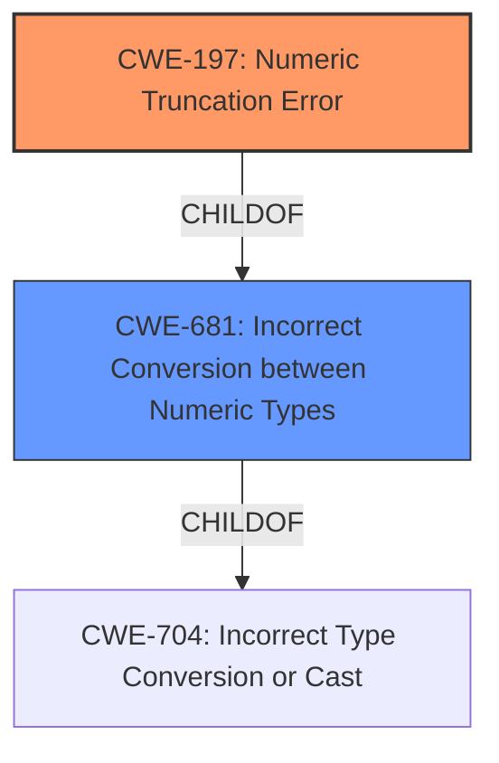

# Analysis for CVE-2022-42324

# Summary
| CWE ID | CWE Name | Confidence | CWE Abstraction Level | CWE Vulnerability Mapping Label | CWE-Vulnerability Mapping Notes |
|---|---|---|---|---|---|
| CWE-197 | Numeric Truncation Error | 1.0 | Base | Allowed | Primary CWE |
| CWE-681 | Incorrect Conversion between Numeric Types | 0.8 | Base | Allowed | Secondary Candidate |

## Evidence and Confidence

*   **Confidence Score:** 0.9
*   **Evidence Strength:** HIGH

## Relationship Analysis
The primary CWE is CWE-197 which is a type of CWE-681. This relationship helps to understand the nature of the truncation error as a specific type of incorrect conversion between numeric types. The vulnerability chain starts with the integer truncation leading to potential signed/unsigned confusion and subsequently a busy loop. The variant classifications like CWE-194 and CWE-195 provide alternative perspectives on the type of numeric error, but the base CWE-197 more accurately captures the **root cause**.

## Vulnerability Chain
The vulnerability chain starts with the **integer truncation** (CWE-197) when casting a `uint32_t` to a smaller Ocaml integer in 32-bit builds. This leads to potential signed/unsigned confusion. This results in unexpected exceptions and, due to improper handling, leads to a busy loop causing denial of service.

## Summary of Analysis
The initial analysis focused on identifying the **root cause** of the vulnerability, which is the **integer truncation** when casting a `uint32_t` to a smaller Ocaml integer in 32-bit builds. The retriever results strongly suggest CWE-197 as the primary candidate. The vulnerability description states "Oxenstored 32->31 bit **integer truncation** issues". The CVE Reference Links Content Summary also supports this by stating "The core issue is the truncation of a 32-bit integer when casting to a 31-bit integer in 32-bit Ocaml builds."

The relationship analysis shows that CWE-197 is a child of CWE-681 (Incorrect Conversion between Numeric Types) and CWE-704 (Incorrect Type Conversion or Cast), indicating a hierarchical structure where CWE-197 is more specific. The other considered CWEs, such as CWE-194 (Unexpected Sign Extension), CWE-195 (Signed to Unsigned Conversion Error), and CWE-190 (Integer Overflow or Wraparound), are related to numeric errors but do not directly represent the truncation issue.

The final decision to select CWE-197 is based on the strong evidence from the vulnerability description and CVE summary, the retriever results, and the hierarchical relationship analysis. The chosen CWE is at the optimal level of specificity as it directly describes the **root cause** of the vulnerability.

Relevant CWE Information:

# Enhanced Context (25 CWEs)

## CWE-197: Numeric Truncation Error
**Abstraction:** Base
**Status:** Incomplete

### Description
Truncation errors occur when a primitive is cast to a primitive of a smaller size and data is lost in the conversion.

### Extended Description
When a primitive is cast to a smaller primitive, the high order bits of the large value are lost in the conversion, potentially resulting in an unexpected value that is not equal to the original value. This value may be required as an index into a buffer, a loop iterator, or simply necessary state data. In any case, the value cannot be trusted and the system will be in an undefined state. While this method may be employed viably to isolate the low bits of a value, this usage is rare, and truncation usually implies that an implementation error has occurred.

### Alternative Terms
None

### Relationships
ChildOf -> CWE-681
ChildOf -> CWE-681
ChildOf -> CWE-681
CanAlsoBe -> CWE-195
CanAlsoBe -> CWE-196
CanAlsoBe -> CWE-192
CanAlsoBe -> CWE-194

### Mapping Guidance
**Usage:** Allowed
**Rationale:** This CWE entry is at the Base level of abstraction, which is a preferred level of abstraction for mapping to the root causes of vulnerabilities.
**Comments:** Carefully read both the name and description to ensure that this mapping is an appropriate fit. Do not try to 'force' a mapping to a lower-level Base/Variant simply to comply with this preferred level of abstraction.
**Reasons:**
- Acceptable-Use

### Observed Examples
- **CVE-2020-17087:** Chain: integer truncation (CWE-197) causes small buffer allocation (CWE-131) leading to out-of-bounds write (CWE-787) in kernel pool, as exploited in the wild per CISA KEV.

## CWE-681: Incorrect Conversion between Numeric Types
**Abstraction:** Base
**Status:** Draft

### Description
When converting from one data type to another, such as long to integer, data can be omitted or translated in a way that produces unexpected values. If the resulting values are used in a sensitive context, then dangerous behaviors may occur.

### Extended Description
Not provided

### Alternative Terms
None

### Relationships
ChildOf -> CWE-704
ChildOf -> CWE-704
CanPrecede -> CWE-682

### Mapping Guidance
**Usage:** Allowed
**Rationale:** This CWE entry is at the Base level of abstraction, which is a preferred level of abstraction for mapping to the root causes of vulnerabilities.
**Comments:** Carefully read both the name and description to ensure that this mapping is an appropriate fit. Do not try to 'force' a mapping to a lower-level Base/Variant simply to comply with this preferred level of abstraction.
**Reasons:**
- Acceptable-Use

## CWE-194: Unexpected Sign Extension
**Abstraction:** Variant
**Status:** Incomplete

### Description
The product performs an operation on a number that causes it to be sign extended when it is transformed into a larger data type. When the original number is negative, this can produce unexpected values that lead to resultant weaknesses.

## CWE-195: Signed to Unsigned Conversion Error
**Abstraction:** Variant
**Status:** Draft

### Description
The product uses a signed primitive and performs a cast to an unsigned primitive, which can produce an unexpected value if the value of the signed primitive can not be represented using an unsigned primitive.

## CWE-190: Integer Overflow or Wraparound
**Abstraction:** Base
**Status:** Stable

### Description
The product performs a calculation that can
         produce an integer overflow or wraparound when the logic
         assumes that the resulting value will always be larger than
         the original value. This occurs when an integer value is
         incremented to a value that is too large to store in the
         associated representation. When this occurs, the value may
         become a very small or negative number.

## CWE-704: Incorrect Type Conversion or Cast
**Abstraction:** Class
**Status:** Incomplete

### Description
The product does not correctly convert an object, resource, or structure from one type to a different type.

## CWE-839: Numeric Range Comparison Without Minimum Check
**Abstraction:** Base
**Status:** Incomplete

### Explanation of CWE Selection:

*   **CWE-197: Numeric Truncation Error (Primary)**
    *   **Match:** The vulnerability description explicitly mentions "integer truncation issues," and the CVE summary details the truncation of a 32-bit integer to a 31-bit integer.
    *   **Security Implications:** Truncation can lead to loss of data and unexpected behavior, including incorrect calculations and control flow issues.
    *   **Relationship:** CWE-197 is a child of CWE-681 (Incorrect Conversion between Numeric Types).
    *   **Mapping Guidance:** The usage is "ALLOWED" and at the Base level of abstraction, which is preferred.
    *   **Confidence:** 1.0

*   **CWE-681: Incorrect Conversion between Numeric Types (Secondary)**
    *   **Match:** While CWE-197 is more specific, CWE-681 broadly covers the incorrect conversion between numeric types. The truncation error is a specific instance of this.
    *   **Security Implications:** Incorrect conversions can lead to unexpected values and subsequent errors.
    *   **Relationship:** CWE-681 is a parent of CWE-197.
    *   **Mapping Guidance:** The usage is "ALLOWED" and at the Base level of abstraction.
    *   **Confidence:** 0.8

*   **CWEs Considered but Not Used:**