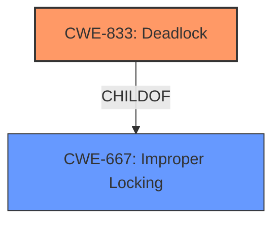

# Enhanced Analysis for CVE-2022-42328

# Summary
| CWE ID | CWE Name | Confidence | CWE Abstraction Level | CWE Vulnerability Mapping Label | CWE-Vulnerability Mapping Notes |
|---|---|---|---|---|---|
| CWE-833 | Deadlock | 0.9 | Base | Allowed | Primary CWE |
| CWE-667 | Improper Locking | 0.7 | Class | Allowed-with-Review | Secondary Candidate |

## Evidence and Confidence

*   **Confidence Score:** 0.9
*   **Evidence Strength:** HIGH

## Relationship Analysis
The primary CWE selected is CWE-833 (Deadlock), which is a child of CWE-667 (Improper Locking). This parent-child relationship indicates that the **deadlock** is a specific type of issue caused by **improper locking**. While CWE-667 is a broader classification, the description clearly indicates a **deadlock** scenario making CWE-833 a more accurate fit.



## Vulnerability Chain
The vulnerability chain starts with a **patch for XSA-392**, which introduced an issue where the incorrect function `kfree_skb()` was called with interrupts disabled or from a hardware interrupt context, leading to a **deadlock** (CWE-833). The root cause is the incorrect memory management within the `xen-netback` driver in the Linux kernel.

## Summary of Analysis
The initial assessment focused on identifying the most specific CWE related to the vulnerability. The evidence strongly suggests a **deadlock** condition due to **incorrect memory management**, specifically related to freeing packet buffers.

The vulnerability description explicitly mentions a **deadlock**: "might result in a **deadlock** when trying to free the SKB" and "the same **deadlock** could occur." The CVE Reference Links Content Summary supports this, stating "This could result in a **deadlock**."

CWE-833 (Deadlock) is the best fit because it directly describes the resulting weakness. CWE-667 (Improper Locking) was also considered, as it represents the broader category of synchronization issues that can lead to a **deadlock**. However, given the clear evidence of a **deadlock**, CWE-833 is the more appropriate and specific choice.

CWE-833 is at the Base level of abstraction, which is preferred. It accurately represents the weakness where multiple threads/executable segments are waiting for each other to release a necessary lock, resulting in a **deadlock**.

Relevant CWE Information:

# Enhanced Context (25 CWEs)
The following CWEs were identified as potentially relevant to this vulnerability:

## CWE-404: Improper Resource Shutdown or Release
**Abstraction Level**: Class
**Similarity Score**: 0.80
**Source**: dense

**Description**:
The product does not release or incorrectly releases a resource before it is made available for re-use.

**Mapping Guidance**:
- Usage: Allowed-with-Review
- Rationale: This CWE entry is a Class and might have Base-level children that would be more appropriate

## CWE-833: Deadlock
**Abstraction Level**: Base
**Similarity Score**: 5772.19
**Source**: sparse

**Description**:
The product contains multiple threads or executable segments that are waiting for each other to release a necessary lock, resulting in deadlock.

**Mapping Guidance**:
- Usage: Allowed
- Rationale: This CWE entry is at the Base level of abstraction, which is a preferred level of abstraction for mapping to the root causes of vulnerabilities.

## CWE-667: Improper Locking
**Abstraction Level**: Class
**Similarity Score**: 5784.53
**Source**: sparse

**Description**:
The product does not properly acquire or release a lock on a resource, leading to unexpected resource state changes and behaviors.

**Mapping Guidance**:
- Usage: Allowed-with-Review
- Rationale: This CWE entry is a Class and might have Base-level children that would be more appropriate


## CWE Relationship Analysis

Current CWEs represent these abstraction levels: .


### Vulnerability Chain Analysis

**Chain starting from CWE-667:**
- 667 (Improper Locking) - ROOT


**Chain starting from CWE-833:**
- 833 (Deadlock) - ROOT


### CWE Relationship Diagram

```mermaid
graph TD
    classDef primary fill:#f96,stroke:#333,stroke-width:2px
    classDef secondary fill:#69f,stroke:#333
    classDef tertiary fill:#9e9,stroke:#333
```