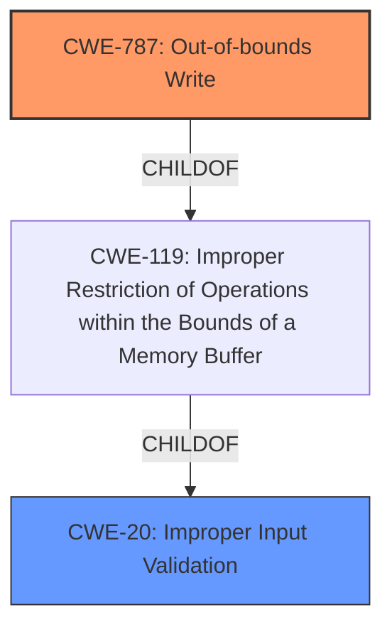

# Analysis Report for CVE-2022-42377

# Vulnerability Analysis Report: CVE-2022-42377

## Description


## Analysis (with Relationship Data)

# Summary
| CWE ID | CWE Name | Confidence | CWE Abstraction Level | CWE Vulnerability Mapping Label | CWE-Vulnerability Mapping Notes |
|---|---|---|---|---|---|
| CWE-787 | Out-of-bounds Write | 0.9 | Base | Primary | Allowed |
| CWE-20 | Improper Input Validation | 0.6 | Class | Secondary | Discouraged |

## Evidence and Confidence

*   **Confidence Score:** 0.8
*   **Evidence Strength:** HIGH

## Relationship Analysis
The primary CWE is CWE-787 **Out-of-bounds Write**, which is a Base level CWE. The secondary CWE is CWE-20 **Improper Input Validation**, which is a Class level CWE. CWE-787 is a child of CWE-119 **Improper Restriction of Operations within the Bounds of a Memory Buffer**, which in turn is a child of CWE-20. This shows a hierarchy where improper input validation can lead to buffer overflows, which can then result in out-of-bounds writes.



## Vulnerability Chain
The vulnerability chain starts with **lack of proper validation of user-supplied data** (CWE-20), which results in a memory corruption condition (CWE-787).

## Summary of Analysis
The initial analysis identified CWE-787 as the primary weakness due to the resulting memory corruption. The vulnerability description key phrases "lack of proper validation of user-supplied data" points to CWE-20, but the consequence is "memory corruption condition" which matches with CWE-787.

The retriever results also support CWE-787 as the top candidate.

CWE-20 is considered a secondary weakness because the primary issue is the memory corruption resulting from the **lack of validation**. While CWE-20 is present, it's a high-level class, and the specific manifestation is an out-of-bounds write.

The final decision is based on the evidence that the vulnerability leads to memory corruption due to **lack of proper validation**, making CWE-787 the most specific and appropriate classification.

Relevant CWE Information:

# Enhanced Context (25 CWEs)

## CWE-457: Use of Uninitialized Variable
**Abstraction Level**: Variant
**Similarity Score**: 0.79
**Source**: dense

This CWE was considered but not chosen because the vulnerability description doesn't explicitly mention the use of uninitialized variables. The focus is on **lack of validation** leading to memory corruption, not the state of variables.

## CWE-1289: Improper Validation of Unsafe Equivalence in Input
**Abstraction Level**: Base
**Similarity Score**: 0.78
**Source**: dense

This CWE was considered but not chosen because the vulnerability description does not suggest the validation of equivalence as the main problem.

## CWE-667: Improper Locking
**Abstraction Level**: Class
**Similarity Score**: 0.77
**Source**: dense

This CWE was considered but not chosen because there is no evidence of locking issues in the vulnerability description.

## CWE-665: Improper Initialization
**Abstraction Level**: Class
**Similarity Score**: 0.77
**Source**: dense

This CWE was considered but not chosen because the vulnerability description focuses on **lack of validation** rather than initialization issues.

## CWE-252: Unchecked Return Value
**Abstraction Level**: Base
**Similarity Score**: 0.76
**Source**: dense

This CWE was considered but not chosen because the vulnerability description does not mention any unchecked return values. The issue is with the **lack of input validation**, not the handling of function returns.

## CWE-131: Incorrect Calculation of Buffer Size
**Abstraction Level**: Base
**Similarity Score**: 0.76
**Source**: dense

This CWE was considered but not chosen because the vulnerability description does not indicate an incorrect calculation of buffer size. The problem is the **lack of proper validation**, not the size calculation itself.

## CWE-754: Improper Check for Unusual or Exceptional Conditions
**Abstraction Level**: Class
**Similarity Score**: 0.76
**Source**: dense

This CWE was considered but not chosen because the vulnerability description does not mention checks for unusual conditions.

## CWE-125: Out-of-bounds Read
**Abstraction Level**: Base
**Similarity Score**: 0.76
**Source**: dense

This CWE was considered, but CWE-787 **Out-of-bounds Write** is a better fit.

## CWE-908: Use of Uninitialized Resource
**Abstraction Level**: Base
**Similarity Score**: 0.76
**Source**: dense

This CWE was considered but not chosen because the vulnerability description focuses on **lack of validation** of user-supplied data rather than the use of uninitialized resources.

## CWE-404: Improper Resource Shutdown or Release
**Abstraction Level**: Class
**Similarity Score**: 0.76
**Source**: dense

This CWE was considered but not chosen because resource shutdown or release is not mentioned in the vulnerability description.

## CWE-190: Integer Overflow or Wraparound
**Abstraction Level**: Base
**Similarity Score**: 7106.89
**Source**: sparse

This CWE was considered but not chosen because there is no mention of integer overflow in the description.

## CWE-1284: Improper Validation of Specified Quantity in Input
**Abstraction Level**: Base
**Similarity Score**: 7092.65
**Source**: sparse

This CWE was considered because it is a child of CWE-20, but CWE-20 is a discouraged CWE and CWE-1284 is not specific enough to the **memory corruption** result.

## CWE-119: Improper Restriction of Operations within the Bounds of a Memory Buffer
**Abstraction Level**: Class
**Similarity Score**: 6932.59
**Source**: sparse

This CWE was considered, but the description indicates it should be avoided when more specific information such as CWE-787 is available.

## CWE-193: Off-by-one Error
**Abstraction Level**: Base
**Similarity Score**: 6636.97
**Source**: sparse

This CWE was considered but not chosen because the vulnerability description does not mention an off-by-one error.

## CWE-41: Improper Resolution of Path Equivalence
**Abstraction Level**: base
**Similarity Score**: 5.03
**Source**: graph

This CWE was not considered as the description is not related.

## CWE-823: Use of Out-of-range Pointer Offset
**Abstraction Level**: base
**Similarity Score**: 4.33
**Source**: graph

This CWE was not considered as the description is not related.

## CWE-170: Improper Null Termination
**Abstraction Level**: base
**Similarity Score**: 4.33
**Source**: graph

This CWE was not considered as the description is not related.

## CWE-22: Improper Limitation of a Pathname to a Restricted Directory ('Path Traversal')
**Abstraction Level**: base
**Similarity Score**: 4.33
**Source**: graph

This CWE was not considered as the description is not related.

## CWE-770: Allocation of Resources Without Limits or Throttling
**Abstraction Level**: base
**Similarity Score**: 4.33
**Source**: graph

This CWE was not considered as the description is not related.

## CWE-73: External Control of File Name or Path
**Abstraction Level**: base
**Similarity Score**: 4.33
**Source**: graph

This CWE was not considered as the description is not related.


## CWE Relationship Analysis

Current CWEs represent these abstraction levels: .


### Vulnerability Chain Analysis

**Chain starting from CWE-41:**
- 41 (Improper Resolution of Path Equivalence) - ROOT


**Chain starting from CWE-908:**
- 908 (Use of Uninitialized Resource) - ROOT


### CWE Relationship Diagram

```mermaid
graph TD
    classDef primary fill:#f96,stroke:#333,stroke-width:2px
    classDef secondary fill:#69f,stroke:#333
    classDef tertiary fill:#9e9,stroke:#333
```


*Report generated on 2025-03-30 20:02:58*
