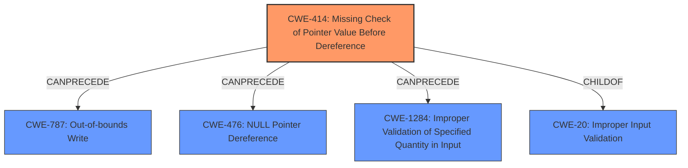

# Analysis Report for CVE-2022-42396

# Vulnerability Analysis Report: CVE-2022-42396

## Description


## Analysis (with Relationship Data)

# Summary
| CWE ID  | CWE Name                                                                    | Confidence | CWE Abstraction Level | CWE Vulnerability Mapping Label | CWE-Vulnerability Mapping Notes |
| :-------- | :-------------------------------------------------------------------------- | :--------- | :---------------------- | :------------------------------ | :------------------------------ |
| CWE-414   | Missing Check of Pointer Value Before Dereference | 0.80       | Base                    | Primary CWE                 | Allowed                       |
| CWE-787   | Out-of-bounds Write                                                           | 0.70       | Base                    | Secondary Candidate              | Allowed                       |
| CWE-476   | NULL Pointer Dereference                                                      | 0.50       | Base                    | Secondary Candidate              | Allowed                       |
| CWE-1284  | Improper Validation of Specified Quantity in Input                            | 0.40       | Base                    | Secondary Candidate              | Allowed                       |

## Evidence and Confidence

*   **Confidence Score:** 0.75
*   **Evidence Strength:** MEDIUM

## Relationship Analysis
The primary relationship that influences my decision is the hierarchical relationship where CWE-414 resides as a base class. The description clearly states the **lack of proper validation of a user-supplied value prior to dereferencing it as a pointer**. While other CWEs such as CWE-787 (Out-of-bounds Write) and CWE-476 (NULL Pointer Dereference) are also possibilities, the root cause is the missing check, making CWE-414 the most appropriate primary mapping. Other CWEs would only occur because the check was missing.



## Vulnerability Chain
The chain of events for this vulnerability starts with the **lack of proper validation of a user-supplied value prior to dereferencing it as a pointer** (CWE-414). This can then lead to various outcomes, such as an out-of-bounds write (CWE-787), a NULL pointer dereference (CWE-476), or other issues, culminating in arbitrary code execution.
- CWE-414: Missing Check of Pointer Value Before Dereference (Root Cause)
- Possible Outcomes:
    - CWE-787: Out-of-bounds Write
    - CWE-476: NULL Pointer Dereference
    - CWE-1284: Improper Validation of Specified Quantity in Input
- Impact: Arbitrary code execution

## Summary of Analysis
Initially, I considered CWE-416 (Use After Free) as the primary CWE due to its high ranking in similar CVE descriptions, however, the description explicitly mentions a **lack of proper validation of a user-supplied value prior to dereferencing it as a pointer**. This points more directly to CWE-414 (Missing Check of Pointer Value Before Dereference), which is a base level CWE and accurately represents the root cause.

The retriever results listed CWE-787, CWE-476 and CWE-1284, and CWE-20. I considered these as contributing factors as possible outcomes, but the root cause is the missing check on the pointer.

I am selecting CWE-414 as the primary CWE because it represents the most fundamental flaw. The evidence is from the Vulnerability Description Key Phrases: "**lack of proper validation of a user-supplied value prior to dereferencing it as a pointer**."

Relevant CWE Information:

# Enhanced Context (25 CWEs)

## CWE-414: Missing Check of Pointer Value Before Dereference
**Abstraction Level**: Base

**Description**: The product dereferences a pointer without first checking if the pointer is valid (e.g., not null).

**Explanation**: The vulnerability description clearly states that the issue results from the **lack of proper validation of a user-supplied value prior to dereferencing it as a pointer**. This directly corresponds to the definition of CWE-414, which is the **missing check of a pointer value before dereferencing it.**

**Security Implications**: If a pointer is dereferenced without being checked for validity (such as being null), it can lead to unpredictable behavior, including crashes, data corruption, or the execution of arbitrary code. In this case, the impact is arbitrary code execution.

**Relationship Analysis**: CWE-414 is a base-level CWE, making it a suitable choice for representing the root cause. It is related to CWE-476 (NULL Pointer Dereference) as a potential outcome, but the root cause is the missing check, not necessarily a NULL pointer.

**Mapping Guidance**: The usage of CWE-414 is allowed, and it aligns well with the vulnerability description.

**Other Candidates Considered**:
- CWE-476 (NULL Pointer Dereference): Considered but not chosen as the primary CWE because the description emphasizes the missing check rather than the guarantee of a NULL pointer. A null pointer dereference is a possible consequence of the missing check.
- CWE-787 (Out-of-bounds Write): Considered but not chosen as the primary CWE because it is a potential consequence, but the root cause is the missing check.
- CWE-1284 (Improper Validation of Specified Quantity in Input): Considered but did not fit the description as well as CWE-414, since its not about a quantity that is validated.
- CWE-416 (Use After Free): This CWE was given in similar CVE Descriptions, but it's not about using memory after it has been freed, but about validating the pointer before dereferencing it.

I am confident in the assessment based on the evidence, relationship analysis, and mapping guidance.


## CWE Relationship Analysis

Current CWEs represent these abstraction levels: .


### Vulnerability Chain Analysis

**Chain starting from CWE-476:**
- 476 (NULL Pointer Dereference) - ROOT


**Chain starting from CWE-20:**
- 20 (Improper Input Validation) - ROOT


### CWE Relationship Diagram

```mermaid
graph TD
    classDef primary fill:#f96,stroke:#333,stroke-width:2px
    classDef secondary fill:#69f,stroke:#333
    classDef tertiary fill:#9e9,stroke:#333
```


*Report generated on 2025-03-30 17:04:00*
