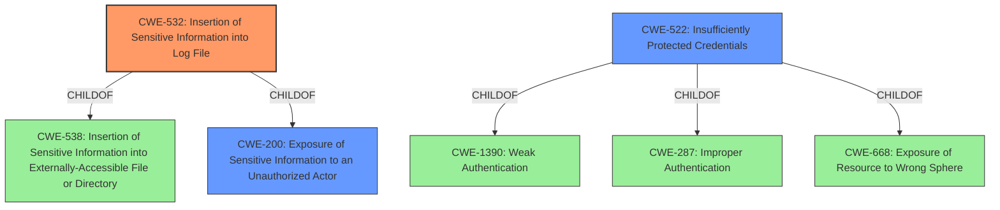

# Enhanced Analysis for CVE-2022-42439

# Summary
| CWE ID | CWE Name | Confidence | CWE Abstraction Level | CWE Vulnerability Mapping Label | CWE-Vulnerability Mapping Notes |
|---|---|---|---|---|---|
| CWE-532 | Insertion of Sensitive Information into Log File | 0.9 | Base | Allowed | Primary CWE |
| CWE-200 | Exposure of Sensitive Information to an Unauthorized Actor | 0.7 | Class | Discouraged | Secondary Candidate |
| CWE-522 | Insufficiently Protected Credentials | 0.6 | Class | Allowed-with-Review | Secondary Candidate |

## Evidence and Confidence

*   **Confidence Score:** 0.9
*   **Evidence Strength:** HIGH

## Relationship Analysis
The primary CWE is CWE-532, which is a Base level CWE and a child of both CWE-538 and CWE-200. CWE-200 is a Class level CWE that describes the exposure of sensitive information, while CWE-532 is more specific to the insertion of sensitive information into log files. This aligns with the vulnerability description, which explicitly mentions the exposure of credentials through log files. CWE-522, Insufficiently Protected Credentials, is also a Class level CWE and a child of CWE-1390, CWE-287, and CWE-668. While related, it's less directly applicable than CWE-532 as the primary issue is the logging of the credentials, not necessarily the protection of them in storage or transit.



## Vulnerability Chain
The vulnerability chain starts with the **unspecified vulnerability** in the Discovery Connector nodes. This leads to the **insertion of sensitive information (credentials)** into log files (CWE-532). The impact is the **exposure of these credentials to a privileged attacker**, which could lead to unauthorized access and other malicious activities (CWE-200).

## Summary of Analysis
The initial assessment identified the **unspecified vulnerability** leading to credentials being exposed to an attacker. The analysis of the vulnerability description and the CVE Reference Links Content Summary clearly points to the root cause being the insertion of sensitive information into log files. The evidence from "CVE Reference Links Content Summary" states: "The vulnerability stems from the use of Discovery Connector nodes within IBM App Connect Enterprise Certified Container IntegrationServer operands. These nodes can lead to the insertion of sensitive information into log files" and "The core weakness is the logging of potentially sensitive data, which could include credentials, API keys, or other confidential information, into log files."

The relationship analysis shows that CWE-532 is the most specific CWE that accurately describes the vulnerability. It is a Base level CWE, which is preferred for mapping root causes. While CWE-200 and CWE-522 are related, they are less specific and represent the impact and a potential contributing factor, respectively.

The selection of CWE-532 is at the optimal level of specificity because it directly addresses the **weakness** of inserting sensitive information into log files, rather than just the general exposure of sensitive information.


## CWE Relationship Analysis

Current CWEs represent these abstraction levels: .


### Vulnerability Chain Analysis

**Chain starting from CWE-200:**
- 200 (Exposure of Sensitive Information to an Unauthorized Actor) - ROOT


**Chain starting from CWE-1390:**
- 1390 (Weak Authentication) - ROOT


### CWE Relationship Diagram

```mermaid
graph TD
    classDef primary fill:#f96,stroke:#333,stroke-width:2px
    classDef secondary fill:#69f,stroke:#333
    classDef tertiary fill:#9e9,stroke:#333
```