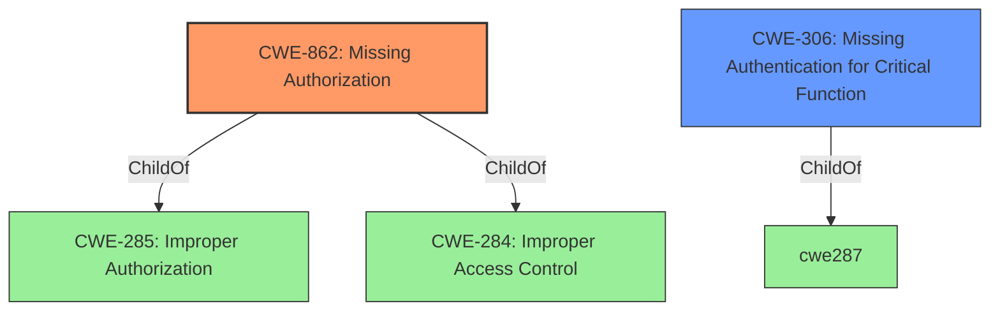

# Analysis Report for CVE-2022-42459

# Vulnerability Analysis Report: CVE-2022-42459

## Description


## Analysis (with Relationship Data)

# Summary
| CWE ID | CWE Name | Confidence | CWE Abstraction Level | CWE Vulnerability Mapping Label | CWE-Vulnerability Mapping Notes |
|---|---|---|---|---|---|
| CWE-862 | Missing Authorization | 1 | Class | Allowed-with-Review | Primary CWE |
| CWE-306 | Missing Authentication for Critical Function | 0.75 | Base | Allowed | Secondary Candidate |

## Evidence and Confidence

*   **Confidence Score:** 0.85
*   **Evidence Strength:** HIGH

## Relationship Analysis
The primary CWE is CWE-862 (**Missing Authorization**), a Class-level CWE. The vulnerability stems from a **missing authorization** check within a WordPress plugin, allowing unprivileged users to perform actions intended for administrators. The secondary CWE is CWE-306 (**Missing Authentication for Critical Function**), a Base-level CWE.



## Vulnerability Chain
The chain of events is:
1.  **Root Cause:** **Missing Authorization** (CWE-862) in the WordPress plugin.
2.  **Weakness:** Unprivileged users can access functions intended for administrators.
3.  **Impact:** **WordPress Options Change** vulnerability, potentially leading to unauthorized modifications of the site's configuration.

## Summary of Analysis
The initial assessment, based on the provided evidence, points to a clear case of **missing authorization**. The vulnerability description explicitly mentions the **lack of proper access control** as the root cause. The CVE Reference Links Content Summary further reinforces this by highlighting the **absence of necessary authorization checks**.

The retriever results suggest CWE-352 (**Cross-Site Request Forgery (CSRF)**), CWE-306 (**Missing Authentication for Critical Function**), CWE-862 (**Missing Authorization**), and CWE-863 (**Incorrect Authorization**) as potential candidates.

CWE-352 is not a direct match because the vulnerability doesn't inherently involve tricking a user into performing unintended actions. It's primarily about the **lack of authorization** on the server side.

CWE-862 (**Missing Authorization**) is the most accurate representation of the vulnerability. The plugin function **lacks an authorization check**, allowing unprivileged users to execute actions that should be restricted. The description of CWE-862 aligns well with the vulnerability: "The product does not perform an authorization check when an actor attempts to access a resource or perform an action."

CWE-306 (**Missing Authentication for Critical Function**) is also plausible, as the **missing authorization** could be viewed as a specific case of **missing authentication**. However, the focus is more on authorization (privilege check) rather than outright authentication (identity verification). Since we have a lack of authentication, the system then cannot check for authorization.

CWE-863 (**Incorrect Authorization**) is not applicable because the code doesn't perform an authorization check incorrectly; it **doesn't perform one at all**.

CWE-284 (**Improper Access Control**) is too generic. While technically correct, it doesn't provide enough specific information about the nature of the vulnerability. The mapping guidance for CWE-284 explicitly discourages its use and suggests more specific alternatives like CWE-862.

Based on the evidence and relationship analysis, CWE-862 (**Missing Authorization**) is the most appropriate primary CWE. The weakness is at the optimal level of specificity, accurately capturing the root cause of the vulnerability. CWE-306 is a plausible secondary candidate.

Relevant CWE Information:

## CWE-434: Unrestricted Upload of File with Dangerous Type
**Abstraction Level**: Base
**Similarity Score**: 0.78
**Source**: dense

**Description**:
The product allows the upload or transfer of dangerous file types that are automatically processed within its environment.

**Mapping Guidance**:
- Usage: Allowed
- Rationale: This CWE entry is at the Base level of abstraction, which is a preferred level of abstraction for mapping to the root causes of vulnerabilities.

## CWE-552: Files or Directories Accessible to External Parties
**Abstraction Level**: Base
**Similarity Score**: 0.77
**Source**: dense

**Description**:
The product makes files or directories accessible to unauthorized actors, even though they should not be.

**Mapping Guidance**:
- Usage: Allowed
- Rationale: This CWE entry is at the Base level of abstraction, which is a preferred level of abstraction for mapping to the root causes of vulnerabilities.

## CWE-184: Incomplete List of Disallowed Inputs
**Abstraction Level**: Base
**Similarity Score**: 0.77
**Source**: dense

**Description**:
The product implements a protection mechanism that relies on a list of inputs (or properties of inputs) that are not allowed by policy or otherwise require other action to neutralize before additional processing takes place, but the list is incomplete.

**Mapping Guidance**:
- Usage: Allowed
- Rationale: This CWE entry is at the Base level of abstraction, which is a preferred level of abstraction for mapping to the root causes of vulnerabilities.

## CWE-472: External Control of Assumed-Immutable Web Parameter
**Abstraction Level**: Base
**Similarity Score**: 0.77
**Source**: dense

**Description**:
The web application does not sufficiently verify inputs that are assumed to be immutable but are actually externally controllable, such as hidden form fields.

**Mapping Guidance**:
- Usage: Allowed
- Rationale: This CWE entry is at the Base level of abstraction, which is a preferred level of abstraction for mapping to the root causes of vulnerabilities.

## CWE-639: Authorization Bypass Through User-Controlled Key
**Abstraction Level**: Base
**Similarity Score**: 0.76
**Source**: dense

**Description**:
The system's authorization functionality does not prevent one user from gaining access to another user's data or record by modifying the key value identifying the data.

**Mapping Guidance**:
- Usage: Allowed
- Rationale: This CWE entry is at the Base level of abstraction, which is a preferred level of abstraction for mapping to the root causes of vulnerabilities.

## CWE-41: Improper Resolution of Path Equivalence
**Abstraction Level**: Base
**Similarity Score**: 0.76
**Source**: dense

**Description**:
The product is vulnerable to file system contents disclosure through path equivalence. Path equivalence involves the use of special characters in file and directory names. The associated manipulations are intended to generate multiple names for the same object.

**Mapping Guidance**:
- Usage: Allowed
- Rationale: This CWE entry is at the Base level of abstraction, which is a preferred level of abstraction for mapping to the root causes of vulnerabilities.

## CWE-1289: Improper Validation of Unsafe Equivalence in Input
**Abstraction Level**: Base
**Similarity Score**: 0.76
**Source**: dense

**Description**:
The product receives an input value that is used as a resource identifier or other type of reference, but it does not validate or incorrectly validates that the input is equivalent to a potentially-unsafe value.

**Mapping Guidance**:
- Usage: Allowed
- Rationale: This CWE entry is at the Base level of abstraction, which is a preferred level of abstraction for mapping to the root causes of vulnerabilities.

## CWE-425: Direct Request ('Forced Browsing')
**Abstraction Level**: Base
**Similarity Score**: 0.76
**Source**: dense

**Description**:
The web application does not adequately enforce appropriate authorization on all restricted URLs, scripts, or files.

**Mapping Guidance**:
- Usage: Allowed
- Rationale: This CWE entry is at the Base level of abstraction, which is a preferred level of abstraction for mapping to the root causes of vulnerabilities.

## CWE-807: Reliance on Untrusted Inputs in a Security Decision
**Abstraction Level**: Base
**Similarity Score**: 0.76
**Source**: dense

**Description**:
The product uses a protection mechanism that relies on the existence or values of an input, but the input can be modified by an untrusted actor in a way that bypasses the protection mechanism.

**Mapping Guidance**:
- Usage: Allowed
- Rationale: This CWE entry is at the Base level of abstraction, which is a preferred level of abstraction for mapping to the root causes of vulnerabilities.

## CWE-73: External Control of File Name or Path
**Abstraction Level**: Base
**Similarity Score**: 0.75
**Source**: dense

**Description**:
The product allows user


## CWE Relationship Analysis

Current CWEs represent these abstraction levels: .


### Vulnerability Chain Analysis

**Chain starting from CWE-862:**
- 862 (Missing Authorization) - ROOT


**Chain starting from CWE-552:**
- 552 (Files or Directories Accessible to External Parties) - ROOT


### CWE Relationship Diagram

```mermaid
graph TD
    classDef primary fill:#f96,stroke:#333,stroke-width:2px
    classDef secondary fill:#69f,stroke:#333
    classDef tertiary fill:#9e9,stroke:#333
```


*Report generated on 2025-03-30 22:04:43*
