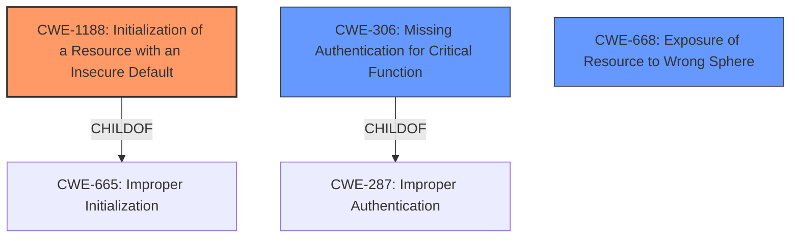

# Raw Analyzer Response for CVE-2022-42467

# Summary
| CWE ID  | CWE Name                                                                      | Confidence | CWE Abstraction Level | CWE Vulnerability Mapping Label | CWE-Vulnerability Mapping Notes |
| :-------- | :---------------------------------------------------------------------------- | :--------- | :---------------------- | :------------------------------ | :------------------------------ |
| CWE-1188 | Initialization of a Resource with an Insecure Default                         | 0.95       | Base                    | Primary CWE                     | Allowed                       |
| CWE-306  | Missing Authentication for Critical Function                                 | 0.85       | Base                    | Secondary Candidate           | Allowed                       |
| CWE-668  | Exposure of Resource to Wrong Sphere                                       | 0.75       | Class                    | Secondary Candidate           | Discouraged                     |

## Evidence and Confidence

*   **Confidence Score:** 0.9
*   **Evidence Strength:** HIGH

## Relationship Analysis
The primary CWE is CWE-1188, Initialization of a Resource with an Insecure Default, due to the H2 web console being automatically available in prototype mode, allowing direct database queries, without explicit configuration.
CWE-306, Missing Authentication for Critical Function, is related because the H2 web console lacked an authentication mechanism by default.
CWE-668, Exposure of Resource to Wrong Sphere, is considered because the database was exposed to the wrong control sphere, giving unintended actors access to it.

## Vulnerability Chain
The vulnerability chain starts with the **initialization of the H2 web console with an insecure default** (CWE-1188), leading to **missing authentication for a critical function** (CWE-306), and ultimately resulting in the **exposure of a resource to the wrong sphere** (CWE-668).

## Summary of Analysis
The initial analysis focused on identifying the root cause of the vulnerability, which is the automatic availability of the H2 web console in prototype mode without explicit configuration or authentication.
The primary CWE, CWE-1188, directly addresses the insecure default configuration.
The provided evidence strongly supports this classification: "When running in prototype mode, the h2 webconsole module (accessible from the Prototype menu) is automatically made available with the ability to directly query the database."
The relationship graph helps visualize how CWE-1188 leads to other weaknesses like CWE-306 and CWE-668.
The selected CWEs are at the optimal level of specificity because they directly address the root cause and the immediate consequences of the vulnerability.

Relevant CWE Information:

# Enhanced Context (25 CWEs)

## CWE-345: Insufficient Verification of Data Authenticity
**Abstraction Level**: Class
**Similarity Score**: 0.75
**Source**: dense

**Description**:
The product does not sufficiently verify the origin or authenticity of data, in a way that causes it to accept invalid data.

**Mapping Guidance**:
- Usage: Discouraged
- Rationale: This CWE entry is a level-1 Class (i.e., a child of a Pillar). It might have lower-level children that would be more appropriate

*Rejected*: This CWE does not apply as the vulnerability is not related to data authenticity.

## CWE-807: Reliance on Untrusted Inputs in a Security Decision
**Abstraction Level**: Base
**Similarity Score**: 0.75
**Source**: dense

**Description**:
The product uses a protection mechanism that relies on the existence or values of an input, but the input can be modified by an untrusted actor in a way that bypasses the protection mechanism.

**Mapping Guidance**:
- Usage: Allowed
- Rationale: This CWE entry is at the Base level of abstraction, which is a preferred level of abstraction for mapping to the root causes of vulnerabilities.

*Rejected*: This CWE does not apply because the web console was enabled by default and did not rely on untrusted input for a security decision.

## CWE-1390: Weak Authentication
**Abstraction Level**: Class
**Similarity Score**: 0.75
**Source**: dense

**Description**:
The product uses an authentication mechanism to restrict access to specific users or identities, but the mechanism does not sufficiently prove that the claimed identity is correct.

**Mapping Guidance**:
- Usage: Allowed-with-Review
- Rationale: This CWE entry is a Class and might have Base-level children that would be more appropriate

*Rejected*: While authentication was missing, CWE-306 is a better fit for the missing authentication issue.

## CWE-1391: Use of Weak Credentials
**Abstraction Level**: Class
**Similarity Score**: 0.75
**Source**: dense

**Description**:
The product uses weak credentials (such as a default key or hard-coded password) that can be calculated, derived, reused, or guessed by an attacker.

**Mapping Guidance**:
- Usage: Allowed-with-Review
- Rationale: This CWE entry is a Class and might have Base-level children that would be more appropriate

*Rejected*: This CWE does not apply as the vulnerability is not primarily about the usage of weak credentials, but rather the lack of authentication by default.

## CWE-657: Violation of Secure Design Principles
**Abstraction Level**: Class
**Similarity Score**: 0.75
**Source**: dense

**Description**:
The product violates well-established principles for secure design.

**Mapping Guidance**:
- Usage: Discouraged
- Rationale: This CWE entry is a level-1 Class (i.e., a child of a Pillar). It might have lower-level children that would be more appropriate

*Rejected*: Too generic.

## CWE-303: Incorrect Implementation of Authentication Algorithm
**Abstraction Level**: Base
**Similarity Score**: 0.75
**Source**: dense

**Description**:
The requirements for the product dictate the use of an established authentication algorithm, but the implementation of the algorithm is incorrect.

**Mapping Guidance**:
- Usage: Allowed
- Rationale: This CWE entry is at the Base level of abstraction, which is a preferred level of abstraction for mapping to the root causes of vulnerabilities.

*Rejected*: This CWE does not apply as the vulnerability is related to missing authentication, rather than incorrect implementation.

## CWE-74: Improper Neutralization of Special Elements in Output Used by a Downstream Component ('Injection')
**Abstraction Level**: Class
**Similarity Score**: 0.75
**Source**: dense

**Description**:
The product constructs all or part of a command, data structure, or record using externally-influenced input from an upstream component, but it does not neutralize or incorrectly neutralizes special elements that could modify how it is parsed or interpreted when it is sent to a downstream component.

**Mapping Guidance**:
- Usage: Discouraged
- Rationale: CWE-74 is high-level and often misused when lower-level weaknesses are more appropriate.

*Rejected*: This CWE does not apply as the vulnerability is not related to injection.

## CWE-668: Exposure of Resource to Wrong Sphere
**Abstraction Level**: Class
**Similarity Score**: 0.74
**Source**: dense

**Description**:
The product exposes a resource to the wrong control sphere, providing unintended actors with inappropriate access to the resource.

**Mapping Guidance**:
- Usage: Discouraged
- Rationale: CWE-668 is high-level and is often misused as a catch-all when lower-level CWE IDs might be applicable. It is sometimes used for low-information vulnerability reports [REF-1287]. It is a level-1 Class (i.e., a child of a Pillar). It is not useful for trend analysis.

*Accepted as Secondary Candidate*: Although discouraged, this CWE is relevant because the database was accessible from the web console in prototype mode, exposing it to a wider audience than intended.

## CWE-1289: Improper Validation of Unsafe Equivalence in Input
**Abstraction Level**: Base
**Similarity Score**: 0.74
**Source**: dense

**Description**:
The product receives an input value that is used as a resource identifier or other type of reference, but it does not validate or incorrectly validates that the input is equivalent to a potentially-unsafe value.

**Mapping Guidance**:
- Usage: Allowed
- Rationale: This CWE entry is at the Base level of abstraction, which is a preferred level of abstraction for mapping to the root causes of vulnerabilities.

*Rejected*: This CWE