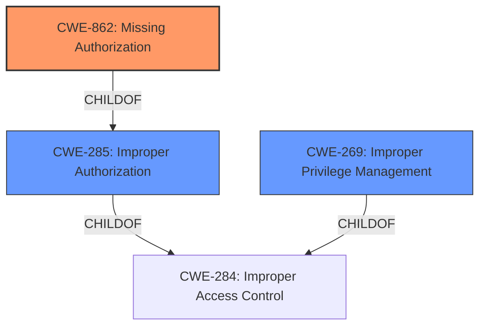

# Analysis for CVE-2022-42488

# Summary
| CWE ID | CWE Name | Confidence | CWE Abstraction Level | CWE Vulnerability Mapping Label | CWE-Vulnerability Mapping Notes |
|---|---|---|---|---|---|
| CWE-862 | Missing Authorization | 1 | Class | Allowed-with-Review | Primary CWE |
| CWE-269 | Improper Privilege Management | 0.6 | Class | Discouraged | Secondary Candidate |
| CWE-285 | Improper Authorization | 0.5 | Class | Discouraged | Secondary Candidate |

## Evidence and Confidence

*   **Confidence Score:** 1
*   **Evidence Strength:** HIGH

## Relationship Analysis
The primary CWE selected is CWE-862 [CWE-862: Missing Authorization], which is a child of CWE-285 [CWE-285: Improper Authorization]. The relationship indicates that a missing authorization is a specific type of improper authorization. The selection of CWE-862 [CWE-862: Missing Authorization] is more appropriate because the vulnerability description specifically mentions "**Missing permission validation**". CWE-269 [CWE-269: Improper Privilege Management] is also a child of CWE-284, indicating its relevance to authorization and privilege issues. However, the explicit "missing permission" aspect directly aligns with CWE-862 [CWE-862: Missing Authorization].

## Vulnerability Chain
The vulnerability chain starts with the **missing permission validation** in the param service of the startup subsystem. This allows a malicious application to elevate privileges to the root user, disable security features, and cause DoS by disabling particular services. The chain can be summarized as:
1.  **Missing Permission Validation** (CWE-862 [CWE-862: Missing Authorization]): The root cause where permission checks are absent in the param service.
2.  **Privilege Elevation**: The immediate impact, leading to root user privileges.
3.  **Disable Security Features**: A consequence of elevated privileges.
4.  **Denial of Service (DoS)**: Another consequence of elevated privileges by disabling services.

## Summary of Analysis
The initial assessment pointed towards CWE-862 [CWE-862: Missing Authorization] as the primary weakness due to the explicit mention of "**Missing permission validation**". The vulnerability description, "**Missing permission validation** vulnerability in param service of startup subsystem," directly supports this. The CVE Reference Links Content Summary also confirms this: "**weaknesses**: [ "Missing permission validation" ]".

The retriever results listed CWE-862 [CWE-862: Missing Authorization] as the top candidate. While other CWEs such as CWE-269 [CWE-269: Improper Privilege Management] and CWE-285 [CWE-285: Improper Authorization] were considered, they were deemed less specific. The graph relationships confirm that CWE-862 [CWE-862: Missing Authorization] is a child of CWE-285 [CWE-285: Improper Authorization], making it a more granular and appropriate choice. The official MITRE mapping guidance for CWE-862 [CWE-862: Missing Authorization] suggests it "is a Class and might have Base-level children that would be more appropriate", but since "**Missing permission validation**" is the most precise description available, CWE-862 [CWE-862: Missing Authorization] is the optimal selection.

CWE-20 [CWE-20: Improper Input Validation] was also considered but rejected because the core issue isn't about validating input but about the absence of authorization checks.

The final decision to use CWE-862 [CWE-862: Missing Authorization] is based on the explicit evidence of **missing permission validation**, its alignment with the CWE description, its position in the CWE hierarchy, and the mapping guidance. The selected CWE is at the optimal level of specificity, accurately representing the weakness.