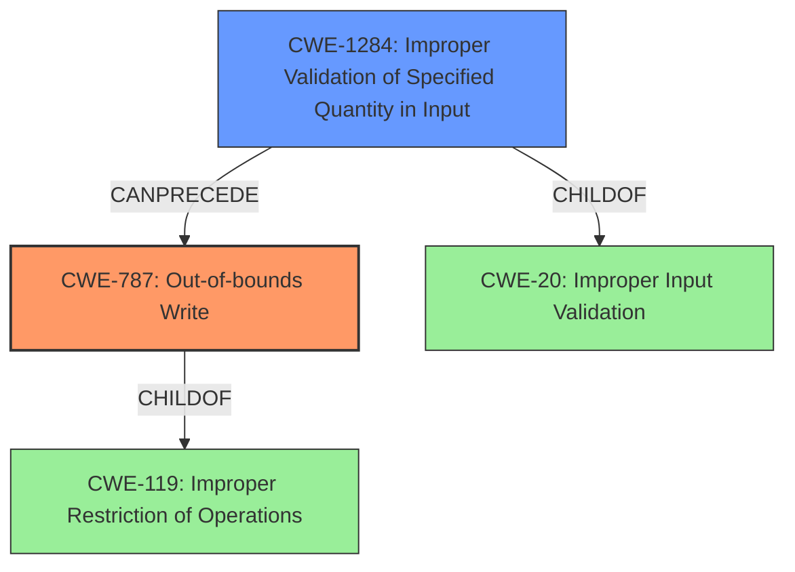

# Analysis Report for CVE-2022-42498

# Vulnerability Analysis Report: CVE-2022-42498

## Description


## Analysis (with Relationship Data)

# Summary

| CWE ID  | CWE Name                       | Confidence | CWE Abstraction Level | CWE Vulnerability Mapping Label | CWE-Vulnerability Mapping Notes |
| ------- | ------------------------------ | ---------- | --------------------- | ------------------------------- | ----------------------------- |
| CWE-787 | Out-of-bounds Write            | 1.0        | Base                  | Primary                         | Allowed                       |
| CWE-1284 | Improper Validation of Specified Quantity in Input | 0.75        | Base                  | Secondary                      | Allowed                       |

## Evidence and Confidence

*   **Confidence Score:** 0.9
*   **Evidence Strength:** HIGH

## Relationship Analysis

The primary CWE, CWE-787 (Out-of-bounds Write), is directly supported by the vulnerability description, which explicitly mentions an "out of bounds write." CWE-787 is a child of CWE-119 (Improper Restriction of Operations within the Bounds of a Memory Buffer), indicating a hierarchical relationship. The secondary CWE, CWE-1284 (Improper Validation of Specified Quantity in Input) is related to the **missing bounds check**, implying a failure to validate the size or quantity of the input. CWE-1284 is a child of CWE-20 (Improper Input Validation). The relationships highlight how a **missing bounds check** can lead to an out-of-bounds write.



## Vulnerability Chain

The vulnerability chain starts with a **missing bounds check** (CWE-1284), which leads to an **out of bounds write** (CWE-787). The impact is remote code execution.

Missing Bounds Check (CWE-1284) -> Out-of-bounds Write (CWE-787) -> Remote Code Execution

## Summary of Analysis

The analysis indicates a high confidence level due to the explicit mention of "**out of bounds write**" and "**missing bounds check**" in the vulnerability description, directly aligning with CWE-787 and CWE-1284, respectively. The CVE Reference Links Content Summary also confirms the presence of a vulnerability in the cellular firmware that could lead to Remote Code Execution (RCE) due to weaknesses.

The graph relationships show the chain of events, where the **missing bounds check** (CWE-1284) enables the out-of-bounds write (CWE-787).

The selected CWEs are at the optimal level of specificity, as they accurately represent the root cause (**missing bounds check**) and the resulting weakness (**out of bounds write**). Selecting a higher-level CWE like CWE-119 or CWE-20 would be less precise.

Relevant CWE Information:

*   CWE-787 (Out-of-bounds Write): The vulnerability description explicitly states "**out of bounds write** due to a **missing bounds check**". This directly aligns with the definition of CWE-787, which involves writing data outside the intended buffer.
*   CWE-1284 (Improper Validation of Specified Quantity in Input): The vulnerability description states a "**missing bounds check**". This indicates a failure to validate the size or quantity of the input, leading to the out-of-bounds write.

CWEs considered but not used:

*   CWE-120 (Buffer Copy without Checking Size of Input ('Classic Buffer Overflow')): While the vulnerability involves writing beyond buffer boundaries, it isn't explicitly a buffer copy operation. The root cause is a **missing bounds check** rather than unchecked copying.
*   CWE-190 (Integer Overflow or Wraparound), CWE-191 (Integer Underflow): These are related to calculation errors, but the description focuses on a **missing bounds check** rather than a calculation error.
*   CWE-20 (Improper Input Validation): While CWE-20 is a parent of CWE-1284, it is too general. CWE-1284 specifically addresses the lack of validation of quantity, which is more precise.
*   CWE-823 (Use of Out-of-range Pointer Offset): The vulnerability description does not provide specific evidence of pointer arithmetic being the root cause.


## CWE Relationship Analysis

Current CWEs represent these abstraction levels: .


### Vulnerability Chain Analysis

**Chain starting from CWE-190:**
- 190 (Integer Overflow or Wraparound) - ROOT


**Chain starting from CWE-823:**
- 823 (Use of Out-of-range Pointer Offset) - ROOT


### CWE Relationship Diagram

```mermaid
graph TD
    classDef primary fill:#f96,stroke:#333,stroke-width:2px
    classDef secondary fill:#69f,stroke:#333
    classDef tertiary fill:#9e9,stroke:#333
```


*Report generated on 2025-03-31 03:39:45*
