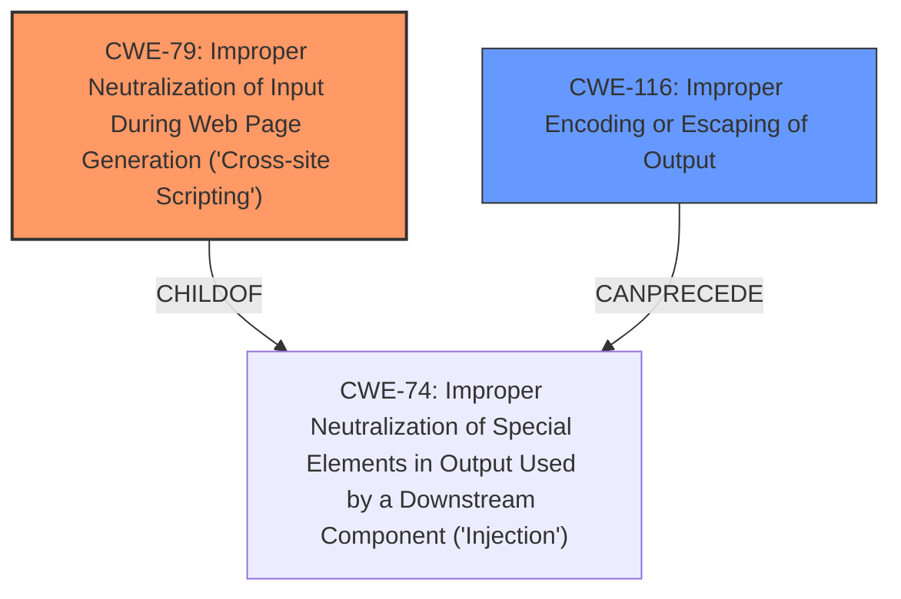

# Raw Analyzer Response for CVE-2022-4250

# Summary
| CWE ID | CWE Name | Confidence | CWE Abstraction Level | CWE Vulnerability Mapping Label | CWE-Vulnerability Mapping Notes |
|---|---|---|---|---|---|
| CWE-79 | Improper Neutralization of Input During Web Page Generation ('Cross-site Scripting') | 1.0 | Base | Allowed | Primary CWE. The application does not neutralize user-controllable input before placing it in output used as a web page, leading to XSS. |
| CWE-116 | Improper Encoding or Escaping of Output | 0.7 | Class | Allowed-with-Review | Secondary CWE. The application's failure to properly encode or escape output allows injected scripts to be interpreted as part of the web page. |

## Evidence and Confidence

*   **Confidence Score:** 1.0
*   **Evidence Strength:** HIGH

## Relationship Analysis
The primary CWE is CWE-79, which represents the **improper neutralization** of input leading to cross-site scripting. CWE-79 is a base-level CWE. CWE-116, which represents **improper encoding or escaping of output**, is a related class-level CWE that describes the general problem of failing to preserve the intended structure of a message. CWE-116 is a parent of more specific encoding/escaping issues. In this case, the lack of proper output encoding directly leads to the XSS vulnerability.

## Vulnerability Chain
The vulnerability chain starts with the application receiving user input, then the **improper input sanitization** (implicit), and finally the impact of cross-site scripting due to **improper neutralization of input** in `booking.php`.

## Summary of Analysis
The analysis is based on the provided vulnerability description and the CVE Reference Links Content Summary. The root cause is the **improper sanitization** of the `id` parameter in `booking.php`, which leads to XSS. The evidence from the "CVE Reference Links Content Summary" clearly states that the `$id` variable is directly inserted into the `value` attribute of a hidden input field without any encoding or escaping.

The primary CWE, CWE-79, is the most appropriate because it directly addresses the **improper neutralization** of input during web page generation, which is the root cause of the XSS vulnerability. The retriever results also list CWE-79 as the top candidate.

CWE-116 is considered as a secondary weakness because the **improper encoding or escaping** of output is a contributing factor to the XSS vulnerability. While CWE-116 is a class-level CWE, it provides additional context to the weakness.

The selected CWEs are at the optimal level of specificity. CWE-79 is a base-level CWE that directly describes the XSS vulnerability, while CWE-116 is a class-level CWE that provides additional context about the encoding/escaping issues.

Relevant CWE Information:

# Enhanced Context (25 CWEs)

## CWE-80: Improper Neutralization of Script-Related HTML Tags in a Web Page (Basic XSS)
**Abstraction Level**: Variant
**Similarity Score**: 0.79
**Source**: dense

**Description**:
The product receives input from an upstream component, but it does not neutralize or incorrectly neutralizes special characters such as "<", ">", and "&" that could be interpreted as web-scripting elements when they are sent to a downstream component that processes web pages.

**Mapping Guidance**:
- Usage: Allowed
- Rationale: This CWE entry is at the Variant level of abstraction, which is a preferred level of abstraction for mapping to the root causes of vulnerabilities.

**Why Not Used:** CWE-80 is more specific and focuses on HTML tags, while CWE-79 is a more general case of XSS. The provided details do not indicate that only HTML tags are the issue.

## CWE-74: Improper Neutralization of Special Elements in Output Used by a Downstream Component ('Injection')
**Abstraction Level**: Class
**Similarity Score**: 0.78
**Source**: dense

**Description**:
The product constructs all or part of a command, data structure, or record using externally-influenced input from an upstream component, but it does not neutralize or incorrectly neutralizes special elements that could modify how it is parsed or interpreted when it is sent to a downstream component.

**Mapping Guidance**:
- Usage: Discouraged
- Rationale: CWE-74 is high-level and often misused when lower-level weaknesses are more appropriate.

**Why Not Used:** CWE-74 is too high-level. CWE-79 provides a more specific classification for the XSS vulnerability.

## CWE-1289: Improper Validation of Unsafe Equivalence in Input
**Abstraction Level**: Base
**Similarity Score**: 0.77
**Source**: dense

**Description**:
The product receives an input value that is used as a resource identifier or other type of reference, but it does not validate or incorrectly validates that the input is equivalent to a potentially-unsafe value.

**Mapping Guidance**:
- Usage: Allowed
- Rationale: This CWE entry is at the Base level of abstraction, which is a preferred level of abstraction for mapping to the root causes of vulnerabilities.

**Why Not Used:** CWE-1289 is not applicable. The vulnerability is not related to validation of equivalence.

## CWE-116: Improper Encoding or Escaping of Output
**Abstraction Level**: Class
**Similarity Score**: 0.77
**Source**: dense

**Description**:
The product prepares a structured message for communication with another component, but encoding or escaping of the data is either missing or done incorrectly. As a result, the intended structure of the message is not preserved.

**Mapping Guidance**:
- Usage: Allowed-with-Review
- Rationale: This CWE entry is a Class and might have Base-level children that would be more appropriate

**Why Used:** As a secondary issue, the lack of proper encoding or escaping of output is contributing to the XSS vulnerability, supporting usage of CWE-116.

## CWE-138: Improper Neutralization of Special Elements
**Abstraction Level**: Class
**Similarity Score**: 0.77
**Source**: dense

**Description**:
The product receives input from an upstream component, but it does not neutralize or incorrectly neutralizes special elements that could be interpreted as control elements or syntactic markers when they are sent to a downstream component.

**Mapping Guidance**:
- Usage: Discouraged
- Rationale: This CWE entry is a level-1 Class (i.e., a child of a Pillar). It might have lower-level children that would be more appropriate

**Why Not Used:** CWE-138 is too general. CWE-79 provides a more specific classification.

## CWE-184: Incomplete List of Disallowed Inputs
**Abstraction Level**: Base
**Similarity Score**: 0.77
**Source**: dense

**Description**:
The product implements a protection mechanism that relies on a list of inputs (or properties of inputs) that are not allowed by policy or otherwise require other action to neutralize before additional processing takes place, but the list is incomplete.

**Mapping Guidance**:
- Usage: Allowed
- Rationale: This CWE entry is at the Base level of abstraction, which is a preferred level of abstraction for mapping to the root causes of vulnerabilities.

**Why Not Used:** CWE-184 does not apply. The vulnerability is not related to an incomplete list of disallowed inputs.

## CWE-838: Inappropriate Encoding for Output Context
**Abstraction Level**: Base
**Similarity Score**: 0.76
**Source**: dense

**Description**:
The product uses or specifies an encoding when generating output to a downstream component, but the specified encoding is not the same as the encoding that is expected by the downstream component.

**Mapping Guidance**:
- Usage: Allowed
- Rationale: This CWE entry is at the Base level of abstraction, which is a preferred level of abstraction for mapping to the root causes of vulnerabilities.

**Why Not Used:** CWE-838 does not apply. The vulnerability is not related to inappropriate encoding for output context.

## CWE-472: External Control of Assumed-Immutable Web Parameter
**Abstraction Level**: Base
**Similarity Score**: 0.76
**Source**: dense

**Description**:
The web application does not sufficiently verify inputs that are assumed to be immutable but are actually externally controllable, such as hidden form fields.

**Mapping Guidance**:
- Usage: Allowed
- Rationale: This CWE entry is at the Base level of abstraction, which is a preferred level of abstraction for mapping to the root causes of vulnerabilities.

**Why Not Used:** CWE-472 doesn't apply because the issue isn