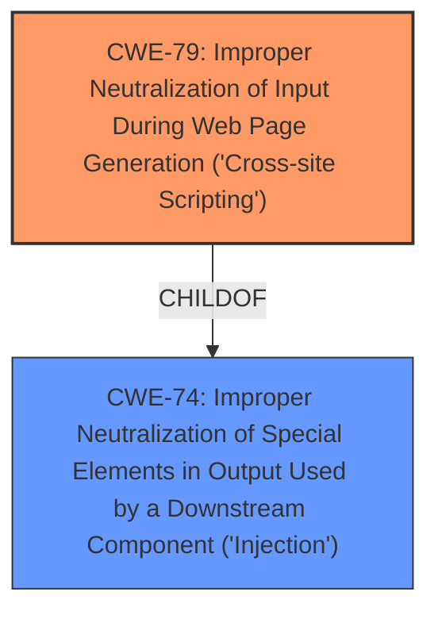

# Analysis Report for CVE-2022-4251

# Vulnerability Analysis Report: CVE-2022-4251

## Description


## Analysis (with Relationship Data)

# Summary
| CWE ID | CWE Name | Confidence | CWE Abstraction Level | CWE Vulnerability Mapping Label | CWE-Vulnerability Mapping Notes |
|---|---|---|---|---|---|
| CWE-79 | Improper Neutralization of Input During Web Page Generation ('Cross-site Scripting') | 1.0 | Base | Allowed | Primary CWE |

## Evidence and Confidence

*   **Confidence Score:** 1.0
*   **Evidence Strength:** HIGH

## Relationship Analysis
The primary relationship influencing the decision is the ChildOf relationship between CWE-79 and CWE-74 (Improper Neutralization of Special Elements in Output Used by a Downstream Component ('Injection')), indicating that XSS is a specific type of injection. The base level abstraction of CWE-79 makes it a strong choice.



## Vulnerability Chain
The vulnerability chain is straightforward:
1.  **Root Cause:** The application **does not neutralize** user-provided input.
2.  **Weakness:** This leads to **cross-site scripting**.
3.  **Impact:** An attacker can inject malicious JavaScript code, leading to session hijacking, defacement, or other malicious actions.

## Summary of Analysis
The initial analysis strongly points to CWE-79 as the primary weakness.

The vulnerability description explicitly mentions "**cross-site scripting**" as the **weakness** and the CVE Reference Links Content Summary details the root cause as "**The application directly stores user-provided input into the database without any sanitization, and later outputs this data to the page without encoding.**" This aligns perfectly with the description of CWE-79, which states, "The product does not neutralize or incorrectly neutralizes user-controllable input before it is placed in output that is used as a web page that is served to other users." The evidence provided is very strong and directly supports the classification.

The relationship analysis reinforces this decision. CWE-79 is a base level CWE, providing the right level of specificity.

Other CWEs considered but not used:

*   CWE-89 (Improper Neutralization of Special Elements used in an SQL Command ('SQL Injection')): While the description mentions storing data in a database, the primary issue is the lack of output sanitization, not the construction of SQL commands.
*   CWE-352 (Cross-Site Request Forgery (CSRF)): CSRF is a different type of vulnerability that involves tricking a user into performing unwanted actions. The description does not suggest any CSRF-related issues.
*   CWE-80 (Improper Neutralization of Script-Related HTML Tags in a Web Page (Basic XSS)): CWE-80 is a variant of CWE-79 and focuses on specific HTML tags. Since the description doesn't specify that the XSS is limited to script-related HTML tags, the broader CWE-79 is more appropriate.
*   CWE-434 (Unrestricted Upload of File with Dangerous Type): This is not relevant since the vulnerability does not involve file uploads.
*   CWE-472 (External Control of Assumed-Immutable Web Parameter): While this could be a contributing factor, the core issue is the **lack of sanitization** of user input before output, making CWE-79 the more direct and relevant classification.

The selected CWE-79 is at the optimal level of specificity (Base) and is directly supported by the vulnerability description and CVE Reference Links Content Summary.


## CWE Relationship Analysis

Current CWEs represent these abstraction levels: .


### Vulnerability Chain Analysis

**Chain starting from CWE-89:**
- 89 (Improper Neutralization of Special Elements used in an SQL Command ('SQL Injection')) - ROOT


**Chain starting from CWE-80:**
- 80 (Improper Neutralization of Script-Related HTML Tags in a Web Page (Basic XSS)) - ROOT


### CWE Relationship Diagram

```mermaid
graph TD
    classDef primary fill:#f96,stroke:#333,stroke-width:2px
    classDef secondary fill:#69f,stroke:#333
    classDef tertiary fill:#9e9,stroke:#333
```


*Report generated on 2025-03-30 22:15:20*
