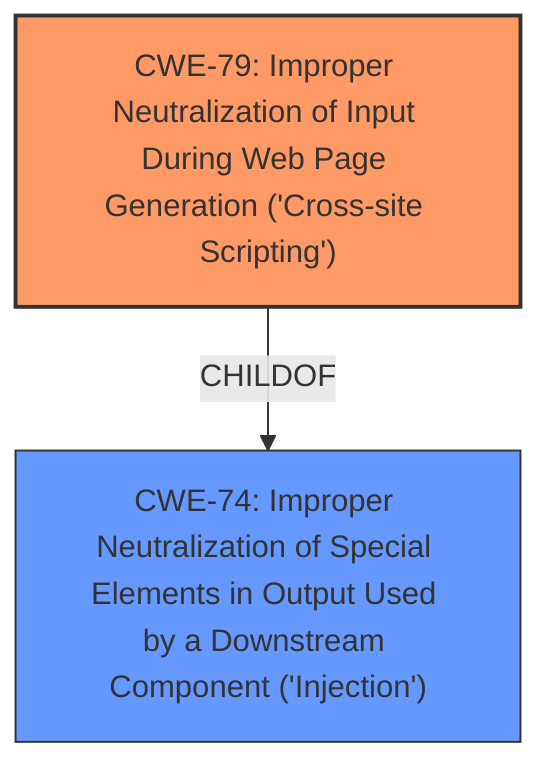

# Analysis Report for CVE-2022-4252

# Vulnerability Analysis Report: CVE-2022-4252

## Description


## Analysis (with Relationship Data)

# Summary
| CWE ID | CWE Name | Confidence | CWE Abstraction Level | CWE Vulnerability Mapping Label | CWE-Vulnerability Mapping Notes |
|---|---|---|---|---|---|
| CWE-79 | Improper Neutralization of Input During Web Page Generation ('Cross-site Scripting') | 1.0 | Base | Allowed | Primary CWE. The product does not neutralize user-controllable input before placing it in output used as a web page. |

## Evidence and Confidence

*   **Confidence Score:** 1.0
*   **Evidence Strength:** HIGH

## Relationship Analysis
The primary relationship that influenced the CWE selection was the ChildOf relationship between CWE-79 and CWE-74. While CWE-74 is a broader category (Improper Neutralization of Special Elements in Output Used by a Downstream Component), CWE-79 is more specific, focusing on Cross-Site Scripting, which is the stated weakness in the vulnerability description. The Retriever results also gave CWE-79 a high score, which further confirmed the selection.



## Vulnerability Chain
The vulnerability chain starts with the **improper input sanitization**, leading to the **cross-site scripting** vulnerability.

## Summary of Analysis
The analysis is based on the vulnerability description, which clearly states that the manipulation of the `builtin_echo` function leads to cross site scripting due to **improper input sanitization**.
> A vulnerability was found in SourceCodester Canteen Management System. It has been classified as problematic. This affects the function builtin_echo of the file categories.php. The manipulation leads to **cross site scripting**. It is possible to initiate the attack remotely.

The selection of CWE-79 is also supported by the "CVE Reference Links Content Summary", which indicates that the root cause is a failure to properly neutralize user-controllable input before it is used in the output of a web page. It also explicitly states "Cross-Site Scripting (XSS): The primary vulnerability is XSS (CWE-79), stemming from improper handling of user-supplied input."

The Retriever results also gave CWE-79 the highest score (0.564).

CWE-79 is at the Base level of abstraction, which is the preferred level, and its description directly matches the vulnerability.

Relevant CWE Information:

# Enhanced Context (25 CWEs)

## CWE-74: Improper Neutralization of Special Elements in Output Used by a Downstream Component ('Injection')
**Abstraction Level**: Class
**Similarity Score**: 0.77
**Source**: dense

**Description**:
The product constructs all or part of a command, data structure, or record using externally-influenced input from an upstream component, but it does not neutralize or incorrectly neutralizes special elements that could modify how it is parsed or interpreted when it is sent to a downstream component.

**Mapping Guidance**:
- Usage: Discouraged
- Rationale: CWE-74 is high-level and often misused when lower-level weaknesses are more appropriate.

## CWE-79: Improper Neutralization of Input During Web Page Generation ('Cross-site Scripting')
**Abstraction Level**: Base
**Similarity Score**: 7013.97
**Source**: sparse

**Description**:
The product does not neutralize or incorrectly neutralizes user-controllable input before it is placed in output that is used as a web page that is served to other users.

**Mapping Guidance**:
- Usage: Allowed
- Rationale: This CWE entry is at the Base level of abstraction, which is a preferred level of abstraction for mapping to the root causes of vulnerabilities.


## CWE Relationship Analysis

Current CWEs represent these abstraction levels: .


### Vulnerability Chain Analysis

**Chain starting from CWE-74:**
- 74 (Improper Neutralization of Special Elements in Output Used by a Downstream Component ('Injection')) - ROOT


**Chain starting from CWE-79:**
- 79 (Improper Neutralization of Input During Web Page Generation ('Cross-site Scripting')) - ROOT


### CWE Relationship Diagram

```mermaid
graph TD
    classDef primary fill:#f96,stroke:#333,stroke-width:2px
    classDef secondary fill:#69f,stroke:#333
    classDef tertiary fill:#9e9,stroke:#333
```


*Report generated on 2025-03-31 10:33:23*
