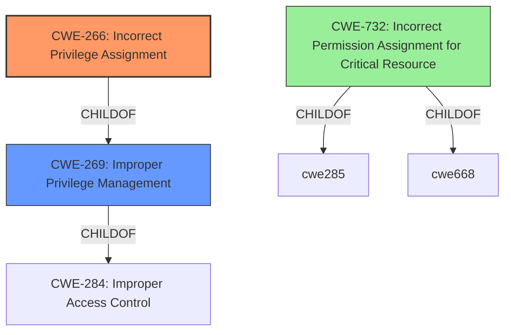

# Enhanced Analysis for CVE-2022-4264

# Summary
| CWE ID | CWE Name | Confidence | CWE Abstraction Level | CWE Vulnerability Mapping Label | CWE-Vulnerability Mapping Notes |
|---|---|---|---|---|---|
| CWE-266 | Incorrect Privilege Assignment | 1.0 | Base | Primary | Allowed |
| CWE-269 | Improper Privilege Management | 0.7 | Class | Secondary | Discouraged |
| CWE-732 | Incorrect Permission Assignment for Critical Resource | 0.6 | Class | Secondary | Allowed-with-Review |

## Evidence and Confidence

*   **Confidence Score:** 1.0
*   **Evidence Strength:** HIGH

## Relationship Analysis
The primary relationship that influenced the selection was the ChildOf relationship between CWE-266 (Incorrect Privilege Assignment) and CWE-269 (Improper Privilege Management). CWE-266 is a more specific Base CWE, making it a better fit than the more general Class CWE-269. CWE-732 was considered as another possible Class CWE, but its description focuses on resource permissions, which is not the primary issue here.



## Vulnerability Chain
The vulnerability chain starts with an **Incorrect Privilege Assignment** (CWE-266), which allows a low-privilege user to **change some configuration**. The root cause is the **incorrect assignment** of privileges, and the impact is the ability to modify configuration data.

## Summary of Analysis
The analysis is based on the provided evidence, specifically the vulnerability description and CVE reference content summary. The key phrase "**Incorrect Privilege Assignment**" directly aligns with CWE-266. The CVE reference summary also mentions "Improper Privilege Management (CWE-269)".

The graph relationships support the choice of CWE-266 as the primary CWE because it is a more specific child of CWE-269. While CWE-269 could be considered, the explicit mention of "**Incorrect Privilege Assignment**" in the vulnerability description makes CWE-266 a more accurate representation of the **root cause**.

The selected CWEs are at the optimal level of specificity because CWE-266 is a Base CWE that directly describes the **root cause**, while CWE-269 and CWE-732 are higher-level Class CWEs that are less specific.

Relevant CWE Information:

# Enhanced Context (25 CWEs)
The following CWEs were identified as potentially relevant to this vulnerability:

## CWE-266: Incorrect Privilege Assignment
**Abstraction:** Base
**Similarity Score**: 0.78
**Source**: dense

**Description**:
A product incorrectly assigns a privilege to a particular actor, creating an unintended sphere of control for that actor.

**Mapping Guidance**:
- Usage: Allowed
- Rationale: This CWE entry is at the Base level of abstraction, which is a preferred level of abstraction for mapping to the root causes of vulnerabilities.

## CWE-266: Incorrect Privilege Assignment
**Abstraction:** Base
**Similarity Score**: 2.50
**Source**: graph

**Description**:
A product incorrectly assigns a privilege to a particular actor, creating an unintended sphere of control for that actor.

**Mapping Guidance**:
- Usage: Allowed
- Rationale: This CWE entry is at the Base level of abstraction, which is a preferred level of abstraction for mapping to the root causes of vulnerabilities.

## CWE-266: Incorrect Privilege Assignment
**Abstraction:** Base
**Similarity Score**: 4829.20
**Source**: sparse

**Description**:
A product incorrectly assigns a privilege to a particular actor, creating an unintended sphere of control for that actor.

**Mapping Guidance**:
- Usage: Allowed
- Rationale: This CWE entry is at the Base level of abstraction, which is a preferred level of abstraction for mapping to the root causes of vulnerabilities.

### Technical Explanation for CWE-266:

*   **How the vulnerability's details match the CWE's characteristics:** The vulnerability description explicitly states "**Incorrect Privilege Assignment**", which directly corresponds to the definition of CWE-266: "A product incorrectly assigns a privilege to a particular actor, creating an unintended sphere of control for that actor." The low-privilege user being able to change configuration details confirms this incorrect assignment.
*   **The security implications and potential impact:** The security implication is that a low-privilege user can modify configuration settings, potentially leading to unauthorized changes in the system's behavior. The impact is classified as a high impact to integrity.
*   **Any parent-child relationships or chain patterns that influenced your mapping:** CWE-266 is a child of CWE-269 (Improper Privilege Management).
*   **Whether the weakness is primary or secondary in the vulnerability:** This is the primary weakness as it's the **root cause** of the vulnerability.
*   **How the official MITRE mapping guidance influenced your decision:** The MITRE mapping guidance for CWE-266 states that it is at the Base level of abstraction, which is preferred, and its Usage is Allowed. This confirms the selection of CWE-266 as the primary CWE.

### Technical Explanation for CWE-269:

*   **How the vulnerability's details match the CWE's characteristics:** CWE-269 describes a general failure to properly manage privileges, which is a broader category that encompasses the **incorrect assignment** of privileges.
*   **The security implications and potential impact:** Similar to CWE-266, the security implication is that unauthorized users gain unintended control over system resources and configurations.
*   **Any parent-child relationships or chain patterns that influenced your mapping:** CWE-269 is a child of CWE-284 (Improper Access Control).
*   **Whether the weakness is primary or secondary in the vulnerability:** This is a secondary weakness, as CWE-266 provides a more specific description of the **root cause**.
*   **How the official MITRE mapping guidance influenced your decision:** The MITRE mapping guidance for CWE-269 is Discouraged, stating that it is commonly misused and should be avoided when a more specific CWE is available. This supports the decision to use CWE-266 as the primary CWE.

### Technical Explanation for CWE-732:

*   **How the vulnerability's details match the CWE's characteristics:** CWE-732 focuses on **incorrect permission assignment** for resources, which is related to privileges but not the direct **root cause** in this case. The core issue is the **incorrect assignment** of privileges to a user, not the permissions of a specific resource.
*   **The security implications and potential impact:** Incorrect permissions on resources can lead to unauthorized access and modification of critical system components.
*   **Any parent-child relationships or chain patterns that influenced your mapping:** CWE-732 is a child of CWE-285 and CWE-668.
*   **Whether the weakness is primary or secondary in the vulnerability:** This is a secondary consideration, as the vulnerability primarily involves the assignment of privileges to a user.
*   **How the official MITRE mapping guidance influenced your decision:** The MITRE mapping guidance for CWE-732 is Allowed-with-Review, noting that it is often misused for authorization weaknesses. This further supports the decision to prioritize CWE-266 and CWE-269.

### CWEs Considered But Not Used:

*   **CWE-284: Improper Access Control:** This is a very high-level (Pillar) CWE and is too general for this vulnerability.
*   **CWE-863: Incorrect Authorization:** While authorization is related, the explicit **incorrect privilege assignment** is a more precise description of the **root cause**.
*   **CWE-915: Improperly Controlled Modification of Dynamically-Determined Object Attributes:** This CWE is related to modification of object attributes but does not directly address the **incorrect privilege assignment** that is the **root cause** of this vulnerability.


## CWE Relationship Analysis

Current CWEs represent these abstraction levels: .


### Vulnerability Chain Analysis

**Chain starting from CWE-266:**
- 266 (Incorrect Privilege Assignment) - ROOT


**Chain starting from CWE-915:**
- 915 (Improperly Controlled Modification of Dynamically-Determined Object Attributes) - ROOT


### CWE Relationship Diagram

```mermaid
graph TD
    classDef primary fill:#f96,stroke:#333,stroke-width:2px
    classDef secondary fill:#69f,stroke:#333
    classDef tertiary fill:#9e9,stroke:#333
```