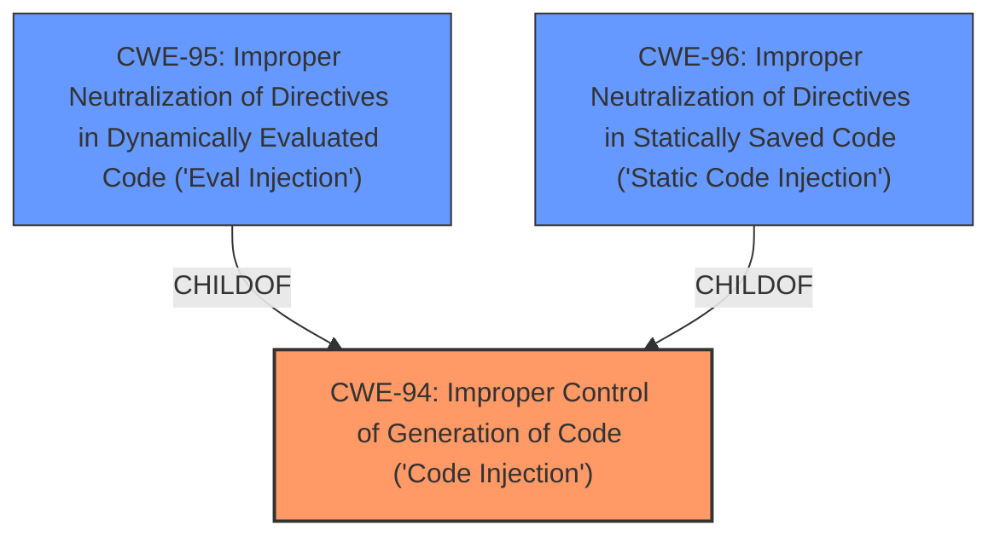

# Raw Analyzer Response for CVE-2022-42699

# Summary
| CWE ID | CWE Name | Confidence | CWE Abstraction Level | CWE Vulnerability Mapping Label | CWE-Vulnerability Mapping Notes |
|---|---|---|---|---|---|
| CWE-94 | Improper Control of Generation of Code ('Code Injection') | 0.8 | Base | Allowed-with-Review | Primary CWE |

## Evidence and Confidence

*   **Confidence Score:** 0.8
*   **Evidence Strength:** MEDIUM

## Relationship Analysis
The primary relationship is that CWE-94 [Improper Control of Generation of Code ('Code Injection')] can have variants such as CWE-95 [Improper Neutralization of Directives in Dynamically Evaluated Code ('Eval Injection')] and CWE-96 [Improper Neutralization of Directives in Statically Saved Code ('Static Code Injection')]. The general category is code injection which fits the description.

## Vulnerability Chain
The vulnerability chain starts with the **improper control of code generation**, leading to potential **code injection** and ultimately **Remote Code Execution**.

## Summary of Analysis
The initial assessment identified **Remote Code Execution** due to an **injection vulnerability** in the Easy WP SMTP plugin.

The evidence for the root cause is:
*   Vulnerability Description Key Phrases: **impact:** Remote Code Execution
*   CVE Reference Links Content Summary: **Root cause of vulnerability:** The vulnerability is a Remote Code Execution (RCE) flaw. The specific details of the vulnerability are not provided in this document.
*   CVE Reference Links Content Summary: **Weaknesses/vulnerabilities present:** Remote Code Execution (RCE). This is also classified as an A1: Injection vulnerability according to OWASP Top 10.

The retriever results suggested multiple CWEs including CWE-96 [Improper Neutralization of Directives in Statically Saved Code ('Static Code Injection')], CWE-94 [Improper Control of Generation of Code ('Code Injection')], and CWE-95 [Improper Neutralization of Directives in Dynamically Evaluated Code ('Eval Injection')]. Given that the specifics of static vs dynamic injection are not provided, CWE-94 [Improper Control of Generation of Code ('Code Injection')] is the most appropriate **Base** CWE.

CWE-94 [Improper Control of Generation of Code ('Code Injection')] is selected because the vulnerability involves the **improper control of code generation**, which can lead to code injection and subsequent remote code execution. CWE-94 [Improper Control of Generation of Code ('Code Injection')] is at the optimal level of specificity because the vulnerability summary indicates a general code injection issue without specifying whether it's static or dynamically evaluated code.

Relevant CWE Information:
# Enhanced Context (25 CWEs)
The following CWEs were identified as potentially relevant to this vulnerability:

## CWE-94: Improper Control of Generation of Code ('Code Injection')
**Abstraction Level**: Base
**Similarity Score**: 4718.38
**Source**: sparse

**Description**:
The product constructs all or part of a code segment using externally-influenced input from an upstream component, but it does not neutralize or incorrectly neutralizes special elements that could modify the syntax or behavior of the intended code segment.

**Mapping Guidance**:
- Usage: Allowed-with-Review
- Rationale: This entry is frequently misused for vulnerabilities with a technical impact of "code execution," which does not by itself indicate a root cause weakness, since dozens of weaknesses can enable code execution.