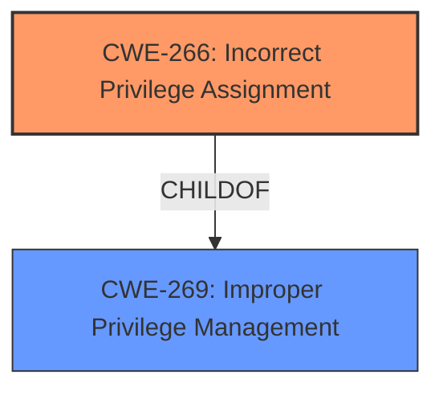

# Raw Analyzer Response for CVE-2022-42735

# Summary

| CWE ID | CWE Name | Confidence | CWE Abstraction Level | CWE Vulnerability Mapping Label | CWE-Vulnerability Mapping Notes |
|---|---|---|---|---|---|
| CWE-266 | Incorrect Privilege Assignment | 1.0 | Base | Allowed | Primary CWE |

## Evidence and Confidence

*   **Confidence Score:** 1.0
*   **Evidence Strength:** HIGH

## Relationship Analysis
The primary relationship influencing my decision is the ChildOf relationship between CWE-266 and CWE-269. CWE-266 is a more specific, Base-level CWE that directly addresses the **incorrect assignment of privileges**, while CWE-269 is a broader Class-level CWE that encompasses **improper privilege management** more generally.

## Vulnerability Chain
The vulnerability chain is straightforward:

1.  **Root Cause:** **Incorrect Privilege Assignment** (CWE-266) due to low-privilege administrators being able to assign higher privileges than their own.
2.  **Impact:** Creation of users with higher privileges than intended.

## Summary of Analysis
The initial assessment identifies **Improper Privilege Management** as the key phrase in the vulnerability description, suggesting CWE-269. However, the description elaborates that low-privilege administrators can *create users with higher privileges*, indicating an **incorrect assignment of privileges**.

The evidence supporting this is:

*   "**Improper Privilege Management** vulnerability in Apache Software Foundation Apache ShenYu."
*   "ShenYu Admin allows low-privilege low-level administrators **create users with higher privileges** than their own."

The Retriever Results also support this, with CWE-266 (**Incorrect Privilege Assignment**) having a relatively high score.

Given that the vulnerability involves a specific error in the assignment of privileges rather than a general problem with privilege management, CWE-266 is the more appropriate and specific choice. CWE-266 is also a Base level CWE which is the preferred level of abstraction.

Relevant CWE Information:

# Enhanced Context (25 CWEs)

## CWE-266: Incorrect Privilege Assignment
**Abstraction:** Base
**Status:** Draft

### Description
A product incorrectly assigns a privilege to a particular actor, creating an unintended sphere of control for that actor.

### Extended Description
Not provided

### Alternative Terms
None

### Relationships
ChildOf -> CWE-269
CanAlsoBe -> CWE-286

### Mapping Guidance
**Usage:** Allowed
**Rationale:** This CWE entry is at the Base level of abstraction, which is a preferred level of abstraction for mapping to the root causes of vulnerabilities.
**Comments:** Carefully read both the name and description to ensure that this mapping is an appropriate fit. Do not try to 'force' a mapping to a lower-level Base/Variant simply to comply with this preferred level of abstraction.
**Reasons:**
- Acceptable-Use

### Observed Examples
- **CVE-1999-1193:** untrusted user placed in unix "wheel" group
- **CVE-2005-2741:** Product allows users to grant themselves certain rights that can be used to escalate privileges.
- **CVE-2005-2496:** Product uses group ID of a user instead of the group, causing it to run with different privileges. This is resultant from some other unknown issue.

CWE-269 was considered but not selected because, while it describes the general problem of **improper privilege management**, it is a Class-level CWE. The vulnerability description points to a more specific issue: the incorrect assignment of privileges by low-privilege administrators, which is best captured by the Base-level CWE-266. The MITRE mapping guidance for CWE-269 discourages its use when more specific CWEs exist.