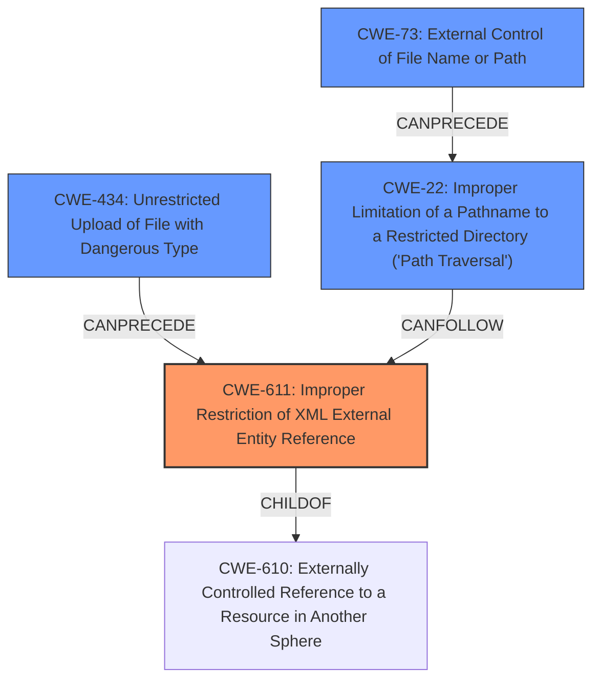

# Raw Analyzer Response for CVE-2022-42745

# Summary
| CWE ID | CWE Name | Confidence | CWE Abstraction Level | CWE Vulnerability Mapping Label | CWE-Vulnerability Mapping Notes |
|---|---|---|---|---|---|
| CWE-611 | Improper Restriction of XML External Entity Reference | 1.0 | Base | Allowed | Primary CWE |
| CWE-434 | Unrestricted Upload of File with Dangerous Type | 0.7 | Base | Allowed | Secondary CWE |
| CWE-22 | Improper Limitation of a Pathname to a Restricted Directory ('Path Traversal') | 0.6 | Base | Allowed | Secondary CWE |
| CWE-73 | External Control of File Name or Path | 0.5 | Base | Allowed | Secondary CWE |

## Evidence and Confidence

*   **Confidence Score:** 0.9
*   **Evidence Strength:** HIGH

## Relationship Analysis
The primary weakness is CWE-611 [Improper Restriction of XML External Entity Reference], which is a base-level CWE. It's a child of CWE-610 [Externally Controlled Reference to a Resource in Another Sphere], a class-level CWE, but CWE-611 is more specific and thus more appropriate. The attack vector involves uploading a file, which could implicate CWE-434 [Unrestricted Upload of File with Dangerous Type]. If the XXE leads to path traversal, CWE-22 [Improper Limitation of a Pathname to a Restricted Directory ('Path Traversal')] could also be relevant. CWE-73 [External Control of File Name or Path] is also considered if the filename or path is directly controlled by the attacker.

## Vulnerability Chain
The vulnerability chain starts with:
1.  The application's **vulnerability to XXE**.
2.  An attacker uploads a malicious DOCX file (potentially related to **CWE-434** if the upload mechanism is not secure).
3.  The XXE allows the attacker to **read arbitrary files** from the server. This might involve **CWE-22** if path traversal is used, with **CWE-73** playing a role if the filename/path is attacker-controlled.

## Summary of Analysis
The initial analysis correctly identified the **XXE vulnerability**. The supporting evidence from the "CVE Reference Links Content Summary" clearly states the **root cause** as an **XXE Injection** flaw, which allows attackers to manipulate XML parsing and include external entities. The vulnerability allows an unauthenticated remote attacker to read arbitrary files from the server by uploading a malicious DOCX file. This aligns perfectly with CWE-611 [Improper Restriction of XML External Entity Reference].

The graph relationships influenced the consideration of other CWEs. Since a malicious file is uploaded, CWE-434 [Unrestricted Upload of File with Dangerous Type] is a relevant, though secondary, concern. The possibility of path traversal due to the file read led to considering CWE-22 [Improper Limitation of a Pathname to a Restricted Directory ('Path Traversal')] and CWE-73 [External Control of File Name or Path], but these are less directly involved than the core XXE issue.

CWE-611 is the most specific and appropriate choice because the core of the vulnerability lies in the improper handling of XML external entities.

Other CWEs Considered But Not Used:

*   CWE-610 [Externally Controlled Reference to a Resource in Another Sphere]: This is a class-level CWE and too general compared to CWE-611.
*   CWE-941 [Incorrectly Specified Destination in a Communication Channel]: This is not relevant as the issue is not about mis-specifying a communication channel.
*   CWE-23 [Relative Path Traversal]: This might be a consequence of the XXE, but it is not the root cause.
*   CWE-138 [Improper Neutralization of Special Elements]: This is a more general case of improper neutralization, while CWE-611 is specific to XML external entities.
*   CWE-183 [Permissive List of Allowed Inputs]: Not directly relevant, as the core issue is not an overly permissive list of allowed inputs.
*   CWE-61 [UNIX Symbolic Link (Symlink) Following]: Not relevant in this context.
*   CWE-639 [Authorization Bypass Through User-Controlled Key]: Not relevant as the vulnerability is not related to authorization bypass.