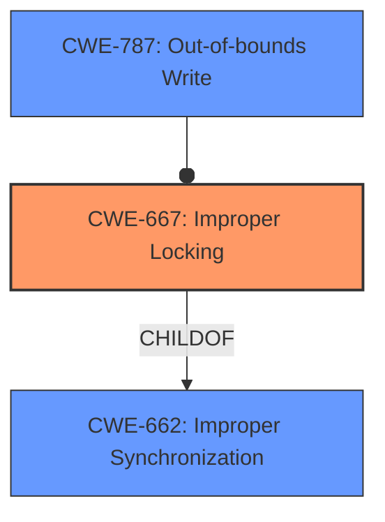

# Raw Analyzer Response for CVE-2022-42775

# Summary
| CWE ID | CWE Name | Confidence | CWE Abstraction Level | CWE Vulnerability Mapping Label | CWE-Vulnerability Mapping Notes |
|---|---|---|---|---|---|
| CWE-667 | Improper Locking | 1.0 | Class | Allowed-with-Review | Primary CWE |
| CWE-787 | Out-of-bounds Write | 0.3 | Base | Allowed | Secondary Candidate |

## Evidence and Confidence

*   **Confidence Score:** 0.8
*   **Evidence Strength:** MEDIUM

## Relationship Analysis
The primary relationship considered was the hierarchical structure with CWE-667 as a class. Although the retriever suggested CWE-787, this was considered less appropriate given the explicit mention of "improper locking" as the root cause. The mermaid diagram illustrates the relationship between the chosen CWE and a potential consequence (out-of-bounds write).

## Vulnerability Chain
The vulnerability chain starts with **improper locking** (CWE-667), leading to **memory corruption**. The description indicates this can result in a local denial of service. There isn't enough information to precisely determine the type of memory corruption, but a potential consequence could be CWE-787 (Out-of-bounds Write).

## Summary of Analysis
The initial assessment focused on the stated root cause of **improper locking**. The vulnerability description explicitly mentions this, supporting the selection of CWE-667. The description also mentions **memory corruption**, which could be a consequence of improper locking. The retriever results also highlighted CWE-667 as the top match.

The primary basis for this assessment is the "Vulnerability Description Key Phrases" section, which states:
- **rootcause:** **improper locking**
- **weakness:** **memory corruption**

CWE-667 (Improper Locking) is selected as the primary CWE because the vulnerability description clearly identifies **improper locking** as the root cause. While **memory corruption** is also mentioned, it is considered a consequence of the locking issue.

The retriever suggested CWE-787 (Out-of-bounds Write) because memory corruption is often related to out-of-bounds writes. However, without more specific information about the type of memory corruption, it is not possible to confirm this. Therefore, CWE-787 is considered a secondary candidate, with a lower confidence score.

The selection of CWE-667 as a Class is acceptable since there isn't enough information to map to a more specific Base-level CWE.

Relevant CWE Information:

# Enhanced Context (25 CWEs)
The following CWEs were identified as potentially relevant to this vulnerability:

## CWE-667: Improper Locking
**Abstraction Level**: Class
**Similarity Score**: 0.81
**Source**: dense

**Description**:
The product does not properly acquire or release a lock on a resource, leading to unexpected resource state changes and behaviors.

**Mapping Guidance**:
- Usage: Allowed-with-Review
- Rationale: This CWE entry is a Class and might have Base-level children that would be more appropriate

## CWE-787: Out-of-bounds Write
**Abstraction Level**: Base
**Similarity Score**: 1.00
**Source**: alternate_terms

**Description**:
The product writes data past the end, or before the beginning, of the intended buffer.

## CWE-662: Improper Synchronization
**Abstraction Level**: Class
**Similarity Score**: 0.196
**Source**: sparse

**Description**:
The product utilizes multiple threads or processes to allow temporary access to a shared resource that can only be exclusive to one process at a time, but it does not properly synchronize these actions, which might cause simultaneous accesses of this resource by multiple threads or processes.

**Mapping Guidance**:
- Usage: Discouraged
- Rationale: This CWE entry is a level-1 Class (i.e., a child of a Pillar). It might have lower-level children that would be more appropriate