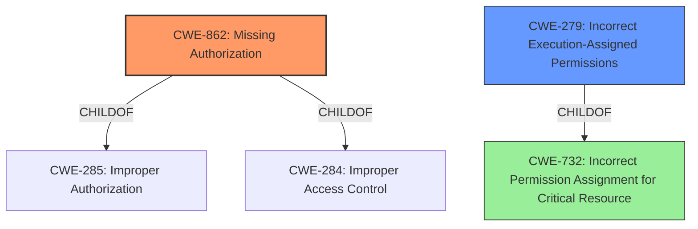

# Raw Analyzer Response for CVE-2022-42778

# Summary
| CWE ID | CWE Name | Confidence | CWE Abstraction Level | CWE Vulnerability Mapping Label | CWE-Vulnerability Mapping Notes |
|---|---|---|---|---|---|
| CWE-862 | Missing Authorization | 0.9 | Class | Allowed-with-Review | Primary CWE |
| CWE-279 | Incorrect Execution-Assigned Permissions | 0.6 | Variant | Allowed | Secondary Candidate |

## Evidence and Confidence

*   **Confidence Score:** 0.9
*   **Evidence Strength:** MEDIUM

## Relationship Analysis
The primary CWE is CWE-862, **Missing Authorization**, which is a class-level CWE. This vulnerability stems from a **missing permission check** in the windows manager service. The retriever results also indicate that CWE-862 is a good fit. CWE-862 is a child of CWE-285 and CWE-284.
CWE-279, **Incorrect Execution-Assigned Permissions**, is a variant of CWE-732, and may also apply, as the **missing permission check** could lead to the windows manager service being set up with incorrect execution-assigned permissions.

## Vulnerability Chain
The vulnerability chain starts with a **missing permission check** (CWE-862), which leads to the ability to set up the windows manager service with no additional execution privileges needed.

## Summary of Analysis
The initial analysis identified the **missing permission check** as the root cause of the vulnerability. The retriever results and the provided CWE descriptions strongly support the selection of CWE-862, **Missing Authorization**, as the primary CWE. The vulnerability description states "there is a **missing permission check**," which directly aligns with the definition of CWE-862: "The product does not perform an authorization check when an actor attempts to access a resource or perform an action."

CWE-279, **Incorrect Execution-Assigned Permissions**, was considered as a secondary CWE because the **missing permission check** could lead to incorrect permissions being assigned to the windows manager service. However, the primary issue is the lack of an authorization check, making CWE-862 the more direct and appropriate classification.

The selection of CWE-862 is at the Class level, as a more specific Base or Variant CWE was not identified based on the provided evidence. While the vulnerability description is concise, the core issue is clearly the absence of an authorization mechanism. The other CWEs considered were not as directly relevant to the root cause of the vulnerability.
- CWE-732: Incorrect Permission Assignment for Critical Resource, was considered but ultimately rejected because the vulnerability lies in the missing check rather than an explicitly incorrect assignment.
- CWE-1284: Improper Validation of Specified Quantity in Input, and CWE-770: Allocation of Resources Without Limits or Throttling, are related to input validation and resource management, respectively, but are not directly applicable to the **missing permission check** described in the vulnerability.
- CWE-20: Improper Input Validation is too general.
Relevant CWE Information: