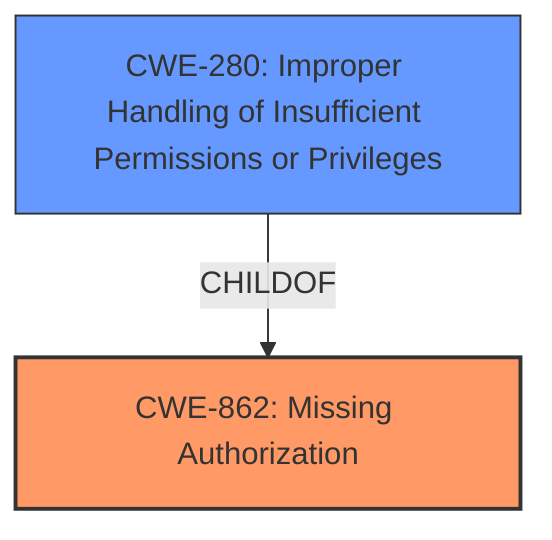

# Analysis for CVE-2022-42782

# Summary
| CWE ID | CWE Name | Confidence | CWE Abstraction Level | CWE Vulnerability Mapping Label | CWE-Vulnerability Mapping Notes |
|---|---|---|---|---|---|
| CWE-862 | Missing Authorization | 0.9 | Class | Allowed-with-Review | Primary CWE |
| CWE-280 | Improper Handling of Insufficient Permissions or Privileges | 0.6 | Base | Allowed | Secondary Candidate |

## Evidence and Confidence

*   **Confidence Score:** 0.9
*   **Evidence Strength:** HIGH

## Relationship Analysis
The primary relationship influencing the selection is the hierarchical structure, with CWE-862 as a Class. While the description points to a **missing permission check**, it is important to note that CWE-862 is a class-level CWE, so it may be worth examining its children to see if there is a better fit. CWE-280 is a potential child, as it describes improper handling of insufficient permissions.

## Vulnerability Chain
The vulnerability chain starts with the **missing permission check** (CWE-862), leading to potential local information disclosure.

## Summary of Analysis
The initial assessment, based on the vulnerability description focusing on a **missing permission check**, strongly suggests CWE-862 (Missing Authorization). The description explicitly states "**missing permission check**," directly aligning with CWE-862's definition: "The product does not perform an authorization check when an actor attempts to access a resource or perform an action." The resulting local information disclosure underscores the impact of this **missing check**.

The retriever results also support this choice, listing CWE-862 as the top candidate.

CWE-280 was considered as a more specific alternative, as it is a child of CWE-862. However, the description focuses on the absence of a check rather than the improper handling of insufficient permissions, making CWE-862 a more direct fit.

Therefore, the selected CWEs are at the optimal level of specificity, accurately capturing the root cause of the vulnerability based on the provided evidence.

Relevant CWE Information:

# Enhanced Context (25 CWEs)
The following CWEs were identified as potentially relevant to this vulnerability:

## CWE-280: Improper Handling of Insufficient Permissions or Privileges 
**Abstraction Level**: Base
**Similarity Score**: 0.79
**Source**: dense

**Description**:
The product does not handle or incorrectly handles when it has insufficient privileges to access resources or functionality as specified by their permissions. This may cause it to follow unexpected code paths that may leave the product in an invalid state.

**Mapping Guidance**:
- Usage: Allowed
- Rationale: This CWE entry is at the Base level of abstraction, which is a preferred level of abstraction for mapping to the root causes of vulnerabilities.

## CWE-862: Missing Authorization
**Abstraction:** Class
**Status:** Incomplete

### Description
The product does not perform an authorization check when an actor attempts to access a resource or perform an action.

### Extended Description
Not provided

### Relationships
ChildOf -> CWE-285
ChildOf -> CWE-284

### Mapping Guidance
**Usage:** Allowed-with-Review
**Rationale:** This CWE entry is a Class and might have Base-level children that would be more appropriate
**Comments:** Examine children of this entry to see if there is a better fit
**Reasons:**
- Abstraction

# Analysis of CWE Selection

## CWE-862: Missing Authorization
*   **Explanation:** The vulnerability description clearly indicates a **missing permission check** in the wlan driver. CWE-862 directly addresses this scenario, stating that "The product does not perform an authorization check when an actor attempts to access a resource or perform an action." This aligns perfectly with the provided information.
*   **Security Implications:** The absence of an authorization check can allow unauthorized access to sensitive resources, leading to information disclosure.
*   **Relationship:** CWE-862 is a Class-level CWE, suggesting the existence of more specific child CWEs. However, given the direct match with the **missing check**, it serves as an appropriate starting point.
*   **Mapping Guidance:** The MITRE mapping guidance suggests reviewing child entries for a better fit.
*   **Confidence:** 0.9

## CWE-280: Improper Handling of Insufficient Permissions or Privileges
*   **Explanation:** CWE-280, a child of CWE-862, describes scenarios where the product incorrectly handles insufficient privileges. While related to authorization, it is less directly applicable than CWE-862, which focuses on the absence of a check. The description implies that a check is missing, and not that it is present and improperly handled. However, it is a potential candidate as a secondary weakness, so it is being included.
*   **Security Implications:** Improper handling of insufficient permissions can lead to unexpected code paths and invalid states, potentially resulting in security vulnerabilities.
*   **Relationship:** As a child of CWE-862, CWE-280 represents a more specific type of authorization issue.
*   **Mapping Guidance:** The MITRE mapping guidance allows for the use of Base-level CWEs like CWE-280.
*   **Confidence:** 0.6