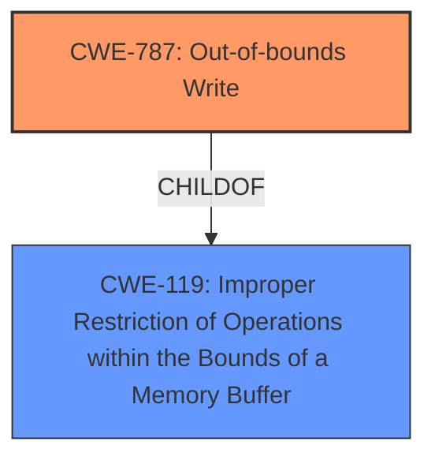

# Enhanced Analysis for CVE-2022-42827

# Summary
| CWE ID | CWE Name | Confidence | CWE Abstraction Level | CWE Vulnerability Mapping Label | CWE-Vulnerability Mapping Notes |
|---|---|---|---|---|---|
| CWE-787 | Out-of-bounds Write | 1.0 | Base | Allowed | Primary CWE |
| CWE-119 | Improper Restriction of Operations within the Bounds of a Memory Buffer | 0.5 | Class | Discouraged | Secondary Candidate |

## Evidence and Confidence

*   **Confidence Score:** 1.0
*   **Evidence Strength:** HIGH

## Relationship Analysis
The primary relationship influencing the decision is the ChildOf relationship between CWE-787 and CWE-119. CWE-787 is a base-level CWE that describes the specific issue of writing data past the end or before the beginning of the intended buffer, whereas CWE-119 is a class-level CWE that describes the more general case of improper restriction of operations within the bounds of a memory buffer. The vulnerability description explicitly states an **out-of-bounds write** issue, making CWE-787 the more specific and appropriate choice.



## Vulnerability Chain
The vulnerability chain consists of a single point:

1.  **Root Cause:** An **out-of-bounds write** (CWE-787) allows writing data past the end or before the beginning of the intended buffer.
2.  **Impact:** An application may be able to execute arbitrary code with kernel privileges.

## Summary of Analysis
The initial analysis strongly suggests CWE-787 as the primary CWE due to the explicit mention of an **out-of-bounds write** issue in the vulnerability description. The retriever results also list CWE-787 as the top combined result.

The relationship graph shows that CWE-787 is a child of CWE-119, which is a more general class. While CWE-119 could be considered, the specificity of CWE-787 makes it the better choice.

The provided evidence directly supports the selection of CWE-787. The vulnerability description states: "An **out-of-bounds write** issue was addressed with improved bounds checking." The "CVE Reference Links Content Summary" section further reinforces this by stating: "Root cause of vulnerability: An **out-of-bounds write** issue" and "Weaknesses/vulnerabilities present: **Out-of-bounds write** vulnerability within the kernel."

The choice of CWE-787 is at the optimal level of specificity because it directly reflects the root cause of the vulnerability as described in the provided information.
CWE-119 is too general, and the other CWEs considered do not accurately represent the specific **out-of-bounds write** issue.

Relevant CWE Information:

# Enhanced Context (25 CWEs)

## CWE-191: Integer Underflow (Wrap or Wraparound)
**Abstraction Level**: Base
**Similarity Score**: 0.79
**Source**: dense

## CWE-680: Integer Overflow to Buffer Overflow
**Abstraction Level**: Compound
**Similarity Score**: 0.77
**Source**: dense

## CWE-190: Integer Overflow or Wraparound
**Abstraction Level**: Base
**Similarity Score**: 0.76
**Source**: dense

## CWE-197: Numeric Truncation Error
**Abstraction Level**: Base
**Similarity Score**: 0.76
**Source**: dense

## CWE-681: Incorrect Conversion between Numeric Types
**Abstraction Level**: Base
**Similarity Score**: 0.75
**Source**: dense

## CWE-131: Incorrect Calculation of Buffer Size
**Abstraction Level**: Base
**Similarity Score**: 0.75
**Source**: dense

## CWE-124: Buffer Underwrite ('Buffer Underflow')
**Abstraction Level**: Base
**Similarity Score**: 0.74
**Source**: dense

## CWE-823: Use of Out-of-range Pointer Offset
**Abstraction Level**: Base
**Similarity Score**: 0.73
**Source**: dense

## CWE-125: Out-of-bounds Read
**Abstraction Level**: Base
**Similarity Score**: 0.73
**Source**: dense

## CWE-667: Improper Locking
**Abstraction Level**: Class
**Similarity Score**: 0.73
**Source**: dense

## CWE-190: Integer Overflow or Wraparound
**Abstraction Level**: Base
**Similarity Score**: 8027.60
**Source**: sparse

## CWE-125: Out-of-bounds Read
**Abstraction Level**: Base
**Similarity Score**: 7721.95
**Source**: sparse

## CWE-119: Improper Restriction of Operations within the Bounds of a Memory Buffer
**Abstraction Level**: Class
**Similarity Score**: 7443.51
**Source**: sparse

## CWE-823: Use of Out-of-range Pointer Offset
**Abstraction Level**: Base
**Similarity Score**: 7432.00
**Source**: sparse

## CWE-1284: Improper Validation of Specified Quantity in Input
**Abstraction Level**: Base
**Similarity Score**: 7350.30
**Source**: sparse

## CWE-128: Wrap-around Error
**Abstraction Level**: base
**Similarity Score**: 5.03
**Source**: graph

## CWE-41: Improper Resolution of Path Equivalence
**Abstraction Level**: base
**Similarity Score**: 5.03
**Source**: graph

## CWE-195: Signed to Unsigned Conversion Error
**Abstraction Level**: variant
**Similarity Score**: 4.53
**Source**: graph

## CWE-787: Out-of-bounds Write
**Abstraction Level**: base
**Similarity Score**: 4.33
**Source**: graph

## CWE-170: Improper Null Termination
**Abstraction Level**: base
**Similarity Score**: 4.33
**Source**: graph

## CWE-22: Improper Limitation of a Pathname to a Restricted Directory ('Path Traversal')
**Abstraction Level**: base
**Similarity Score**: 4.33
**Source**: graph

## CWE-770: Allocation of Resources Without Limits or Throttling
**Abstraction Level**: base
**Similarity Score**: 4.33
**Source**: graph

## CWE-73: External Control of File Name or Path
**Abstraction Level**: base
**Similarity Score**: 4.33
**Source**: graph

## CWE-1284: Improper Validation of Specified Quantity in Input
**Abstraction Level**: base
**Similarity Score**: 4.33
**Source**: graph

## CWE-123: Write-what-where Condition
**Abstraction Level**: base
**Similarity Score**: 3.89
**Source**: graph

### Other CWEs Considered and Rejected:

*   **CWE-119: Improper Restriction of Operations within the Bounds of a Memory Buffer:** While related, it's a broader category than the specific **out-of-bounds write** described in the vulnerability. The mapping guidance discourages its use when more specific CWEs are available.
*   **CWE-843: Access of Resource Using Incompatible Type ('Type Confusion'):** This CWE relates to type confusion, which isn't mentioned in the vulnerability description. Therefore, it's not an appropriate match.
*   **CWE-20: Improper Input Validation:** While input validation could be a contributing factor, the primary issue is the **out-of-bounds write** itself. This CWE is too general and the mapping guidance discourages its use when more specific CWEs are available.
*   **CWE-667: Improper Locking:** Locking issues are not described in the vulnerability, making this CWE irrelevant.
*   **CWE-823: Use of Out-of-range Pointer Offset:** This is related to pointer arithmetic, which isn't explicitly mentioned. While possible, it's less direct than the **out-of-bounds write**.
*   **CWE-128: Wrap-around Error:** Integer wrap-around is not mentioned in the description.
*   **CWE-125: Out-of-bounds Read:** The vulnerability description specifically mentions an **out-of-bounds write**, not a read.
*   **CWE-122: Heap-based Buffer Overflow:** While this is a type of buffer overflow, the description doesn't specify where the buffer is allocated (heap or stack). CWE-787 is more general and applicable.
*   **CWE-190: Integer Overflow or Wraparound:** Integer issues are not part of the described vulnerability.


## CWE Relationship Analysis

Current CWEs represent these abstraction levels: .


### Vulnerability Chain Analysis

**Chain starting from CWE-41:**
- 41 (Improper Resolution of Path Equivalence) - ROOT


**Chain starting from CWE-823:**
- 823 (Use of Out-of-range Pointer Offset) - ROOT


### CWE Relationship Diagram

```mermaid
graph TD
    classDef primary fill:#f96,stroke:#333,stroke-width:2px
    classDef secondary fill:#69f,stroke:#333
    classDef tertiary fill:#9e9,stroke:#333
```