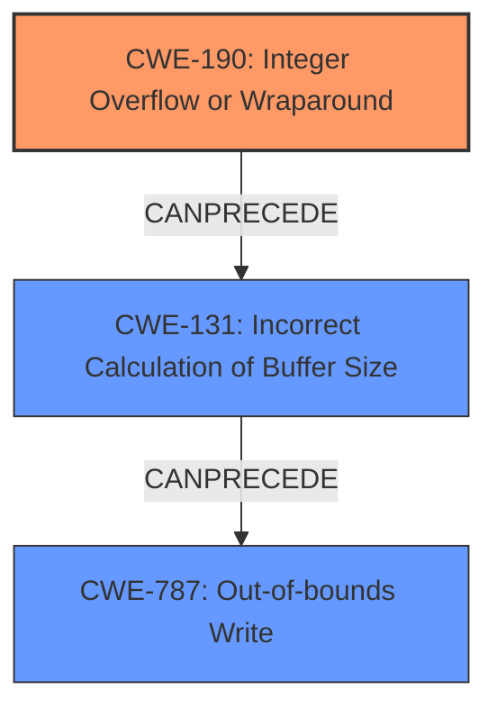

# Analysis for CVE-2022-42898

# Summary
| CWE ID | CWE Name | Confidence | CWE Abstraction Level | CWE Vulnerability Mapping Label | CWE-Vulnerability Mapping Notes |
|---|---|---|---|---|---|
| CWE-190 | Integer Overflow or Wraparound | 1.0 | Base | Primary | Allowed |
| CWE-131 | Incorrect Calculation of Buffer Size | 0.7 | Base | Secondary | Allowed |
| CWE-787 | Out-of-bounds Write | 0.6 | Base | Secondary | Allowed |

## Evidence and Confidence

*   **Confidence Score:** 0.8
*   **Evidence Strength:** HIGH

## Relationship Analysis
The primary CWE is CWE-190, which can lead to CWE-131 due to the **incorrect** calculation of buffer size as a consequence of the **integer overflow**. This can then lead to CWE-787 **Out-of-bounds Write** because the allocated buffer is smaller than expected.



## Vulnerability Chain
The vulnerability chain starts with an **integer overflow** (CWE-190) when calculating the buffer size, leading to an **incorrect** buffer size calculation (CWE-131). This smaller-than-expected buffer then results in an out-of-bounds write (CWE-787) during PAC parsing.

## Summary of Analysis
The primary weakness is CWE-190 **Integer Overflow or Wraparound** as this is the root cause of the vulnerability described. The vulnerability description states that there are "**integer overflows** that may lead to remote code execution... on 32-bit platforms (which have a resultant heap-based buffer overflow), and cause a denial of service on other platforms". The summary of the CVE Reference Links Content also confirms the **integer overflows** in PAC parsing. The secondary weaknesses include CWE-131 **Incorrect Calculation of Buffer Size**, due to the **integer overflow**, and CWE-787 **Out-of-bounds Write** due to the **incorrect** buffer size.

Relevant CWE Information:

# Enhanced Context (25 CWEs)

## CWE-197: Numeric Truncation Error
**Abstraction Level**: Base
**Similarity Score**: 0.74
**Source**: dense

**Description**:
Truncation errors occur when a primitive is cast to a primitive of a smaller size and data is lost in the conversion.

**Mapping Guidance**:
- Usage: Allowed
- Rationale: This CWE entry is at the Base level of abstraction, which is a preferred level of abstraction for mapping to the root causes of vulnerabilities.

## CWE-674: Uncontrolled Recursion
**Abstraction Level**: Class
**Similarity Score**: 0.74
**Source**: dense

**Description**:
The product does not properly control the amount of recursion that takes place,  consuming excessive resources, such as allocated memory or the program stack.

**Mapping Guidance**:
- Usage: Allowed-with-Review
- Rationale: This CWE entry is a Class and might have Base-level children that would be more appropriate

## CWE-191: Integer Underflow (Wrap or Wraparound)
**Abstraction Level**: Base
**Similarity Score**: 0.73
**Source**: dense

**Description**:
The product subtracts one value from another, such that the result is less than the minimum allowable integer value, which produces a value that is not equal to the correct result.

**Mapping Guidance**:
- Usage: Allowed
- Rationale: This CWE entry is at the Base level of abstraction, which is a preferred level of abstraction for mapping to the root causes of vulnerabilities.

## CWE-131: Incorrect Calculation of Buffer Size
**Abstraction Level**: Base
**Similarity Score**: 0.72
**Source**: dense

**Description**:
The product does not correctly calculate the size to be used when allocating a buffer, which could lead to a buffer overflow.

**Mapping Guidance**:
- Usage: Allowed
- Rationale: This CWE entry is at the Base level of abstraction, which is a preferred level of abstraction for mapping to the root causes of vulnerabilities.

## CWE-125: Out-of-bounds Read
**Abstraction Level**: Base
**Similarity Score**: 0.72
**Source**: dense

**Description**:
The product reads data past the end, or before the beginning, of the intended buffer.

**Mapping Guidance**:
- Usage: Allowed
- Rationale: This CWE entry is at the Base level of abstraction, which is a preferred level of abstraction for mapping to the root causes of vulnerabilities.

## CWE-193: Off-by-one Error
**Abstraction Level**: Base
**Similarity Score**: 0.71
**Source**: dense

**Description**:
A product calculates or uses an incorrect maximum or minimum value that is 1 more, or 1 less, than the correct value.

**Mapping Guidance**:
- Usage: Allowed
- Rationale: This CWE entry is at the Base level of abstraction, which is a preferred level of abstraction for mapping to the root causes of vulnerabilities.

## CWE-1325: Improperly Controlled Sequential Memory Allocation
**Abstraction Level**: Base
**Similarity Score**: 0.71
**Source**: dense

**Description**:
The product manages a group of objects or resources and performs a separate memory allocation for each object, but it does not properly limit the total amount of memory that is consumed by all of the combined objects.

**Mapping Guidance**:
- Usage: Allowed
- Rationale: This CWE entry is at the Base level of abstraction, which is a preferred level of abstraction for mapping to the root causes of vulnerabilities.

## CWE-789: Memory Allocation with Excessive Size Value
**Abstraction Level**: Variant
**Similarity Score**: 0.71
**Source**: dense

**Description**:
The product allocates memory based on an untrusted, large size value, but it does not ensure that the size is within expected limits, allowing arbitrary amounts of memory to be allocated.

**Mapping Guidance**:
- Usage: Allowed
- Rationale: This CWE entry is at the Variant level of abstraction, which is a preferred level of abstraction for mapping to the root causes of vulnerabilities.

## CWE-404: Improper Resource Shutdown or Release
**Abstraction Level**: Class
**Similarity Score**: 0.71
**Source**: dense

**Description**:
The product does not release or incorrectly releases a resource before it is made available for re-use.

**Mapping Guidance**:
- Usage: Allowed-with-Review
- Rationale: This CWE entry is a Class and might have Base-level children that would be more appropriate

## CWE-667: Improper Locking
**Abstraction Level**: Class
**Similarity Score**: 0.71
**Source**: dense

**Description**:
The product does not properly acquire or release a lock on a resource, leading to unexpected resource state changes and behaviors.

**Mapping Guidance**:
- Usage: Allowed-with-Review
- Rationale: This CWE entry is a Class and might have Base-level children that would be more appropriate

## CWE-190: Integer Overflow or Wraparound
**Abstraction Level**: Base
**Similarity Score**: 7757.30
**Source**: sparse

**Description**:
The product performs a calculation that can
         produce an integer overflow or wraparound when the logic
         assumes that the resulting value will always be larger than
         the original value. This occurs when an integer value is
         incremented to a value that is too large to store in the
         associated representation. When this occurs, the value may
         become a very small or negative number.

**Mapping Guidance**:
- Usage: Allowed
- Rationale: This CWE entry is at the Base level of abstraction, which is a preferred level of abstraction for mapping to the root causes of vulnerabilities.

## CWE-197: Numeric Truncation Error
**Abstraction Level**: Base
**Similarity Score**: 7157.23
**Source**: sparse

**Description**:
Truncation errors occur when a primitive is cast to a primitive of a smaller size and data is lost in the conversion.

**Mapping Guidance**:
- Usage: Allowed
- Rationale: This CWE entry is at the Base level of abstraction, which is a preferred level of abstraction for mapping to the root causes of vulnerabilities.

## CWE-125: Out-of-bounds Read
**Abstraction Level**: Base
**Similarity Score**: 6954.48
**Source**: sparse

**Description**:
The product reads data past the end, or before the beginning, of the intended buffer.

**Mapping Guidance**:
- Usage: Allowed
- Rationale: This CWE entry is at the Base level

# Enhanced Query for CVE-2022-42898

## Vulnerability Description
PAC parsing in MIT Kerberos 5 (aka krb5) before 1.19.4 and 1.20.x before 1.20.1 has **integer overflows** that may lead to remote code execution (in KDC, kadmind, or a GSS or Kerberos application server) on 32-bit platforms (which have a resultant heap-based buffer overflow), and cause a denial of service on other platforms. This occurs in krb5_pac_parse in lib/krb5/krb/pac.c. Heimdal before 7.7.1 has a similar bug.

### Vulnerability Description Key Phrases
- **rootcause:** **integer overflows**
- **impact:** remote code execution and denial of service
- **product:** MIT Kerberos 5 (aka krb5)
- **version:** before 1.19.4 and 1.20.x before 1.20.1
- **component:** krb5_pac_parse in lib/krb5/krb/pac.c

## CVE Reference Links Content Summary
```
{
  "CVE-2022-42898": [
    {
      "source": "github.com_89210042_20250108_124414.html",
      "root_cause": "Integer overflows in PAC parsing.",
      "weaknesses": [
        "Integer overflow when calculating the size of the buffer needed to store the PAC header.",
        "Integer overflow when checking the length of each buffer within the PAC."
      ],
      "impact": "An authenticated attacker may be able to cause a KDC or kadmind process to crash by reading beyond the bounds of allocated memory, creating a denial of service. A privileged attacker may similarly be able to cause a Kerberos or GSS application service to crash. On 32-bit platforms, an attacker can also cause insufficient memory to be allocated for the result, potentially leading to remote code execution in a KDC, kadmind, or GSS or Kerberos application server process. An attacker with the privileges of a cross-realm KDC may be able to extract secrets from a KDC process's memory by having them copied into the PAC of a new ticket.",
      "attack_vectors": [
        "By providing a specially crafted PAC (Privilege Attribute Certificate) within a Kerberos ticket."
      ],
      "required_attacker_capabilities": [
        "An authenticated attacker with the ability to obtain or forge a Kerberos ticket.",
        "For remote code execution, attacker needs to target a 32-bit platform.",
          "For extracting secrets attacker needs to have privileges of a cross-realm KDC."
      ]
    },
    {
      "source": "web.mit.edu_f51c9b76_20250108_124416.html",
        "root_cause": "Integer overflows in PAC parsing.",
        "weaknesses": [
          "Integer overflow when calculating the size of the buffer needed to store the PAC header."
        ],
        "impact": "Unspecified impact, but fixed in krb5-1.19.4.",
        "attack_vectors": [
            "Parsing a maliciously crafted PAC."
        ],
        "required_attacker_capabilities": [
            "An attacker with the ability to provide a specially crafted PAC."
        ]
    },
    {
      "source": "github.com_f7777a47_20250108_153852.html",
      "root_cause": "The `_krb5_get_int64` function uses an `unsigned long` variable to accumulate the 64-bit integer value, which is only 32-bits on some systems. This results in incorrect values being extracted from the buffer.",
      "weaknesses": [
        "Type mismatch when extracting a 64-bit integer from a buffer on a 32-bit system",
          "Use of a 32 bit variable to accumulate a 64 bit integer."
      ],
      "impact": "Incorrect PAC parsing leading to potential vulnerabilities.",
      "attack_vectors": [
        "By providing a specially crafted PAC (Privilege Attribute Certificate) within a Kerberos ticket"
      ],
     "required_attacker_capabilities": [
        "An attacker with the ability to forge a Kerberos ticket with a crafted PAC."
      ]
    },
       {
      "source": "security.gentoo.org_d0636a05_20250108_124414.html",
      "root_cause": "Multiple vulnerabilities in Samba, including CVE-2022-42898.",
      "weaknesses": [
        "Multiple unspecified vulnerabilities."
      ],
      "impact": "Unspecified impact. Could result in root remote code execution.",
        "attack_vectors": [
            "Unspecified."
        ],
        "required_attacker_capabilities": [
            "Unspecified."
        ]
    },
    {
     "source": "web.mit.edu_a3a00f2e_20250108_124417.html",
      "root_cause": "Integer overflows in PAC parsing.",
      "weaknesses": [
        "Integer overflow when calculating the size of the buffer needed to store the PAC header."
      ],
      "impact": "Unspecified impact but fixed in krb5-1.20.1.",
       "attack_vectors": [
            "By providing a specially crafted PAC within a Kerberos ticket"
        ],
        "required_attacker_capabilities": [
            "An attacker with the ability to provide a specially crafted PAC"
        ]
    },
    {
      "source": "security.netapp.com_35fd584f_20250108_124415.html",
      "root_cause": "Integer overflow vulnerability in MIT Kerberos 5.",
        "weaknesses": [
          "Integer overflow when parsing a PAC in MIT Kerberos 5 versions prior to 1.19.4 and 1.20.x prior to 1.20.1."
        ],
      "impact": "Successful exploitation of this vulnerability could lead to disclosure of sensitive information, addition or modification of data, or Denial of Service (DoS).",
      "attack_vectors": [
        "By exploiting a vulnerable version of MIT Kerberos 5"
          ],
     "required_attacker_capabilities": [
            "An attacker with the ability to exploit a vulnerable version of MIT Kerberos 5 and provide a specially crafted PAC."
        ]
    },
    {
      "source": "security.gentoo.org_27f69661_20250108_124415.html",
      "root_cause": "Multiple vulnerabilities in Heimdal, including CVE-2022-42898.",
      "weaknesses": [
          "Multiple unspecified vulnerabilities."
        ],
       "impact": "Unspecified, but could lead to remote code execution on a KDC.",
        "attack_vectors": [
            "Unspecified."
        ],
        "required_attacker_capabilities": [
            "Unspecified."
        ]
    },
    {
      "source": "www.samba.org_c5d61c06_20250108_124417.html",
      "root_cause": "Integer multiplication overflow when calculating how many bytes to allocate for a buffer for the parsed PAC on 32-bit systems.",
      "weaknesses": [
        "Integer overflow when calculating buffer allocation size for parsed PAC on 32 bit systems."
      ],
      "impact": "On a 32-bit system, an overflow allows placement of 16-byte chunks of entirely attacker-controlled data, leading to heap corruption. The most vulnerable server is the KDC. Secondary risk is to Kerberos-enabled file server installations in a non-AD realm.",
        "attack_vectors": [
        "By using a crafted PAC in a Kerberos ticket"
          ],
     "required_attacker_capabilities": [
           "An attacker with a forged PAC, targeting a 32-bit system, and a vulnerable KDC or Kerberos-enabled file server."
        ]
    },
   {
      "source": "security.netapp.com_e151c353_20250108_124415.html",
     "root_cause": "Multiple vulnerabilities in Heimdal, including CVE-2022-42898.",
        "weaknesses": [
            "Multiple unspecified vulnerabilities in Heimdal versions prior to 7.7.1."
        ],
        "impact": "Successful exploitation could lead to disclosure of sensitive information, addition or modification of data, or Denial of Service (DoS). ONTAP Select Deploy administration utility is only affected by CVE-2022-42898.",
       "attack_vectors": [
        "By exploiting a vulnerable version of Heimdal"
          ],
     "required_attacker_capabilities": [
          "An attacker with the ability to exploit a vulnerable version of Heimdal and crafted PAC."
      ]
    },
    {
      "source": "github.com_4d3d9cd4_20250108_153853.html",
        "root_cause": "The `_krb5_get_int64` function uses an `unsigned long` variable to accumulate the 64-bit integer value, which is only 32-bits on some systems. This results in incorrect values being extracted from the buffer.",
        "weaknesses": [
            "Type mismatch when extracting a 64-bit integer from a buffer on a 32-bit system",
             "Use of a 32 bit variable to accumulate a 64 bit integer."
        ],
        "impact": "Incorrect PAC parsing leading to potential vulnerabilities.",
        "attack_vectors": [
            "By providing a specially crafted PAC (Privilege Attribute Certificate) within a Kerberos ticket"
        ],
        "required_attacker_capabilities": [
            "An attacker with the ability to forge a Kerberos ticket with a crafted PAC."
        ]
    },
    {
      "source": "github.com_39249a07_20250108_124414.html",
      "root_cause": "Integer overflows in PAC parsing.",
      "weaknesses": [
        "Integer overflow vulnerabilities in PAC parsing."
      ],
      "impact": "Denial of service vulnerability for Heimdal KDCs and possibly Heimdal servers (e.g., via GSS-API).",
      "attack_vectors": [
          "By exploiting a vulnerable version of Heimdal"
        ],
      "required_attacker_capabilities": [
          "An attacker with the ability to exploit a vulnerable version of Heimdal and crafted PAC."
        ]
    },
    {
      "source": "bugzilla.samba.org_fd351fcc_20250108_124413.html",
      "root_cause": "Integer overflows when parsing PAC in Kerberos libraries.",
      "weaknesses": [
        "Integer overflow when calculating the size of buffer for PAC header.",
        "Integer overflow during memory allocation for PAC buffers on 32-bit systems."
      ],
     "impact": "Heap write overrun with attacker-controlled data on 32-bit systems, potentially leading to code execution.  KDC is more vulnerable. An attacker can potentially exploit it via S4U2Proxy or TGT renewal.",
     "attack_vectors": [
       "By using crafted PACs in S4U2Proxy requests or TGT renewal requests, especially targeting 32-bit KDCs."
        ],
      "required_attacker_capabilities": [
          "An attacker with the ability to forge a Kerberos ticket with a crafted PAC, especially for targeting a 32 bit KDC"
        ]
    }
  ]
}
```

## Retriever Results

### Top Combined Results

| Rank | CWE ID | Name | Abstraction | Usage  | Retrievers | Individual Scores |
|------|--------|------|-------------|-------|------------|-------------------|
| 1 | 190 | Integer Overflow or Wraparound | Base | Allowed | alternate_terms | 0.800 |
| 2 | 193 | Off-by-one Error | Base | Allowed | sparse | 0.440 |
| 3 | 126 | Buffer Over-read | Variant | Allowed | sparse | 0.438 |
| 4 | 122 | Heap-based Buffer Overflow | Variant | Allowed | sparse | 0.413 |
| 5 | 125 | Out-of-bounds Read | Base | Allowed | sparse | 0.407 |
| 6 | 121 | Stack-based Buffer Overflow | Variant | Allowed | dense | 0.550 |
| 7 | 128 | Wrap-around Error | Base | Allowed | graph | 0.002 |
| 8 | 1284 | Improper Validation of Specified Quantity in Input | Base | Allowed | sparse | 0.400 |
| 9 | 197 | Numeric Truncation Error | Base | Allowed | sparse | 0.392 |
| 10 | 674 | Uncontrolled Recursion | Class | Allowed-with-Review | sparse | 0.385 |


# Complete CWE Specifications


## CWE-190: Integer Overflow or Wraparound
**Abstraction:** Base
**Status:** Stable

### Description
The product performs a calculation that can
         produce an integer overflow or wraparound when the logic
         assumes that the resulting value will always be larger than
         the original value. This occurs when an integer value is
         incremented to a value that is too large to store in the
         associated representation. When this occurs, the value may
         become a very small or negative number.

### Extended Description
Not provided

### Alternative Terms
Overflow: The terms "overflow" and "wraparound" are used interchangeably by some people, but they can have more precise distinctions by others. See Terminology Notes.
Wraparound: The terms "overflow" and "wraparound" are used interchangeably by some people, but they can have more precise distinctions by others. See Terminology Notes.
wrap, wrap-around, wrap around: Alternate spellings of "wraparound"

### Relationships
ChildOf -> CWE-682
ChildOf -> CWE-682
ChildOf -> CWE-20
CanPrecede -> CWE-119

### Mapping Guidance
**Usage:** Allowed
**Rationale:** This CWE entry is at the Base level of abstraction, which is a preferred level of abstraction for mapping to the root causes of vulnerabilities.
**Comments:** Be careful of terminology problems with "overflow," "underflow," and "wraparound" - see Terminology Notes. Carefully read both the name and description to ensure that this mapping is an appropriate fit. Do not try to 'force' a mapping to a lower-level Base/Variant simply to comply with this preferred level of abstraction.
**Reasons:**
- Acceptable-Use
**Suggested Alternatives:**
- CWE-191: Integer Underflow (Wrap or Wraparound). Consider CWE-191 when the result is less than the minimum value that can be represented (sometimes called "underflows").


### Additional Notes
**[Relationship]** Integer overflows can be primary to buffer overflows when they cause less memory to be allocated than expected.

**[Terminology]** 

"Integer overflow" is sometimes used to cover several types of errors, including signedness errors, or buffer overflows that involve manipulation of integer data types instead of characters. Part of the confusion results from the fact that 0xffffffff is -1 in a signed context. Other confusion also arises because of the role that integer overflows have in chains.


A "wraparound" is a well-defined, standard behavior that follows specific rules for how to handle situations when the intended numeric value is too large or too small to be represented, as specified in standards such as C11.


"Overflow" is sometimes conflated with "wraparound" but typically indicates a non-standard or undefined behavior.


The "overflow" term is sometimes used to indicate cases where either the maximum or the minimum is exceeded, but others might only use "overflow" to indicate exceeding the maximum while using "underflow" for exceeding the minimum.


Some people use "overflow" to mean any value outside the representable range - whether greater than the maximum, or less than the minimum - but CWE uses "underflow" for cases in which the intended result is less than the minimum.


See [REF-1440] for additional explanation of the ambiguity of terminology.


**[Other]** While there may be circumstances in which the logic intentionally relies on wrapping - such as with modular arithmetic in timers or counters - it can have security consequences if the wrap is unexpected. This is especially the case if the integer overflow can be triggered using user-supplied inputs.


### Observed Examples
- **CVE-2021-43537:** Chain: in a web browser, an unsigned 64-bit integer is forcibly cast to a 32-bit integer (CWE-681) and potentially leading to an integer overflow (CWE-190). If an integer overflow occurs, this can cause heap memory corruption (CWE-122)
- **CVE-2022-21668:** Chain: Python library does not limit the resources used to process images that specify a very large number of bands (CWE-1284), leading to excessive memory consumption (CWE-789) or an integer overflow (CWE-190).
- **CVE-2022-0545:** Chain: 3D renderer has an integer overflow (CWE-190) leading to write-what-where condition (CWE-123) using a crafted image.


## CWE-193: Off-by-one Error
**Abstraction:** Base
**Status:** Draft

### Description
A product calculates or uses an incorrect maximum or minimum value that is 1 more, or 1 less, than the correct value.

### Extended Description
Not provided

### Alternative Terms
off-by-five: An "off-by-five" error was reported for sudo in 2002 (CVE-2002-0184), but that is more like a "length calculation" error.

### Relationships
ChildOf -> CWE-682
ChildOf -> CWE-682
CanPrecede -> CWE-617
CanPrecede -> CWE-170
CanPrecede -> CWE-119

### Mapping Guidance
**Usage:** Allowed
**Rationale:** This CWE entry is at the Base level of abstraction, which is a preferred level of abstraction for mapping to the root causes of vulnerabilities.
**Comments:** Carefully read both the name and description to ensure that this mapping is an appropriate fit. Do not try to 'force' a mapping to a lower-level Base/Variant simply to comply with this preferred level of abstraction.
**Reasons:**
- Acceptable-Use


### Additional Notes
**[Relationship]** This is not always a buffer overflow. For example, an off-by-one error could be a factor in a partial comparison, a read from the wrong memory location, an incorrect conditional, etc.


### Observed Examples
- **CVE-2003-0252:** Off-by-one error allows remote attackers to cause a denial of service and possibly execute arbitrary code via requests that do not contain newlines.
- **CVE-2001-1391:** Off-by-one vulnerability in driver allows users to modify kernel memory.
- **CVE-2002-0083:** Off-by-one error allows local users or remote malicious servers to gain privileges.


## CWE-126: Buffer Over-read
**Abstraction:** Variant
**Status:** Draft

### Description
The product reads from a buffer using buffer access mechanisms such as indexes or pointers that reference memory locations after the targeted buffer.

### Extended Description
This typically occurs when the pointer or its index is incremented to a position beyond the bounds of the buffer or when pointer arithmetic results in a position outside of the valid memory location to name a few. This may result in exposure of sensitive information or possibly a crash.

### Alternative Terms
None

### Relationships
ChildOf -> CWE-125
ChildOf -> CWE-788

### Mapping Guidance
**Usage:** Allowed
**Rationale:** This CWE entry is at the Variant level of abstraction, which is a preferred level of abstraction for mapping to the root causes of vulnerabilities.
**Comments:** Carefully read both the name and description to ensure that this mapping is an appropriate fit. Do not try to 'force' a mapping to a lower-level Base/Variant simply to comply with this preferred level of abstraction.
**Reasons:**
- Acceptable-Use


### Additional Notes
**[Relationship]** These problems may be resultant from missing sentinel values (CWE-463) or trusting a user-influenced input length variable.


### Observed Examples
- **CVE-2022-1733:** Text editor has out-of-bounds read past end of line while indenting C code
- **CVE-2014-0160:** Chain: "Heartbleed" bug receives an inconsistent length parameter (CWE-130) enabling an out-of-bounds read (CWE-126), returning memory that could include private cryptographic keys and other sensitive data.
- **CVE-2009-2523:** Chain: product does not handle when an input string is not NULL terminated, leading to buffer over-read or heap-based buffer overflow.


## CWE-122: Heap-based Buffer Overflow
**Abstraction:** Variant
**Status:** Draft

### Description
A heap overflow condition is a buffer overflow, where the buffer that can be overwritten is allocated in the heap portion of memory, generally meaning that the buffer was allocated using a routine such as malloc().

### Extended Description
Not provided

### Alternative Terms
None

### Relationships
ChildOf -> CWE-788
ChildOf -> CWE-787

### Mapping Guidance
**Usage:** Allowed
**Rationale:** This CWE entry is at the Variant level of abstraction, which is a preferred level of abstraction for mapping to the root causes of vulnerabilities.
**Comments:** Carefully read both the name and description to ensure that this mapping is an appropriate fit. Do not try to 'force' a mapping to a lower-level Base/Variant simply to comply with this preferred level of abstraction.
**Reasons:**
- Acceptable-Use


### Additional Notes
**[Relationship]** Heap-based buffer overflows are usually just as dangerous as stack-based buffer overflows.


### Observed Examples
- **CVE-2021-43537:** Chain: in a web browser, an unsigned 64-bit integer is forcibly cast to a 32-bit integer (CWE-681) and potentially leading to an integer overflow (CWE-190). If an integer overflow occurs, this can cause heap memory corruption (CWE-122)
- **CVE-2007-4268:** Chain: integer signedness error (CWE-195) passes signed comparison, leading to heap overflow (CWE-122)
- **CVE-2009-2523:** Chain: product does not handle when an input string is not NULL terminated (CWE-170), leading to buffer over-read (CWE-125) or heap-based buffer overflow (CWE-122).


## CWE-125: Out-of-bounds Read
**Abstraction:** Base
**Status:** Draft

### Description
The product reads data past the end, or before the beginning, of the intended buffer.

### Extended Description
Not provided

### Alternative Terms
OOB read: Shorthand for "Out of bounds" read

### Relationships
ChildOf -> CWE-119
ChildOf -> CWE-119
ChildOf -> CWE-119
ChildOf -> CWE-119

### Mapping Guidance
**Usage:** Allowed
**Rationale:** This CWE entry is at the Base level of abstraction, which is a preferred level of abstraction for mapping to the root causes of vulnerabilities.
**Comments:** Carefully read both the name and description to ensure that this mapping is an appropriate fit. Do not try to 'force' a mapping to a lower-level Base/Variant simply to comply with this preferred level of abstraction.
**Reasons:**
- Acceptable-Use


### Observed Examples
- **CVE-2023-1018:** The reference implementation code for a Trusted Platform Module does not implement length checks on data, allowing for an attacker to read 2 bytes past the end of a buffer.
- **CVE-2020-11899:** Out-of-bounds read in IP stack used in embedded systems, as exploited in the wild per CISA KEV.
- **CVE-2014-0160:** Chain: "Heartbleed" bug receives an inconsistent length parameter (CWE-130) enabling an out-of-bounds read (CWE-126), returning memory that could include private cryptographic keys and other sensitive data.


## CWE-121: Stack-based Buffer Overflow
**Abstraction:** Variant
**Status:** Draft

### Description
A stack-based buffer overflow condition is a condition where the buffer being overwritten is allocated on the stack (i.e., is a local variable or, rarely, a parameter to a function).

### Extended Description
Not provided

### Alternative Terms
Stack Overflow: "Stack Overflow" is often used to mean the same thing as stack-based buffer overflow, however it is also used on occasion to mean stack exhaustion, usually a result from an excessively recursive function call. Due to the ambiguity of the term, use of stack overflow to describe either circumstance is discouraged.

### Relationships
ChildOf -> CWE-788
ChildOf -> CWE-787

### Mapping Guidance
**Usage:** Allowed
**Rationale:** This CWE entry is at the Variant level of abstraction, which is a preferred level of abstraction for mapping to the root causes of vulnerabilities.
**Comments:** Carefully read both the name and description to ensure that this mapping is an appropriate fit. Do not try to 'force' a mapping to a lower-level Base/Variant simply to comply with this preferred level of abstraction.
**Reasons:**
- Acceptable-Use


### Additional Notes
**[Other]** Stack-based buffer overflows can instantiate in return address overwrites, stack pointer overwrites or frame pointer overwrites. They can also be considered function pointer overwrites, array indexer overwrites or write-what-where condition, etc.


### Observed Examples
- **CVE-2021-35395:** Stack-based buffer overflows in SFK for wifi chipset used for IoT/embedded devices, as exploited in the wild per CISA KEV.


## CWE-128: Wrap-around Error
**Abstraction:** Base
**Status:** Incomplete

### Description
Wrap around errors occur whenever a value is incremented past the maximum value for its type and therefore "wraps around" to a very small, negative, or undefined value.

### Extended Description
Not provided

### Alternative Terms
None

### Relationships
ChildOf -> CWE-682
CanPrecede -> CWE-119
PeerOf -> CWE-190

### Mapping Guidance
**Usage:** Allowed
**Rationale:** This CWE entry is at the Base level of abstraction, which is a preferred level of abstraction for mapping to the root causes of vulnerabilities.
**Comments:** Carefully read both the name and description to ensure that this mapping is an appropriate fit. Do not try to 'force' a mapping to a lower-level Base/Variant simply to comply with this preferred level of abstraction.
**Reasons:**
- Acceptable-Use


### Additional Notes
**[Relationship]** The relationship between overflow and wrap-around needs to be examined more closely, since several entries (including CWE-190) are closely related.


## CWE-1284: Improper Validation of Specified Quantity in Input
**Abstraction:** Base
**Status:** Incomplete

### Description
The product receives input that is expected to specify a quantity (such as size or length), but it does not validate or incorrectly validates that the quantity has the required properties.

### Extended Description


Specified quantities include size, length, frequency, price, rate, number of operations, time, and others. Code may rely on specified quantities to allocate resources, perform calculations, control iteration, etc. When the quantity is not properly validated, then attackers can specify malicious quantities to cause excessive resource allocation, trigger unexpected failures, enable buffer overflows, etc.


### Alternative Terms
None

### Relationships
ChildOf -> CWE-20
ChildOf -> CWE-20
CanPrecede -> CWE-789

### Mapping Guidance
**Usage:** Allowed
**Rationale:** This CWE entry is at the Base level of abstraction, which is a preferred level of abstraction for mapping to the root causes of vulnerabilities.
**Comments:** Carefully read both the name and description to ensure that this mapping is an appropriate fit. Do not try to 'force' a mapping to a lower-level Base/Variant simply to comply with this preferred level of abstraction.
**Reasons:**
- Acceptable-Use


### Additional Notes
**[Maintenance]** This entry is still under development and will continue to see updates and content improvements.


### Observed Examples
- **CVE-2022-21668:** Chain: Python library does not limit the resources used to process images that specify a very large number of bands (CWE-1284), leading to excessive memory consumption (CWE-789) or an integer overflow (CWE-190).
- **CVE-2008-1440:** lack of validation of length field leads to infinite loop
- **CVE-2008-2374:** lack of validation of string length fields allows memory consumption or buffer over-read


## CWE-197: Numeric Truncation Error
**Abstraction:** Base
**Status:** Incomplete

### Description
Truncation errors occur when a primitive is cast to a primitive of a smaller size and data is lost in the conversion.

### Extended Description
When a primitive is cast to a smaller primitive, the high order bits of the large value are lost in the conversion, potentially resulting in an unexpected value that is not equal to the original value. This value may be required as an index into a buffer, a loop iterator, or simply necessary state data. In any case, the value cannot be trusted and the system will be in an undefined state. While this method may be employed viably to isolate the low bits of a value, this usage is rare, and truncation usually implies that an implementation error has occurred.

### Alternative Terms
None

### Relationships
ChildOf -> CWE-681
ChildOf -> CWE-681
ChildOf -> CWE-681
CanAlsoBe -> CWE-195
CanAlsoBe -> CWE-196
CanAlsoBe -> CWE-192
CanAlsoBe -> CWE-194

### Mapping Guidance
**Usage:** Allowed
**Rationale:** This CWE entry is at the Base level of abstraction, which is a preferred level of abstraction for mapping to the root causes of vulnerabilities.
**Comments:** Carefully read both the name and description to ensure that this mapping is an appropriate fit. Do not try to 'force' a mapping to a lower-level Base/Variant simply to comply with this preferred level of abstraction.
**Reasons:**
- Acceptable-Use


### Additional Notes
**[Research Gap]** This weakness has traditionally been under-studied and under-reported, although vulnerabilities in popular software have been published in 2008 and 2009.


### Observed Examples
- **CVE-2020-17087:** Chain: integer truncation (CWE-197) causes small buffer allocation (CWE-131) leading to out-of-bounds write (CWE-787) in kernel pool, as exploited in the wild per CISA KEV.
- **CVE-2009-0231:** Integer truncation of length value leads to heap-based buffer overflow.
- **CVE-2008-3282:** Size of a particular type changes for 64-bit platforms, leading to an integer truncation in document processor causes incorrect index to be generated.


## CWE-674: Uncontrolled Recursion
**Abstraction:** Class
**Status:** Draft

### Description
The product does not properly control the amount of recursion that takes place,  consuming excessive resources, such as allocated memory or the program stack.

### Extended Description
Not provided

### Alternative Terms
Stack Exhaustion

### Relationships
ChildOf -> CWE-834

### Mapping Guidance
**Usage:** Allowed-with-Review
**Rationale:** This CWE entry is a Class and might have Base-level children that would be more appropriate
**Comments:** Examine children of this entry to see if there is a better fit
**Reasons:**
- Abstraction


### Observed Examples
- **CVE-2007-1285:** Deeply nested arrays trigger stack exhaustion.
- **CVE-2007-3409:** Self-referencing pointers create infinite loop and resultant stack exhaustion.
- **CVE-2016-10707:** Javascript application accidentally changes input in a way that prevents a recursive call from detecting an exit condition.

