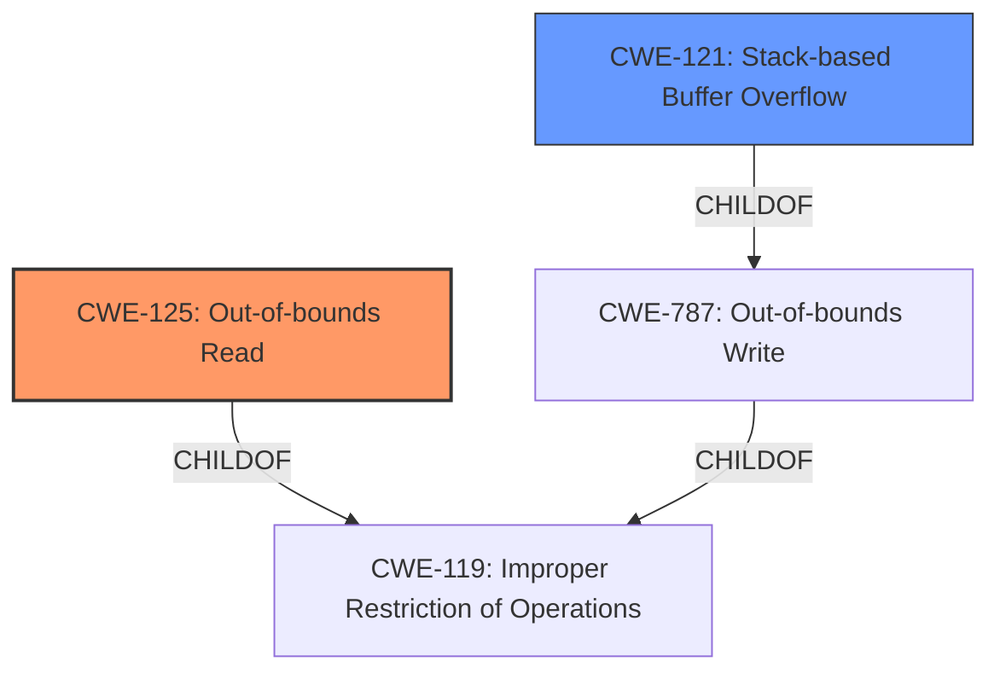

# Analysis for CVE-2022-42901

# Summary
| CWE ID | CWE Name | Confidence | CWE Abstraction Level | CWE Vulnerability Mapping Label | CWE-Vulnerability Mapping Notes |
|---|---|---|---|---|---|
| CWE-125 | Out-of-bounds Read | 0.9 | Base | Primary | Allowed |
| CWE-121 | Stack-based Buffer Overflow | 0.7 | Variant | Secondary | Allowed |

## Evidence and Confidence

*   **Confidence Score:** 0.8
*   **Evidence Strength:** MEDIUM

## Relationship Analysis
The primary CWE is CWE-125 **Out-of-bounds Read**, which has a ChildOf relationship to CWE-119 **Improper Restriction of Operations within the Bounds of a Memory Buffer**. The secondary CWE is CWE-121 **Stack-based Buffer Overflow**, which has a ChildOf relationship to CWE-787 **Out-of-bounds Write**. These relationships help clarify the nature of memory-related vulnerabilities and guide the selection of the most specific CWEs.

## Vulnerability Chain
The vulnerability chain starts with the processing of crafted XMT files. This leads to an **out-of-bounds** read vulnerability and a stack overflow issue. The final impact is information disclosure and code execution.

## Summary of Analysis
The initial assessment focused on identifying the root cause of the vulnerability based on the description provided. The description explicitly mentions "**out-of-bounds**" issues. The retriever results also indicated CWE-125 **Out-of-bounds Read** as a strong candidate. The final decision was to map CWE-125 as the primary CWE and CWE-121 **Stack-based Buffer Overflow** as a secondary CWE.

The vulnerability description states, "Bentley MicroStation and MicroStation-based applications may be affected by **out-of-bounds** and stack overflow issues when opening crafted XMT files. Exploiting these issues could lead to information disclosure and code execution."

CWE-125 is at the Base level of abstraction, which is a preferred level for mapping.

Relevant CWE Information:

# Enhanced Context (25 CWEs)

## CWE-226: Sensitive Information in Resource Not Removed Before Reuse
**Abstraction Level**: Base
**Similarity Score**: 0.77
**Source**: dense

This CWE was not selected because the vulnerability description does not mention anything about sensitive information.

## CWE-404: Improper Resource Shutdown or Release
**Abstraction Level**: Class
**Similarity Score**: 0.77
**Source**: dense

This CWE was not selected because the vulnerability description does not mention any resource shutdown or release issues.

## CWE-191: Integer Underflow (Wrap or Wraparound)
**Abstraction Level**: Base
**Similarity Score**: 0.77
**Source**: dense

This CWE was not selected because the vulnerability description does not mention integer underflow issues.

## CWE-131: Incorrect Calculation of Buffer Size
**Abstraction Level**: Base
**Similarity Score**: 0.76
**Source**: dense

This CWE was not selected because the vulnerability description does not explicitly mention incorrect calculation of buffer size, although it could be an underlying cause.

## CWE-824: Access of Uninitialized Pointer
**Abstraction Level**: Base
**Similarity Score**: 0.76
**Source**: dense

This CWE was not selected because the vulnerability description does not mention access of uninitialized pointers.

## CWE-664: Improper Control of a Resource Through its Lifetime
**Abstraction Level**: Pillar
**Similarity Score**: 0.76
**Source**: dense

This CWE was not selected because it is too general, and lower-level CWEs are available.

## CWE-1289: Improper Validation of Unsafe Equivalence in Input
**Abstraction Level**: Base
**Similarity Score**: 0.76
**Source**: dense

This CWE was not selected because the vulnerability description does not mention input validation issues related to unsafe equivalence.

## CWE-667: Improper Locking
**Abstraction Level**: Class
**Similarity Score**: 0.75
**Source**: dense

This CWE was not selected because the vulnerability description does not mention any locking issues.

## CWE-908: Use of Uninitialized Resource
**Abstraction Level**: Base
**Similarity Score**: 0.75
**Source**: dense

This CWE was not selected because the vulnerability description does not mention the use of uninitialized resources.

## CWE-665: Improper Initialization
**Abstraction Level**: Class
**Similarity Score**: 0.75
**Source**: dense

This CWE was not selected because the vulnerability description does not mention improper initialization.

## CWE-190: Integer Overflow or Wraparound
**Abstraction Level**: Base
**Similarity Score**: 7559.55
**Source**: sparse

This CWE was not selected because the vulnerability description does not mention integer overflow or wraparound issues.

## CWE-125: Out-of-bounds Read
**Abstraction Level**: Base
**Similarity Score**: 7172.49
**Source**: sparse

This CWE was selected as the primary because the vulnerability description explicitly mentions "**out-of-bounds**" issues.

## CWE-1284: Improper Validation of Specified Quantity in Input
**Abstraction Level**: Base
**Similarity Score**: 7054.35
**Source**: sparse

This CWE was not selected because the vulnerability description does not mention issues related to validating specified quantities in input.

## CWE-789: Memory Allocation with Excessive Size Value
**Abstraction Level**: Variant
**Similarity Score**: 6844.69
**Source**: sparse

This CWE was not selected because the vulnerability description does not mention issues with memory allocation and excessive size values.

## CWE-839: Numeric Range Comparison Without Minimum Check
**Abstraction Level**: Base
**Similarity Score**: 6795.76
**Source**: sparse

This CWE was not selected because the vulnerability description does not mention issues with numeric range comparison.

## CWE-41: Improper Resolution of Path Equivalence
**Abstraction Level**: base
**Similarity Score**: 5.03
**Source**: graph

This CWE was not selected because the vulnerability description does not mention any path equivalence issues.

## CWE-825: Expired Pointer Dereference
**Abstraction Level**: base
**Similarity Score**: 4.33
**Source**: graph

This CWE was not selected because the vulnerability description does not mention pointer dereference issues.

## CWE-823: Use of Out-of-range Pointer Offset
**Abstraction Level**: base
**Similarity Score**: 4.33
**Source**: graph

This CWE was not selected because the vulnerability description does not mention pointer offset issues.

## CWE-787: Out-of-bounds Write
**Abstraction Level**: base
**Similarity Score**: 4.33
**Source**: graph

This CWE was not selected because while the description does mention out of bounds, it is in the context of a read more than a write.

## CWE-170: Improper Null Termination
**Abstraction Level**: base
**Similarity Score**: 4.33
**Source**: graph

This CWE was not selected because the vulnerability description does not mention null termination issues.

## CWE-190: Integer Overflow or Wraparound
**Abstraction Level**: base
**Similarity Score**: 4.33
**Source**: graph

This CWE was not selected because the vulnerability description does not mention integer overflow issues.

## CWE-839: Numeric Range Comparison Without Minimum Check
**Abstraction Level**: base
**Similarity Score**: 4.33
**Source**: graph

This CWE was not selected because the vulnerability description does not mention issues with numeric range comparison without minimum check.

## CWE-22: Improper Limitation of a Pathname to a Restricted Directory ('Path Traversal')
**Abstraction Level**: base
**Similarity Score**: 4.33
**Source**: graph

This CWE was not selected because the vulnerability description does not mention path traversal issues.

## CWE-770: Allocation of Resources Without Limits or Throttling
**Abstraction Level**: base
**Similarity Score**: 4.33
**Source**: graph

This CWE was not selected because the vulnerability description does not mention resource allocation issues without limits or throttling.

## CWE-73: External Control of File Name or Path
**Abstraction Level**: base
**Similarity Score**: 4.33
**Source**: graph

This CWE was not selected because the vulnerability description does not mention external