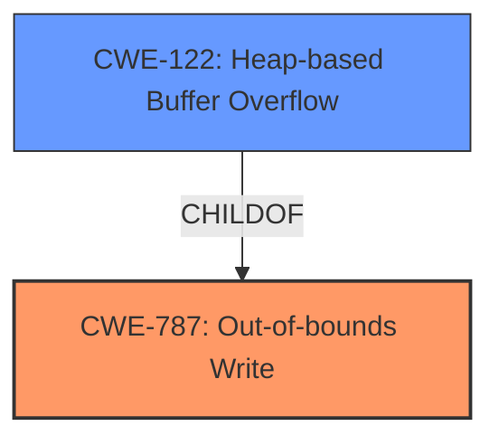

# Enhanced Analysis for CVE-2022-4291

# Summary
| CWE ID | CWE Name | Confidence | CWE Abstraction Level | CWE Vulnerability Mapping Label | CWE-Vulnerability Mapping Notes |
|---|---|---|---|---|---|
| CWE-787 | Out-of-bounds Write | 0.9 | Base | Allowed | Primary CWE |
| CWE-122 | Heap-based Buffer Overflow | 0.7 | Variant | Allowed | Secondary Candidate |

## Evidence and Confidence

*   **Confidence Score:** 0.8
*   **Evidence Strength:** HIGH

## Relationship Analysis
The primary CWE selected is CWE-787 (**Out-of-bounds Write**), a **Base** level CWE, because the vulnerability description explicitly mentions **heap corruption** which often leads to the ability to write data outside the intended buffer. CWE-122 (**Heap-based Buffer Overflow**) is a **Variant** of CWE-787, specifically related to overflows on the heap. The relationship between CWE-787 and CWE-122 is that CWE-122 is a more specific case of CWE-787.



## Vulnerability Chain
The vulnerability chain starts with a **heap corruption** (**CWE-787**), potentially leading to bypassing the application's sandbox.

## Summary of Analysis
The initial assessment focused on identifying the root cause of the vulnerability. The vulnerability description and CVE reference summary clearly point to **heap corruption** within the `aswjsflt.dll` library. This aligns well with **CWE-787 (Out-of-bounds Write)**, which describes writing data past the end or before the beginning of the intended buffer.

The evidence for **CWE-787** is strong:
*   Vulnerability Description Key Phrases: "**weakness:** **heap corruption**"
*   CVE Reference Links Content Summary: "**Root Cause:** The `aswjsflt.dll` library from Avast Antivirus contained a heap corruption vulnerability."

Given that the **heap corruption** occurs in the heap, **CWE-122 (Heap-based Buffer Overflow)** was considered, as it's a variant of **CWE-787**. While **CWE-122** is a more specific variant, the description only mentions **heap corruption**, and doesn't give enough detail to confirm an actual overflow.

Therefore, **CWE-787** is the primary CWE as it directly addresses the **root cause**, and **CWE-122** is a secondary candidate that may be applicable, but requires more information.

Other CWEs Considered but Not Used:

*   CWE-415 (Double Free): While heap corruption *could* be caused by a double free, there is no evidence to support this, so it was not selected.
*   CWE-843 (Access of Resource Using Incompatible Type ('Type Confusion')): While type confusion can lead to memory corruption, the description does not provide any detail about type mismatches.
*   CWE-190 (Integer Overflow or Wraparound): Integer overflows can lead to heap corruption, but there is no evidence of an integer overflow in the description.
*   CWE-476 (NULL Pointer Dereference): This is not directly indicated in the description.
*   CWE-362 (Concurrent Execution using Shared Resource with Improper Synchronization ('Race Condition')): No mention of concurrency issues.
*   CWE-427 (Uncontrolled Search Path Element): This is not relevant to heap corruption.
*   CWE-123 (Write-what-where Condition): This could be a consequence of heap corruption, but CWE-787 is the direct cause.
*   CWE-416 (Use After Free): This is also a possible cause of heap corruption, but less directly indicated than a general out-of-bounds write.
*   CWE-120 (Buffer Copy without Checking Size of Input ('Classic Buffer Overflow')): Similar to CWE-122, a possible cause, but not enough details.


## CWE Relationship Analysis

Current CWEs represent these abstraction levels: .


### Vulnerability Chain Analysis

**Chain starting from CWE-190:**
- 190 (Integer Overflow or Wraparound) - ROOT


**Chain starting from CWE-476:**
- 476 (NULL Pointer Dereference) - ROOT


### CWE Relationship Diagram

```mermaid
graph TD
    classDef primary fill:#f96,stroke:#333,stroke-width:2px
    classDef secondary fill:#69f,stroke:#333
    classDef tertiary fill:#9e9,stroke:#333
```