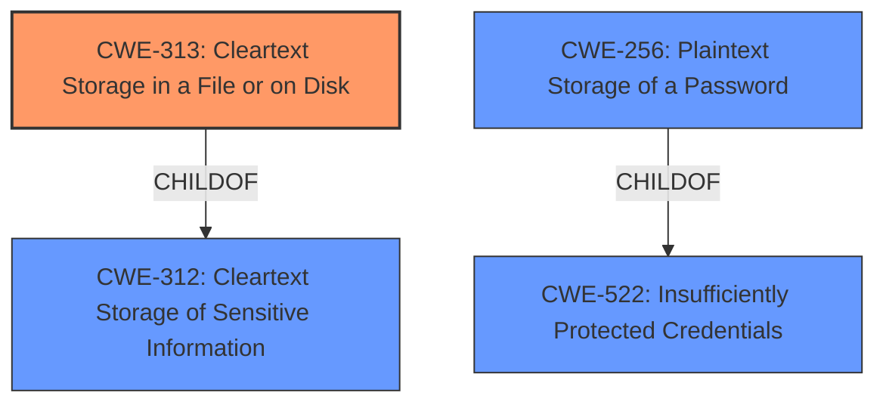

# Enhanced Analysis for CVE-2022-42931

# Summary

| CWE ID  | CWE Name                                          | Confidence | CWE Abstraction Level | CWE Vulnerability Mapping Label | CWE-Vulnerability Mapping Notes |
| :-------- | :------------------------------------------------ | :---------- | :---------------------- | :------------------------------ | :------------------------------ |
| CWE-313   | Cleartext Storage in a File or on Disk          | 0.9         | Variant                 | Allowed                         | Primary CWE                     |
| CWE-312   | Cleartext Storage of Sensitive Information       | 0.7         | Base                    | Allowed                         | Secondary Candidate             |
| CWE-256   | Plaintext Storage of a Password                 | 0.6         | Base                    | Allowed                         | Secondary Candidate             |
| CWE-532   | Insertion of Sensitive Information into Log File | 0.5         | Base                    | Allowed                         | Secondary Candidate             |

## Evidence and Confidence

*   **Confidence Score:** 0.9
*   **Evidence Strength:** HIGH

## Relationship Analysis

The primary CWE selected, CWE-313 (Cleartext Storage in a File or on Disk), is a variant of CWE-312 (Cleartext Storage of Sensitive Information). This parent-child relationship indicates that CWE-313 is a more specific case of the broader cleartext storage issue. CWE-256 (Plaintext Storage of a Password) is a child of CWE-522 (Insufficiently Protected Credentials), indicating a potential connection where credentials, specifically passwords, are stored without proper protection. This aligns with the vulnerability description, though the specific case involves usernames rather than passwords.
The choice of CWE-313 is based on the fact that the sensitive information was stored in a file on disk, making it a more precise classification than its parent.



## Vulnerability Chain

The chain of root cause and weaknesses for this vulnerability description is as follows:

1.  **Root Cause:** **Improper user data storage** by the Form Manager component in Firefox. The Form Manager **fails to** check if the input is managed by the Login Manager before saving it to the `formhistory.sqlite` database.
2.  **Weakness:** Usernames are stored in **cleartext** in `formhistory.sqlite` file.
3.  **Impact:** Potential information disclosure if an attacker gains local file access to the user's profile.

## Summary of Analysis

The initial assessment strongly supports CWE-313 (Cleartext Storage in a File or on Disk) as the primary CWE. This is based on the vulnerability description which states that usernames were saved by the Form Manager to an unencrypted file on disk. The "CVE Reference Links Content Summary" confirms that "Usernames, which should be protected, were being stored in an unencrypted database (`formhistory.sqlite`)." This aligns perfectly with the definition of CWE-313.

The relationship graph and retriever results were used to consider alternative CWEs, but CWE-313 remains the most specific and accurate representation of the vulnerability. While CWE-312 (Cleartext Storage of Sensitive Information) is a parent CWE and relevant, CWE-313 provides more granularity by specifying the location of the cleartext storage (file or disk). CWE-256 (Plaintext Storage of a Password) was considered but is less accurate because the vulnerability involves usernames, not passwords. CWE-532 (Insertion of Sensitive Information into Log File) was deemed not applicable because the sensitive information was stored in a database file, not a log file.

The final decision to use CWE-313 is based on the evidence from the vulnerability description and the clear alignment with the CWE's definition. The CWE is at the optimal level of specificity, providing more detail than its parent CWE-312 while remaining directly relevant to the described vulnerability.

Relevant CWE Information:

# Enhanced Context (25 CWEs)

## CWE-312: Cleartext Storage of Sensitive Information
**Abstraction Level**: Base
**Similarity Score**: 0.77
**Source**: dense

**Description**:
The product stores sensitive information in cleartext within a resource that might be accessible to another control sphere.

**Mapping Guidance**:
- Usage: Allowed
- Rationale: This CWE entry is at the Base level of abstraction, which is a preferred level of abstraction for mapping to the root causes of vulnerabilities.

## CWE-538: Insertion of Sensitive Information into Externally-Accessible File or Directory
**Abstraction Level**: Base
**Similarity Score**: 0.75
**Source**: dense

**Description**:
The product places sensitive information into files or directories that are accessible to actors who are allowed to have access to the files, but not to the sensitive information.

**Mapping Guidance**:
- Usage: Allowed
- Rationale: This CWE entry is at the Base level of abstraction, which is a preferred level of abstraction for mapping to the root causes of vulnerabilities.

## CWE-212: Improper Removal of Sensitive Information Before Storage or Transfer
**Abstraction Level**: Base
**Similarity Score**: 0.75
**Source**: dense

**Description**:
The product stores, transfers, or shares a resource that contains sensitive information, but it does not properly remove that information before the product makes the resource available to unauthorized actors.

**Mapping Guidance**:
- Usage: Allowed
- Rationale: This CWE entry is at the Base level of abstraction, which is a preferred level of abstraction for mapping to the root causes of vulnerabilities.

## CWE-319: Cleartext Transmission of Sensitive Information
**Abstraction Level**: Base
**Similarity Score**: 0.75
**Source**: dense

**Description**:
The product transmits sensitive or security-critical data in cleartext in a communication channel that can be sniffed by unauthorized actors.

**Mapping Guidance**:
- Usage: Allowed
- Rationale: This CWE entry is at the Base level of abstraction, which is a preferred level of abstraction for mapping to the root causes of vulnerabilities.

## CWE-226: Sensitive Information in Resource Not Removed Before Reuse
**Abstraction Level**: Base
**Similarity Score**: 0.75
**Source**: dense

**Description**:
The product releases a resource such as memory or a file so that it can be made available for reuse, but it does not clear or "zeroize" the information contained in the resource before the product performs a critical state transition or makes the resource available for reuse by other entities.

**Mapping Guidance**:
- Usage: Allowed
- Rationale: This CWE entry is at the Base level of abstraction, which is a preferred level of abstraction for mapping to the root causes of vulnerabilities.

## CWE-316: Cleartext Storage of Sensitive Information in Memory
**Abstraction Level**: Variant
**Similarity Score**: 0.75
**Source**: dense

**Description**:
The product stores sensitive information in cleartext in memory.

**Mapping Guidance**:
- Usage: Allowed
- Rationale: This CWE entry is at the Variant level of abstraction, which is a preferred level of abstraction for mapping to the root causes of vulnerabilities.

## CWE-807: Reliance on Untrusted Inputs in a Security Decision
**Abstraction Level**: Base
**Similarity Score**: 0.75
**Source**: dense

**Description**:
The product uses a protection mechanism that relies on the existence or values of an input, but the input can be modified by an untrusted actor in a way that bypasses the protection mechanism.

**Mapping Guidance**:
- Usage: Allowed
- Rationale: This CWE entry is at the Base level of abstraction, which is a preferred level of abstraction for mapping to the root causes of vulnerabilities.

## CWE-1391: Use of Weak Credentials
**Abstraction Level**: Class
**Similarity Score**: 0.74
**Source**: dense

**Description**:
The product uses weak credentials (such as a default key or hard-coded password) that can be calculated, derived, reused, or guessed by an attacker.

**Mapping Guidance**:
- Usage: Allowed-with-Review
- Rationale: This CWE entry is a Class and might have Base-level children that would be more appropriate

## CWE-922: Insecure Storage of Sensitive Information
**Abstraction Level**: Class
**Similarity Score**: 0.74
**Source**: dense

**Description**:
The product stores sensitive information without properly limiting read or write access by unauthorized actors.

**Mapping Guidance**:
- Usage: Allowed-with-Review
- Rationale: This CWE entry is a Class and might have Base-level children that would be more appropriate

## CWE-1289: Improper Validation of Unsafe Equivalence


## CWE Relationship Analysis

Current CWEs represent these abstraction levels: .


### Vulnerability Chain Analysis

**Chain starting from CWE-226:**
- 226 (Sensitive Information in Resource Not Removed Before Reuse) - ROOT


**Chain starting from CWE-319:**
- 319 (Cleartext Transmission of Sensitive Information) - ROOT


### CWE Relationship Diagram

```mermaid
graph TD
    classDef primary fill:#f96,stroke:#333,stroke-width:2px
    classDef secondary fill:#69f,stroke:#333
    classDef tertiary fill:#9e9,stroke:#333
```