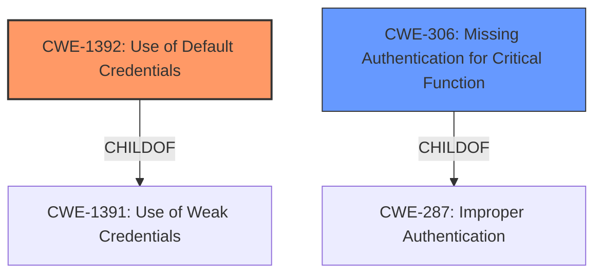

# Analysis for CVE-2022-42951

# Summary
| CWE ID | CWE Name | Confidence | CWE Abstraction Level | CWE Vulnerability Mapping Label | CWE-Vulnerability Mapping Notes |
|---|---|---|---|---|---|
| CWE-1392 | Use of Default Credentials | 1.0 | Base | Allowed | Primary CWE |
| CWE-306 | Missing Authentication for Critical Function | 0.7 | Base | Allowed | Secondary Candidate |

## Evidence and Confidence

*   **Confidence Score:** 0.9
*   **Evidence Strength:** HIGH

## Relationship Analysis
The primary CWE selected is CWE-1392, which is a Base level CWE. It has a parent-child relationship with CWE-1391 (Class). CWE-306 (Base) was considered as a secondary CWE. It is a child of CWE-287 (Class). Choosing CWE-1392 provides more specificity, as the vulnerability stems from the use of default credentials rather than a general lack of authentication.

## Vulnerability Chain
The vulnerability chain starts with the **lack of access control** during the initial startup phase of a Couchbase Server node. This leads to the **use of default credentials**, allowing an attacker to connect to the cluster manager. The impact is that the attacker can execute arbitrary code remotely.

## Summary of Analysis
The initial assessment strongly points towards **CWE-1392 (Use of Default Credentials)** as the primary weakness. The "CVE Reference Links Content Summary" explicitly states the root cause: "Couchbase Cluster Manager **lacks access controls** during a cluster node restart... the security cookie is set to "nocookie" which **lacks access controls** over the Erlang distribution protocol." This allows an attacker to "connect to the cluster manager **using default credentials**" (from the Vulnerability Description).

The retriever results also list CWE-1392 as the top match.

While **CWE-306 (Missing Authentication for Critical Function)** is also a reasonable candidate, **CWE-1392** is a more precise characterization of the vulnerability, as the issue isn't the complete absence of authentication, but rather the exploitation of default credentials during a specific time window.

Therefore, the final decision is to classify this vulnerability as **CWE-1392 (Use of Default Credentials)** as the primary CWE, with **CWE-306 (Missing Authentication for Critical Function)** as a secondary candidate. This selection is based on the evidence provided, the retriever results, and the relationship analysis, which indicates that **CWE-1392** is the more specific and appropriate choice.

Relevant CWE Information:
* CWE-1392: Use of Default Credentials
* CWE-306: Missing Authentication for Critical Function