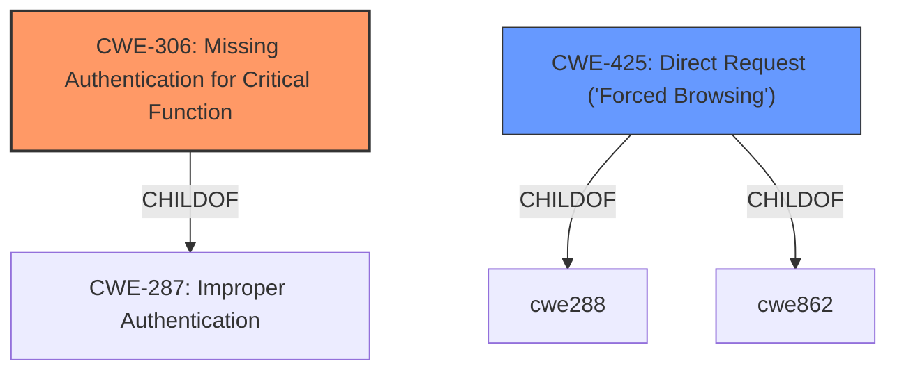

# Enhanced Analysis for CVE-2022-42953

# Summary
| CWE ID | CWE Name | Confidence | CWE Abstraction Level | CWE Vulnerability Mapping Label | CWE-Vulnerability Mapping Notes |
|---|---|---|---|---|---|
| CWE-306 | Missing Authentication for Critical Function | 1.0 | Base | Primary | Allowed |
| CWE-425 | Direct Request ('Forced Browsing') | 0.7 | Base | Secondary | Allowed |

## Evidence and Confidence

*   **Confidence Score:** 0.9
*   **Evidence Strength:** HIGH

## Relationship Analysis
The primary relationship influencing the choice is the direct mapping of the vulnerability to the **missing authentication** (**CWE-306**) and its potential exploitation via direct requests (**CWE-425**). **CWE-306** is a child of **CWE-287 (Improper Authentication)**, but **CWE-306** is more specific. **CWE-425** also represents the ability to directly request sensitive information.



## Vulnerability Chain
The vulnerability chain starts with the **missing authentication** (**CWE-306**) which allows for direct requests (**CWE-425**) to access sensitive information. The root cause is the **lack of authentication**, and the impact is unauthorized access to sensitive data.

## Summary of Analysis
The initial analysis strongly points to **CWE-306 (Missing Authentication for Critical Function)** as the primary weakness. The vulnerability description and the CVE reference links content summary clearly indicate that the ZKTeco products lack proper authentication, allowing unauthorized access to sensitive data. This aligns perfectly with the description of **CWE-306**, which states that the product "does not perform any authentication for functionality that requires a provable user identity or consumes a significant amount of resources." The evidence is clear from the "Root Cause of Vulnerability" section: "The ZKTeco ZEM/ZMM time attendance devices **lack proper authentication** for their web interface. This allows unauthenticated access to sensitive data and functionalities."

Additionally, the ability to access sensitive information via direct requests for specific URLs suggests **CWE-425 (Direct Request ('Forced Browsing'))**. This is further supported by the "Attack Vectors" section, which mentions that "Exploitation is done by sending HTTP GET or POST requests to specific URLs to access the web interface, backup data, and user details." While the retriever results also lists **CWE-425**, **CWE-306** is a more direct fit.

**CWE-287 (Improper Authentication)** was considered but deemed too general. While **CWE-306** is a child of **CWE-287**, the specific **missing authentication** makes **CWE-306** a more appropriate choice.

Other CWEs like **CWE-74 (Improper Neutralization of Special Elements in Output Used by a Downstream Component ('Injection'))** and **CWE-88 (Improper Neutralization of Argument Delimiters in a Command ('Argument Injection'))** were also considered but did not directly apply, as the vulnerability's root cause isn't related to injection. The same reasoning applies to **CWE-22 (Improper Limitation of a Pathname to a Restricted Directory ('Path Traversal'))**.

**CWE-425** is at the Base level of abstraction, and the mapping guidance allows its usage. The weakness enables direct access to resources without adequate authorization checks, which aligns perfectly with the vulnerability description.

The selected CWEs are at the optimal level of specificity, as they accurately represent the **root cause (missing authentication)** and the **attack vector (direct request)** of the vulnerability.

Relevant CWE Information:

# Enhanced Context (25 CWEs)
The following CWEs were identified as potentially relevant to this vulnerability:

## CWE-807: Reliance on Untrusted Inputs in a Security Decision
**Abstraction Level**: Base
**Similarity Score**: 0.78
**Source**: dense

**Description**:
The product uses a protection mechanism that relies on the existence or values of an input, but the input can be modified by an untrusted actor in a way that bypasses the protection mechanism.

**Mapping Guidance**:
- Usage: Allowed
- Rationale: This CWE entry is at the Base level of abstraction, which is a preferred level of abstraction for mapping to the root causes of vulnerabilities.

## CWE-303: Incorrect Implementation of Authentication Algorithm
**Abstraction Level**: Base
**Similarity Score**: 0.77
**Source**: dense

**Description**:
The requirements for the product dictate the use of an established authentication algorithm, but the implementation of the algorithm is incorrect.

**Mapping Guidance**:
- Usage: Allowed
- Rationale: This CWE entry is at the Base level of abstraction, which is a preferred level of abstraction for mapping to the root causes of vulnerabilities.

## CWE-1391: Use of Weak Credentials
**Abstraction Level**: Class
**Similarity Score**: 0.77
**Source**: dense

**Description**:
The product uses weak credentials (such as a default key or hard-coded password) that can be calculated, derived, reused, or guessed by an attacker.

**Mapping Guidance**:
- Usage: Allowed-with-Review
- Rationale: This CWE entry is a Class and might have Base-level children that would be more appropriate

## CWE-1390: Weak Authentication
**Abstraction Level**: Class
**Similarity Score**: 0.77
**Source**: dense

**Description**:
The product uses an authentication mechanism to restrict access to specific users or identities, but the mechanism does not sufficiently prove that the claimed identity is correct.

**Mapping Guidance**:
- Usage: Allowed-with-Review
- Rationale: This CWE entry is a Class and might have Base-level children that would be more appropriate

## CWE-74: Improper Neutralization of Special Elements in Output Used by a Downstream Component ('Injection')
**Abstraction Level**: Class
**Similarity Score**: 0.77
**Source**: dense

**Description**:
The product constructs all or part of a command, data structure, or record using externally-influenced input from an upstream component, but it does not neutralize or incorrectly neutralizes special elements that could modify how it is parsed or interpreted when it is sent to a downstream component.

**Mapping Guidance**:
- Usage: Discouraged
- Rationale: CWE-74 is high-level and often misused when lower-level weaknesses are more appropriate.

## CWE-345: Insufficient Verification of Data Authenticity
**Abstraction Level**: Class
**Similarity Score**: 0.76
**Source**: dense

**Description**:
The product does not sufficiently verify the origin or authenticity of data, in a way that causes it to accept invalid data.

**Mapping Guidance**:
- Usage: Discouraged
- Rationale: This CWE entry is a level-1 Class (i.e., a child of a Pillar). It might have lower-level children that would be more appropriate

## CWE-472: External Control of Assumed-Immutable Web Parameter
**Abstraction Level**: Base
**Similarity Score**: 0.76
**Source**: dense

**Description**:
The web application does not sufficiently verify inputs that are assumed to be immutable but are actually externally controllable, such as hidden form fields.

**Mapping Guidance**:
- Usage: Allowed
- Rationale: This CWE entry is at the Base level of abstraction, which is a preferred level of abstraction for mapping to the root causes of vulnerabilities.

## CWE-1289: Improper Validation of Unsafe Equivalence in Input
**Abstraction Level**: Base
**Similarity Score**: 0.75
**Source**: dense

**Description**:
The product receives an input value that is used as a resource identifier or other type of reference, but it does not validate or incorrectly validates that the input is equivalent to a potentially-unsafe value.

**Mapping Guidance**:
- Usage: Allowed
- Rationale: This CWE entry is at the Base level of abstraction, which is a preferred level of abstraction for mapping to the root causes of vulnerabilities.

## CWE-799: Improper Control of Interaction Frequency
**Abstraction Level**: Class
**Similarity Score**: 0.75
**Source**: dense

**Description**:
The product does not properly limit the number or frequency of interactions that it has with an actor, such as the number of incoming requests.

**Mapping Guidance**:
- Usage: Allowed-with-Review
- Rationale: This CWE entry is a Class and might have Base-level children that would be more appropriate

## CWE-639: Authorization Bypass Through User-


## CWE Relationship Analysis

Current CWEs represent these abstraction levels: .


### Vulnerability Chain Analysis

**Chain starting from CWE-425:**
- 425 (Direct Request ('Forced Browsing')) - ROOT


**Chain starting from CWE-472:**
- 472 (External Control of Assumed-Immutable Web Parameter) - ROOT


### CWE Relationship Diagram

```mermaid
graph TD
    classDef primary fill:#f96,stroke:#333,stroke-width:2px
    classDef secondary fill:#69f,stroke:#333
    classDef tertiary fill:#9e9,stroke:#333
```