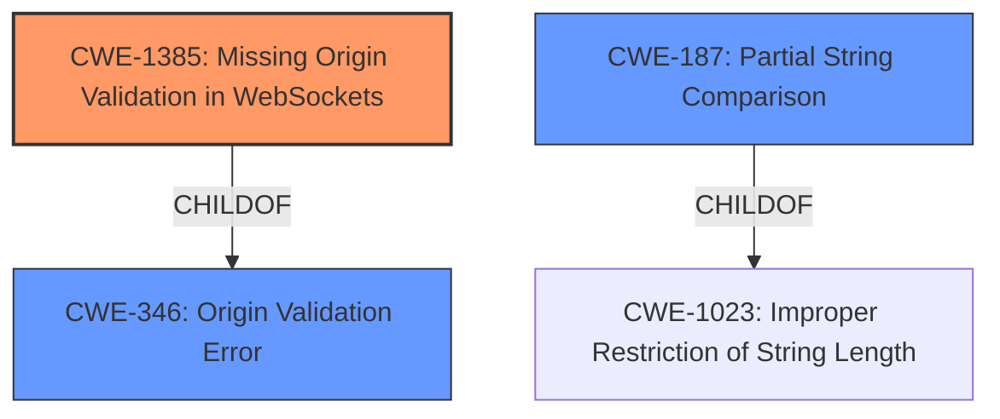

# Analysis Report for CVE-2022-42975

# Vulnerability Analysis Report: CVE-2022-42975

## Description


## Analysis (with Relationship Data)

# Summary
| CWE ID  | CWE Name                                                                                                 | Confidence | CWE Abstraction Level | CWE Vulnerability Mapping Label | CWE-Vulnerability Mapping Notes |
| :-------- | :--------------------------------------------------------------------------------------------------------- | :---------- | :---------------------- | :-------------------------------- | :--------------------------------- |
| CWE-1385 | Missing Origin Validation in WebSockets                                                               | 0.95       | Variant                | Primary                          | Allowed                         |
| CWE-187 | Partial String Comparison | 0.75       | Variant                | Secondary                          | Allowed                         |

## Evidence and Confidence

*   **Confidence Score:** 0.90
*   **Evidence Strength:** HIGH

## Relationship Analysis
The primary relationship that impacted the decision was the ChildOf relationship between CWE-1385 and CWE-346 (Improper Neutralization During Web Page Generation). Also, CWE-187 (Partial String Comparison) is a peer of CWE-183 (Permissive List of Allowed Inputs) and CWE-184 (Incomplete List of Disallowed Inputs), all of which deal with issues of inadequate input validation. The variant level of CWE-1385 provided a focused representation of the missing origin validation, while CWE-187 highlighted the flaw in the comparison logic.



## Vulnerability Chain
The vulnerability chain starts with the **mishandling of check_origin wildcarding**, specifically the **incorrect implementation of wildcard subdomain matching**. This leads to a **bypass of origin checks**, which allows an attacker to establish unauthenticated channel connections.

## Summary of Analysis
The initial assessment focused on the **mishandling of check_origin wildcarding** detailed in the vulnerability description. The CVE Reference Links Content Summary provided strong evidence, explaining the flawed logic in `compare_host?` and how `String.ends_with?(request_host, allowed_host)` failed to properly validate wildcard subdomains, leading to bypass origin checks.

The Retriever Results pointed to several potential CWEs, including CWE-625 (Permissive Regular Expression), CWE-116 (Improper Encoding or Escaping of Output), and CWE-1385 (Missing Origin Validation in WebSockets). However, CWE-1385 stood out due to its specific focus on origin validation in WebSockets, aligning perfectly with the vulnerability's context.

CWE-1385 is "The product uses a WebSocket, but it does not properly verify that the source of data or communication is valid." The vulnerability description states "**mishandles check_origin wildcarding**". The CVE Reference Links Content Summary says "The core issue is the flawed logic in `compare_host?`, specifically, `String.ends_with?(request_host, allowed_host)` did not properly validate wildcard subdomains.". This is an origin validation error.

CWE-187 is "Partial String Comparison". The CVE Reference Links Content Summary says "The code used `String.ends_with?` to compare the request origin against allowed origins, but it failed to properly account for the subdomain dot prefix when a wildcard (`*.`) was used." This is a partial string comparison.

The final decision prioritized CWE-1385 as the primary CWE due to its specific relevance to WebSocket origin validation and CWE-187 for it's partial string comparison. This selection is at the optimal level of specificity, addressing the root cause of the vulnerability.

Relevant CWE Information:

# Enhanced Context (25 CWEs)
The following CWEs were identified as potentially relevant to this vulnerability:

## CWE-1289: Improper Validation of Unsafe Equivalence in Input
**Abstraction Level**: Base
**Similarity Score**: 0.80
**Source**: dense

**Description**:
The product receives an input value that is used as a resource identifier or other type of reference, but it does not validate or incorrectly validates that the input is equivalent to a potentially-unsafe value.

**Mapping Guidance**:
- Usage: Allowed
- Rationale: This CWE entry is at the Base level of abstraction, which is a preferred level of abstraction for mapping to the root causes of vulnerabilities.

## CWE-807: Reliance on Untrusted Inputs in a Security Decision
**Abstraction Level**: Base
**Similarity Score**: 0.77
**Source**: dense

**Description**:
The product uses a protection mechanism that relies on the existence or values of an input, but the input can be modified by an untrusted actor in a way that bypasses the protection mechanism.

**Mapping Guidance**:
- Usage: Allowed
- Rationale: This CWE entry is at the Base level of abstraction, which is a preferred level of abstraction for mapping to the root causes of vulnerabilities.

## CWE-330: Use of Insufficiently Random Values
**Abstraction Level**: Class
**Similarity Score**: 0.77
**Source**: dense

**Description**:
The product uses insufficiently random numbers or values in a security context that depends on unpredictable numbers.

**Mapping Guidance**:
- Usage: Discouraged
- Rationale: This CWE entry is a level-1 Class (i.e., a child of a Pillar). It might have lower-level children that would be more appropriate

## CWE-703: Improper Check or Handling of Exceptional Conditions
**Abstraction Level**: Pillar
**Similarity Score**: 0.77
**Source**: dense

**Description**:
The product does not properly anticipate or handle exceptional conditions that rarely occur during normal operation of the product.

**Mapping Guidance**:
- Usage: Discouraged
- Rationale: This CWE entry is extremely high-level, a Pillar.

## CWE-319: Cleartext Transmission of Sensitive Information
**Abstraction Level**: Base
**Similarity Score**: 0.77
**Source**: dense

**Description**:
The product transmits sensitive or security-critical data in cleartext in a communication channel that can be sniffed by unauthorized actors.

**Mapping Guidance**:
- Usage: Allowed
- Rationale: This CWE entry is at the Base level of abstraction, which is a preferred level of abstraction for mapping to the root causes of vulnerabilities.

## CWE-668: Exposure of Resource to Wrong Sphere
**Abstraction Level**: Class
**Similarity Score**: 0.77
**Source**: dense

**Description**:
The product exposes a resource to the wrong control sphere, providing unintended actors with inappropriate access to the resource.

**Mapping Guidance**:
- Usage: Discouraged
- Rationale: CWE-668 is high-level and is often misused as a catch-all when lower-level CWE IDs might be applicable. It is sometimes used for low-information vulnerability reports [REF-1287]. It is a level-1 Class (i.e., a child of a Pillar). It is not useful for trend analysis.

## CWE-345: Insufficient Verification of Data Authenticity
**Abstraction Level**: Class
**Similarity Score**: 0.77
**Source**: dense

**Description**:
The product does not sufficiently verify the origin or authenticity of data, in a way that causes it to accept invalid data.

**Mapping Guidance**:
- Usage: Discouraged
- Rationale: This CWE entry is a level-1 Class (i.e., a child of a Pillar). It might have lower-level children that would be more appropriate

## CWE-1286: Improper Validation of Syntactic Correctness of Input
**Abstraction Level**: Base
**Similarity Score**: 0.77
**Source**: dense

**Description**:
The product receives input that is expected to be well-formed - i.e., to comply with a certain syntax - but it does not validate or incorrectly validates that the input complies with the syntax.

**Mapping Guidance**:
- Usage: Allowed
- Rationale: This CWE entry is at the Base level of abstraction, which is a preferred level of abstraction for mapping to the root causes of vulnerabilities.

## CWE-303: Incorrect Implementation of Authentication Algorithm
**Abstraction Level**: Base
**Similarity Score**: 0.77
**Source**: dense

**Description**:
The requirements for the product dictate the use of an established authentication algorithm, but the implementation of the algorithm is incorrect.

**Mapping Guidance**:
- Usage: Allowed
- Rationale: This CWE entry is at the Base level of abstraction, which is a preferred level of abstraction for mapping to the root causes of vulnerabilities.

## CWE-184: Incomplete List of Disallowed Inputs
**Abstraction Level**: Base
**Similarity Score**: 0.76
**Source**: dense

**Description**:
The product implements a protection mechanism that relies


## CWE Relationship Analysis

Current CWEs represent these abstraction levels: .


### Vulnerability Chain Analysis

**Chain starting from CWE-1023:**
- 1023 (Incomplete Comparison with Missing Factors) - ROOT


**Chain starting from CWE-330:**
- 330 (Use of Insufficiently Random Values) - ROOT


### CWE Relationship Diagram

```mermaid
graph TD
    classDef primary fill:#f96,stroke:#333,stroke-width:2px
    classDef secondary fill:#69f,stroke:#333
    classDef tertiary fill:#9e9,stroke:#333
```


*Report generated on 2025-03-30 19:22:02*
