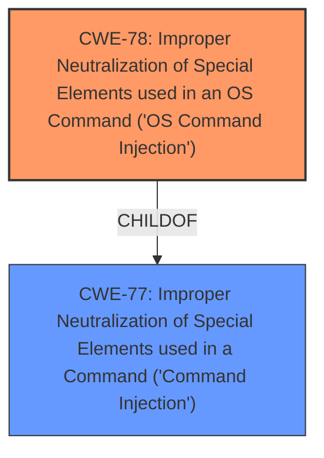

# Enhanced Analysis for CVE-2022-42999

# Summary
| CWE ID | CWE Name | Confidence | CWE Abstraction Level | CWE Vulnerability Mapping Label | CWE-Vulnerability Mapping Notes |
|---|---|---|---|---|---|
| CWE-78 | Improper Neutralization of Special Elements used in an OS Command ('OS Command Injection') | 1.0 | Base | Allowed | Primary CWE |
| CWE-77 | Improper Neutralization of Special Elements used in a Command ('Command Injection') | 0.7 | Class | Allowed-with-Review | Secondary Candidate |

## Evidence and Confidence

*   **Confidence Score:** 0.9
*   **Evidence Strength:** HIGH

## Relationship Analysis
The primary relationship that influenced my decision was the child-of relationship between CWE-78 and CWE-77. CWE-78 is a more specific case of CWE-77, focusing specifically on OS commands. Since the vulnerability involves injecting commands directly into the system shell, CWE-78 is the more appropriate choice. The Retriever Results also supports the use of CWE-78, as it is a top result.



## Vulnerability Chain
The vulnerability chain starts with the lack of input sanitization, leading to the ability to inject OS commands, which then results in arbitrary command execution and potential router compromise.

Lack of Input Sanitization -> CWE-78 -> Arbitrary Command Execution -> Router Compromise

## Summary of Analysis
The initial analysis identified **command injection** as the primary **weakness**. The vulnerability description clearly states that the `admuser` and `admpass` parameters are directly passed to the system shell as commands. The CVE Reference Links Content Summary confirms the **root cause** as the lack of proper input sanitization and identifies the presence of a **command injection** vulnerability.

The Retriever Results listed CWE-77 as the top result, but the more specific CWE-78 was chosen because the **command injection** occurs in the OS.

The selection of CWE-78 is based on the evidence provided in the vulnerability description and the CVE Reference Links Content Summary. The relationship analysis further supports this decision, as CWE-78 is a child of CWE-77 and specifically addresses OS command injection. The mapping guidance for CWE-78 allows its use, and the abstraction level is Base, which is preferred.

Relevant CWE Information:

# Enhanced Context (25 CWEs)

## CWE-77: Improper Neutralization of Special Elements used in a Command ('Command Injection')
**Abstraction:** Class
**Status:** Draft

### Description
The product constructs all or part of a command using externally-influenced input from an upstream component, but it does not neutralize or incorrectly neutralizes special elements that could modify the intended command when it is sent to a downstream component.

### Extended Description
Many protocols and products have their own custom command language. While OS or shell command strings are frequently discovered and targeted, developers may not realize that these other command languages might also be vulnerable to attacks.

### Mapping Guidance
**Usage:** Allowed-with-Review
**Rationale:** CWE-77 is often misused when OS command injection (CWE-78) was intended instead [REF-1287].

## CWE-78: Improper Neutralization of Special Elements used in an OS Command ('OS Command Injection')
**Abstraction:** Base
**Status:** Stable

### Description
The product constructs all or part of an OS command using externally-influenced input from an upstream component, but it does not neutralize or incorrectly neutralizes special elements that could modify the intended OS command when it is sent to a downstream component.

### Extended Description
This weakness can lead to a vulnerability in environments in which the attacker does not have direct access to the operating system, such as in web applications. Alternately, if the weakness occurs in a privileged program, it could allow the attacker to specify commands that normally would not be accessible, or to call alternate commands with privileges that the attacker does not have.

### Mapping Guidance
**Usage:** Allowed
**Rationale:** This CWE entry is at the Base level of abstraction, which is a preferred level of abstraction for mapping to the root causes of vulnerabilities.

## CWE Selection Details

### CWE-78: Improper Neutralization of Special Elements used in an OS Command ('OS Command Injection')
*   **Explanation:** The vulnerability description clearly indicates that the `admuser` and `admpass` parameters are passed directly to the system shell, allowing for the injection of arbitrary OS commands. This aligns perfectly with the description of CWE-78.
*   **Security Implications:** This vulnerability can lead to arbitrary command execution on the router, potentially allowing an attacker to compromise the entire device.
*   **Relationship:** CWE-78 is a child of CWE-77, which is a more general class of command injection vulnerabilities.
*   **Mapping Guidance:** The MITRE mapping guidance allows for the use of CWE-78, and it is at the Base level of abstraction.
*   **Confidence:** 1.0

### CWE-77: Improper Neutralization of Special Elements used in a Command ('Command Injection')
*   **Explanation:** While CWE-78 is the more specific choice, CWE-77 is a valid, more general classification, as it covers command injection in general, regardless of the specific command language.
*   **Security Implications:** Similar to CWE-78, this vulnerability can lead to arbitrary command execution.
*   **Relationship:** CWE-77 is the parent of CWE-78.
*   **Mapping Guidance:** The MITRE mapping guidance allows for the use of CWE-77 with review.
*   **Confidence:** 0.7

### CWEs Considered but Not Used:
*   CWE-89: Improper Neutralization of Special Elements used in an SQL Command ('SQL Injection'): This was not selected because the vulnerability involves OS commands, not SQL commands.
*   CWE-121: Stack-based Buffer Overflow: This was not selected because the root cause is **command injection**, not a buffer overflow.
*   CWE-259: Use of Hard-coded Password: This was not selected because the vulnerability is related to **command injection**, not hard-coded credentials.
*   CWE-912: Hidden Functionality: This was not selected as the **command injection** itself is the core issue, not hidden functionality.
*   CWE-790: Improper Filtering of Special Elements: This was not selected as CWE-78 is more specific


## CWE Relationship Analysis

Current CWEs represent these abstraction levels: .


### Vulnerability Chain Analysis

**Chain starting from CWE-89:**
- 89 (Improper Neutralization of Special Elements used in an SQL Command ('SQL Injection')) - ROOT


**Chain starting from CWE-259:**
- 259 (Use of Hard-coded Password) - ROOT


### CWE Relationship Diagram

```mermaid
graph TD
    classDef primary fill:#f96,stroke:#333,stroke-width:2px
    classDef secondary fill:#69f,stroke:#333
    classDef tertiary fill:#9e9,stroke:#333
```