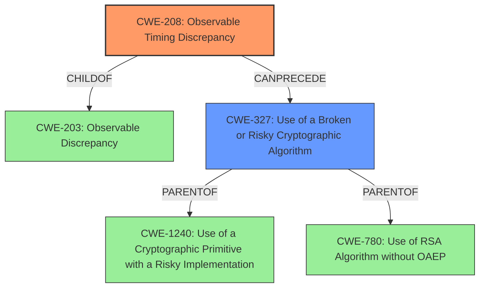

# Analysis for CVE-2022-4304

# Summary
| CWE ID  | CWE Name  | Confidence | CWE Abstraction Level | CWE Vulnerability Mapping Label | CWE-Vulnerability Mapping Notes |
|---|---|---|---|---|---|
| CWE-208 | Observable Timing Discrepancy | 0.9 | Base | Allowed | Primary CWE. The vulnerability is due to variations in the time it takes to perform the RSA decryption operation, which can be measured by an attacker to extract information about the secret data being decrypted. |
| CWE-327 | Use of a Broken or Risky Cryptographic Algorithm | 0.6 | Class | Allowed-with-Review | Secondary CWE. RSA decryption is susceptible to timing analysis |

## Evidence and Confidence

*   **Confidence Score:** 0.75
*   **Evidence Strength:** HIGH

## Relationship Analysis
The primary CWE is CWE-208, which is a base-level weakness describing observable timing discrepancies that leak security-relevant information. CWE-208 is a child of CWE-203 (Observable Discrepancy) and can precede CWE-385 (Covert Timing Channel) or CWE-327 (Use of a Broken or Risky Cryptographic Algorithm).

CWE-327 is a Class-level weakness and parent of CWE-1240 (Use of a Cryptographic Primitive with a Risky Implementation) and CWE-780 (Use of RSA Algorithm without OAEP). Since the vulnerability description mentions the RSA decryption implementation and its susceptibility to timing analysis, CWE-327 serves as a relevant secondary classification.

## Vulnerability Chain
The vulnerability chain begins with a **timing based side channel** in the OpenSSL RSA Decryption implementation (CWE-208), which allows an attacker to recover plaintext across a network (impact). The **timing based side channel** allows the attacker to send many messages and record the timing differences. This leads to information disclosure and potential compromise of encrypted communications.

## Summary of Analysis
The analysis indicates that the primary weakness is CWE-208 (**Observable Timing Discrepancy**), as the vulnerability stems from the **timing based side channel** in the RSA decryption implementation. This is supported by the vulnerability description, which explicitly mentions the **timing based side channel** and its role in allowing an attacker to recover plaintext. The CVE Reference Links Content Summary also confirms that the root cause is a timing-based side channel. "A timing-based side channel exists in the OpenSSL RSA decryption implementation."

CWE-327 (**Use of a Broken or Risky Cryptographic Algorithm**) is considered a secondary weakness because the RSA decryption process is susceptible to timing analysis. This is reinforced by the vulnerability description, which states that all RSA padding modes are vulnerable.

The relationships between CWEs, particularly the child-parent relationship between CWE-208 and CWE-203, and the ability of CWE-208 to precede CWE-327, support the selection of CWE-208 as the primary weakness. The abstraction levels are appropriate, with CWE-208 being a Base-level weakness and CWE-327 being a Class-level weakness.

CWE-789 (Memory Allocation with Excessive Size Value) and CWE-1325 (Improperly Controlled Sequential Memory Allocation) were considered but rejected because the vulnerability does not directly involve memory allocation issues. Instead, it focuses on the **timing based side channel** in the RSA decryption process.
CWE-1204 (Generation of Weak Initialization Vector (IV)) was also considered, but the vulnerability description doesn't mention anything about IV generation.
CWE-780 (Use of RSA Algorithm without OAEP) was not selected because the vulnerability affects all RSA padding modes.

Relevant CWE Information: