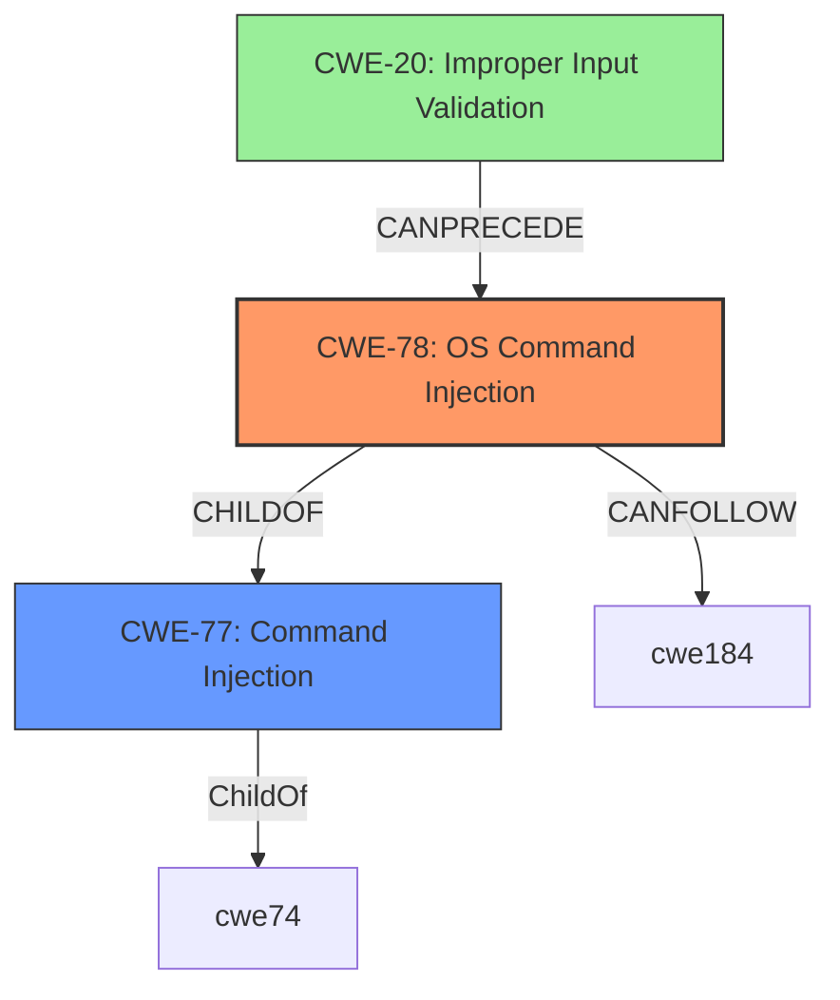

# Analysis for CVE-2022-43184

# Summary
| CWE ID | CWE Name | Confidence | CWE Abstraction Level | CWE Vulnerability Mapping Label | CWE-Vulnerability Mapping Notes |
|---|---|---|---|---|---|
| CWE-78 | Improper Neutralization of Special Elements used in an OS Command ('OS Command Injection') | 1.0 | Base | Allowed | Primary CWE |
| CWE-77 | Improper Neutralization of Special Elements used in a Command ('Command Injection') | 0.7 | Class | Allowed-with-Review | Secondary CWE |
| CWE-20 | Improper Input Validation | 0.5 | Class | Discouraged | Secondary CWE |

## Evidence and Confidence

*   **Confidence Score:** 0.9
*   **Evidence Strength:** HIGH

## Relationship Analysis
The primary relationship that impacted the decision was the hierarchical relationship between CWE-77 and CWE-78. CWE-78 is a Base level CWE and a child of CWE-77, which is a Class level CWE. Given the specific context of the vulnerability being an OS command injection, CWE-78 was selected as the primary CWE due to its greater specificity. CWE-20 was considered due to the **inadequate input validation** but was not chosen as the primary weakness.

## Vulnerability Chain
The vulnerability chain begins with **inadequate input validation**, leading to **unsafe string concatenation**, ultimately resulting in **OS command injection** and potential **remote code execution (RCE)**.
  - **Inadequate Input Validation** -> **Unsafe String Concatenation** -> **OS Command Injection** -> **Remote Code Execution**

## Summary of Analysis
The initial assessment strongly pointed towards CWE-78, based on the description of the vulnerability as a **command injection** in the `/bin/proc.cgi` component of the D-Link DIR878 router. The CVE Reference Links Content Summary explicitly mentions the root cause as a command injection vulnerability. The analysis also indicates **inadequate input validation** and **unsafe string concatenation** as contributing factors. The retriever results also prioritize CWE-77 and CWE-78.

The description explicitly states: "D-Link DIR878 1.30B08 Hotfix_04 was discovered to contain a **command injection** vulnerability via the component /bin/proc.cgi."

The evidence is very strong for this vulnerability to be classified as CWE-78.

Relevant CWE Information:

# Enhanced Context (25 CWEs)
The following CWEs were identified as potentially relevant to this vulnerability:

## CWE-74: Improper Neutralization of Special Elements in Output Used by a Downstream Component ('Injection')
**Abstraction Level**: Class
**Similarity Score**: 0.76
**Source**: dense

**Description**:
The product constructs all or part of a command, data structure, or record using externally-influenced input from an upstream component, but it does not neutralize or incorrectly neutralizes special elements that could modify how it is parsed or interpreted when it is sent to a downstream component.

**Mapping Guidance**:
- Usage: Discouraged
- Rationale: CWE-74 is high-level and often misused when lower-level weaknesses are more appropriate.

## CWE-78: Improper Neutralization of Special Elements used in an OS Command ('OS Command Injection')
**Abstraction Level**: Base
**Similarity Score**: 6461.25
**Source**: sparse

**Description**:
The product constructs all or part of an OS command using externally-influenced input from an upstream component, but it does not neutralize or incorrectly neutralizes special elements that could modify the intended OS command when it is sent to a downstream component.

**Mapping Guidance**:
- Usage: Allowed
- Rationale: This CWE entry is at the Base level of abstraction, which is a preferred level of abstraction for mapping to the root causes of vulnerabilities.
### CWE Selection Details:

*   **CWE-78: Improper Neutralization of Special Elements used in an OS Command ('OS Command Injection')**
    *   **Explanation:** The vulnerability description clearly indicates a **command injection** issue, aligning directly with CWE-78. The router constructs an OS command using external input without proper neutralization. This allows attackers to modify the intended command.
    *   **Security Implications:** This can lead to arbitrary code execution on the router, potentially allowing attackers to gain full control, steal data, or cause denial of service.
    *   **Relationships:** CWE-78 is a child of CWE-77 (Command Injection) and CWE-74 (Improper Neutralization).
    *   **Mapping Guidance:** The usage is "ALLOWED" and the abstraction level is "Base", which is the preferred level.
    *   **Confidence:** 1.0

*   **CWE-77: Improper Neutralization of Special Elements used in a Command ('Command Injection')**
    *   **Explanation:** While CWE-78 is more specific, CWE-77 is a broader category that encompasses command injection in general. The vulnerability could be seen as an instance of command injection, making CWE-77 a relevant, though less precise, classification.
    *   **Security Implications:** Similar to CWE-78, this can lead to unauthorized command execution.
    *   **Relationships:** CWE-77 is a parent of CWE-78.
    *   **Mapping Guidance:** The usage is "Allowed-with-Review" and the abstraction level is "Class".
    *   **Confidence:** 0.7

*   **CWE-20: Improper Input Validation**
    *   **Explanation:** The CVE Reference Links Content Summary mentions **inadequate input validation** as a contributing factor. While this is true, it is a high-level CWE. The **command injection** is a more precise description of the vulnerability.
    *   **Security Implications:** This can lead to various types of vulnerabilities.
    *   **Relationships:** CWE-20 is a general weakness that can lead to many other vulnerabilities.
    *   **Mapping Guidance:** The usage is "Discouraged" and the abstraction level is "Class".
    *   **Confidence:** 0.5

### CWEs Considered but Not Used:

*   **CWE-74, CWE-138, CWE-790, CWE-88, CWE-93, CWE-94, CWE-96, CWE-117, CWE-121, CWE-426, CWE-89:** These CWEs were considered but ultimately not selected because they did not directly address the root cause, or were too general, or were related to different types of injection vulnerabilities (e.g., SQL injection).