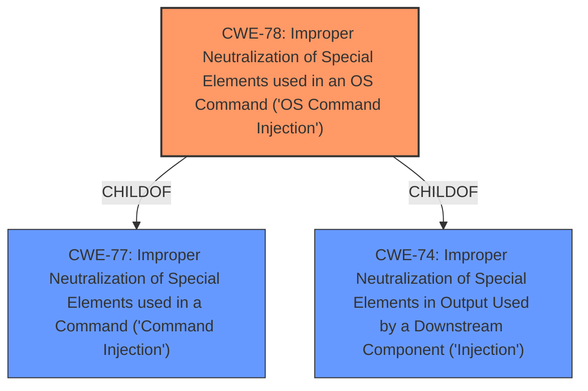

# Analysis Report for CVE-2022-43325

# Vulnerability Analysis Report: CVE-2022-43325

## Description


## Analysis (with Relationship Data)

# Summary
| CWE ID | CWE Name | Confidence | CWE Abstraction Level | CWE Vulnerability Mapping Label | CWE-Vulnerability Mapping Notes |
|---|---|---|---|---|---|
| CWE-78 | Improper Neutralization of Special Elements used in an OS Command ('OS Command Injection') | 1.0 | Base | Allowed | Primary CWE |

## Evidence and Confidence

*   **Confidence Score:** 1.0
*   **Evidence Strength:** HIGH

## Relationship Analysis
The primary identified CWE is CWE-78. It is a base level CWE that is a child of CWE-77 and CWE-74. This indicates a specific type of command injection related to OS commands.



## Vulnerability Chain
The vulnerability involves an unauthenticated attacker injecting a crafted payload into the license input, leading to the execution of arbitrary OS commands.

## Summary of Analysis
The vulnerability description explicitly states that there is a **command injection** vulnerability. The retriever results also show CWE-77 and CWE-78 as the top candidates.

The description mentions "execute arbitrary commands" which indicates that the attacker can run commands of their choosing.

The vulnerability is in the "product license validation function", where a "crafted payload" can be injected. This aligns with the description of CWE-78, which involves constructing an OS command using externally-influenced input without proper neutralization.

CWE-77 is a Class-level CWE, while CWE-78 is a Base-level CWE. Since the vulnerability specifically involves OS commands, CWE-78 is a more specific and appropriate choice. The MITRE guidance for CWE-78 states that it is at the Base level of abstraction, which is a preferred level of abstraction for mapping to the root causes of vulnerabilities and its usage is "Allowed".

I considered other CWEs such as CWE-77, CWE-93, CWE-116, and CWE-94, but these were not as directly relevant. CWE-77 is a more general command injection, while CWE-78 specifies OS command injection. CWE-93 (CRLF Injection) and CWE-116 (Improper Encoding or Escaping of Output) are related to specific types of injection and output handling, respectively, but the provided description doesn't have evidence of these types of issues. CWE-94 (Code Injection) is related to injecting code segments, which is also not explicitly described in the vulnerability.

Therefore, CWE-78 is the most appropriate CWE for this vulnerability.


## CWE Relationship Analysis

Current CWEs represent these abstraction levels: .


### Vulnerability Chain Analysis

**Chain starting from CWE-78:**
- 78 (Improper Neutralization of Special Elements used in an OS Command ('OS Command Injection')) - ROOT


**Chain starting from CWE-116:**
- 116 (Improper Encoding or Escaping of Output) - ROOT


### CWE Relationship Diagram

```mermaid
graph TD
    classDef primary fill:#f96,stroke:#333,stroke-width:2px
    classDef secondary fill:#69f,stroke:#333
    classDef tertiary fill:#9e9,stroke:#333
```


*Report generated on 2025-03-30 22:51:00*
