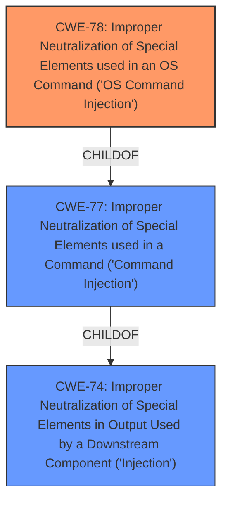

# Analysis for CVE-2022-43367

# Summary
| CWE ID | CWE Name | Confidence | CWE Abstraction Level | CWE Vulnerability Mapping Label | CWE-Vulnerability Mapping Notes |
|---|---|---|---|---|---|
| CWE-78 | Improper Neutralization of Special Elements used in an OS Command ('OS Command Injection') | 1.0 | Base | Allowed | Primary CWE |

## Evidence and Confidence

*   **Confidence Score:** 1.0
*   **Evidence Strength:** HIGH

## Relationship Analysis
The primary relationship that impacted my decision was the ChildOf relationship between CWE-78 and CWE-77. CWE-78 is a Base level CWE and a child of the Class level CWE-77. Since the **command injection** is in the context of an Operating System command, CWE-78 is the more appropriate, specific choice.

## Vulnerability Chain
The vulnerability chain starts with the **improper neutralization** of special elements, leading to the execution of unintended OS commands.
  - Root Cause: **Improper Neutralization**
  - Weakness: **OS Command Injection**
  - Impact: Arbitrary command execution

## Summary of Analysis
The initial analysis strongly points towards **command injection** due to the description stating a **command injection** vulnerability exists in the `formSetDebugCfg` function.

The key phrase "command injection" in the vulnerability description is strong evidence. The description states "IP-COM EW9 V15.11.0.14(9732) was discovered to contain a **command injection** vulnerability in the formSetDebugCfg function."

The retriever results also support this, with CWE-77 and CWE-78 being the top candidates.

CWE-78 is at the optimal level of specificity, as it is a Base CWE that directly addresses **OS command injection**.

Relevant CWE Information:

# Enhanced Context (25 CWEs)

## CWE-77: Improper Neutralization of Special Elements used in a Command ('Command Injection')
**Abstraction:** Class
**Similarity Score**: 1.000 (Retriever Results)

The product constructs all or part of a command using externally-influenced input from an upstream component, but it does not neutralize or incorrectly neutralizes special elements that could modify the intended command when it is sent to a downstream component.

This CWE is a class-level CWE, and the mapping guidance suggests using CWE-78 instead when the command injection is related to OS commands.

## CWE-78: Improper Neutralization of Special Elements used in an OS Command ('OS Command Injection')
**Abstraction:** Base
**Similarity Score**: 0.700 (Retriever Results)

The product constructs all or part of an OS command using externally-influenced input from an upstream component, but it does not neutralize or incorrectly neutralizes special elements that could modify the intended OS command when it is sent to a downstream component.

This CWE is a base-level CWE, which is preferred. The description aligns perfectly with the vulnerability description.

I am confident in this assessment because the vulnerability description explicitly states a **command injection** vulnerability, and CWE-78 is the most specific and appropriate CWE for this type of vulnerability.