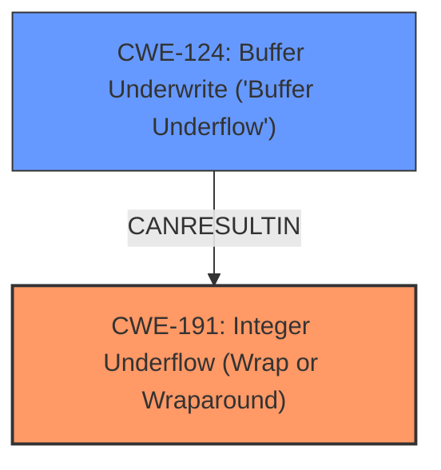

# Analysis for CVE-2022-4338

# Summary
| CWE ID | CWE Name | Confidence | CWE Abstraction Level | CWE Vulnerability Mapping Label | CWE-Vulnerability Mapping Notes |
|---|---|---|---|---|---|
| CWE-191 | Integer Underflow (Wrap or Wraparound) | 1.0 | Base | Allowed | Primary CWE |
| CWE-124 | Buffer Underwrite ('Buffer Underflow') | 0.6 | Base | Allowed | Secondary Candidate |

## Evidence and Confidence

*   **Confidence Score:** 0.8
*   **Evidence Strength:** HIGH

## Relationship Analysis
The primary relationship impacting the decision is that CWE-191 **Integer Underflow** can lead to other weaknesses such as CWE-124 **Buffer Underwrite ('Buffer Underflow')**. While not explicitly stated, the "out-of-bounds read" suggests that the integer underflow is leading to an attempt to access memory outside the allocated buffer. The abstraction levels are both Base, which is the preferred level.

## Vulnerability Chain
The vulnerability chain starts with:
1.  **Root Cause:** **Integer Underflow** (CWE-191) due to a lack of proper length checks.
2.  **Resulting Weakness:** Out-of-bounds read and potential **buffer underwrite** (CWE-124).
3.  **Impact:** Denial of service or other undefined behavior, including crashes.

## Summary of Analysis
The initial assessment strongly points to CWE-191 **Integer Underflow (Wrap or Wraparound)** as the primary root cause. The description explicitly states an **integer underflow** vulnerability. The CVE Reference Links Content Summary confirms this: "A malformed LLDP packet with a short LLDP_TLV_AA_ISID_VLAN_ASGNS_SUBTYPE element can cause an **integer underflow**."
The evidence is compelling and clearly supports CWE-191.

The secondary consideration is CWE-124 **Buffer Underwrite ('Buffer Underflow')**. While not explicitly stated as a "buffer underwrite," the description mentions an "out-of-bounds read" and the possibility of "other undefined behavior, including crashes". An integer underflow could lead to writing before the buffer begins, aligning with CWE-124. This is further supported by the Retriever Results, listing CWE-124 as a possibility. However, the evidence for CWE-124 is less direct and relies on inference; thus, it's a secondary candidate.

The selection of CWE-191 as the primary CWE is at the optimal level of specificity as it directly addresses the root cause reported in the vulnerability description.

Relevant CWE Information:

# Enhanced Context (25 CWEs)

## CWE-191: Integer Underflow (Wrap or Wraparound)
**Abstraction Level**: Base
**Similarity Score**: 0.79
**Source**: dense

**Description**:
The product subtracts one value from another, such that the result is less than the minimum allowable integer value, which produces a value that is not equal to the correct result.

**Mapping Guidance**:
- Usage: Allowed
- Rationale: This CWE entry is at the Base level of abstraction, which is a preferred level of abstraction for mapping to the root causes of vulnerabilities.

## CWE-124: Buffer Underwrite ('Buffer Underflow')
**Abstraction Level**: Base
**Similarity Score**: 0.71
**Source**: dense

**Description**:
The product writes to a buffer using an index or pointer that references a memory location prior to the beginning of the buffer.

**Mapping Guidance**:
- Usage: Allowed
- Rationale: This CWE entry is at the Base level of abstraction, which is a preferred level of abstraction for mapping to the root causes of vulnerabilities.